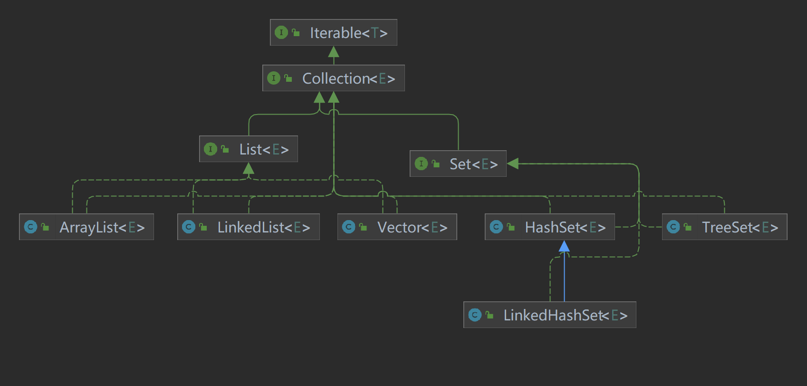
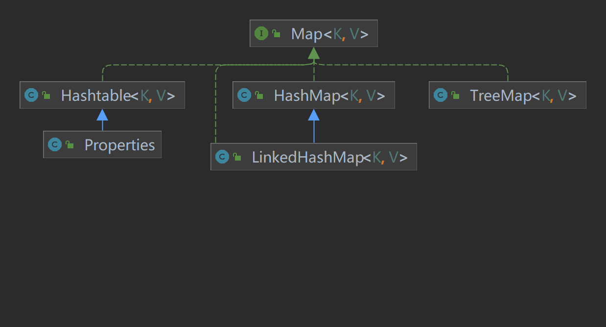
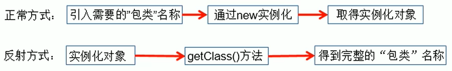

# java -jar

1. **java -jar demo.jar**

   说明：用这种方法启动后，不能继续执行其它命令了，如果想要继续执行其它命令，需要退出当前命令运行窗口，会打断jar的运行，打断一般用ctrl+c。

2. **java -jar demo.jar &**

   第2种在第1种方式的基础上在命令的结尾增加了&，&表达的意思是在后台运行。

   这种方式可以避免打断后程序停止运行的问题，但是如果关闭当前窗口后程序会停止运行。

3. **nohup java -jar demo.jar &**

   第3种在第2种方式的基础上，在命令的最前面增加了[nohup](https://so.csdn.net/so/search?q=nohup&spm=1001.2101.3001.7020)。

   nohup是不挂断运行命令,当账户退出或终端关闭时,程序仍然运行。

   加了nohup后，即使关掉命令窗口，后台程序demo.jar也会一直执行。

4. nohup java -jar demo.jar >1.txt &

   第4种在第3种的基础上，在后面增加了>1.txt，意思是将nohup java -jar demo.jar的运行内容重定向输出到1.txt文件中，即输出内容不打印到当前窗口上，而是输出到1.txt文件中。

   第3种没有加>1.txt，它的输出重定向到nohup.out文件中，nohup.out也就是nohup命令的默认输出文件， 文件位于$HOME/nohup.out 文件中,比如用root执行，就会输出到/root/nohup.out。

5. nohup java -jar demo.jar >/dev/null 2>&1 &

   这里说下jar后面这串符号的意义 >/dev/null 2>&1 &

   > 代表重定向到哪里，例如：echo "123" > /home/123.txt
   > /dev/null 代表空设备文件
   > 2> 表示stderr标准错误
   > & 表示等同于的意思，2>&1，表示2的输出重定向等同于1
   > 1 表示stdout标准输出，系统默认值是1，所以">/dev/null"等同于 "1>/dev/null"

   最后一个&表示在后台运行。

   这里再补充说下这几个数字代表的含义：

   0 标准输入（一般是键盘）
   1 标准输出（一般是显示屏，是用户终端控制台）
   2 标准错误（错误信息输出）

   /dev/null ：首先表示标准输出重定向到空设备文件，也就是不输出任何信息到终端，说白了就是不显示任何信息。一般项目中定义中输出运行日志到指定地址，这样的话，就不需要再单独输出nohup.out文件，这种情况可以考虑使用这种。
   ————————————————
   版权声明：本文为CSDN博主「moxiaoran5753」的原创文章，遵循CC 4.0 BY-SA版权协议，转载请附上原文出处链接及本声明。
   原文链接：https://blog.csdn.net/shenxiaomo1688/article/details/127319133

# 集合

## 体系

数组：

- 长度开始必须指定，而且一旦指定，不能更改
- 保存的元素必须为同一类型
- 使用数组进行增加元素 -> 麻烦


集合：

- 可以**动态**保存任意多个对象，使用比较方便！
- 提供了一系列方便的操作对象的方法：add、remove、set、get等
- 使用集合添加，删除新元素的示意代码-简洁了








## Collection

### Collection接口和常用方法

#### Collection接口实现类的特点

`public interface Collection<E> extends Iterable<E>`

1. collection 实现子类可以存放多个元素，每个元素可以是 Object
2. 有些 Collection 的实现类，可以存放重复的元素，有些不可以
3. 有些 Collection 的实现类，有些是有序的(List)，有些不是有序(Set)
4. Collection 接口没有直接的实现子类，是通过它的子接口**Set**和**List**来实现的


#### Collection接口常用方法，以实现子类

ArrayList来演示 CollectionMethod.java

1. add:添加单个元素
2. remove:删除指定元素
3. contains:查找元素是否存在
4. size:获取元素个数
5. isEmpty:判断是否为空
6. clear:清空
7. addAll:添加多个元素
8. containsAll::查找多个元素是否都存在
9. removeAll:删除多个元素
10. 说明：以ArrayList实现类来演示.


#### Collection接口遍历元素方式1-使用lterator(迭代器)

1. Iterator对象称为迭代器，主要用于遍历Collection集合中的元素。

2. 所有实现了Collection接口的集合类都有一个`iterator()`方法，用以返回
   一个实现了Iterator接口的对象，即可以返回一个迭代器。

3. Iterator的结构.[图：]

4. Iterator仅用于遍历集合，Iterator本身并不存放对象。


迭代器的执行原理

```java
Iterator iterator=coll.iterator()://得到一个集合的迭代器

//hasNext():判断是否还有下一个元素

while(iterator.hasNext()){
	//next():1.下移 2.将下移以后集合位置上的元素返回
	System.out.println(iterator.next());
}
```

==提示：在调用`iterator.next()`方法前**必须要调用`iterator.hasNext()`进行检测**。若不调用，且下一条记录无效，直接调用`iterator.next()`会抛出`NoSuchElementException`异常。==


### List

List接口基本介绍

- List接口是Collection接口的子接口

- List集合类中元素有序（即添加顺序和取出顺序一致）、且可重复

- List集合中的每个元素都有其对应的顺序索引，即支持索引

- List容器中的元素都对应一个整数型的序号记载其在容器中的位置，可以根据序号存取容器中的元素。
  JDK API中List接口的实现类有：

  所有已知实现类：

  `AbstractList，AbstractSequentialList，ArrayList，AttributeList，CopyOnWriteArrayList，LinkedList，RoleList，RoleUnresolvedList，Stack，Vector`


#### ArrayList

线程不安全的，没有`synchronized`，在多线程情况下，不建议使用`ArrayList`


底层源码分析：

1)ArrayList中维护了一个Object类型的数组elementData.[debug看源码]
transient Object[] elementData;

2)当创建对象时，如果使用的是无参构造器，则初始elementData容量为`0`(jdk7是10)

3)当添加元素时：先判断是否需要扩容，如果需要扩容，则调用`grow`方法，否则直接添加元素到合适位置

4)如果使用的是无参构造器，如果第一次添动加，需要扩容的话，则扩容elementData为`10`，如果需要再次扩容的话，则扩容elementData为1.5倍。

5)如果使用的是指定容量capacity的构造器，则初始elementData:容量为capacity

6)如果使用的是指定容量capacity的构造器，如果需要扩容，则直接扩容elementData为1.5倍。


#### LinkedList


#### Vector


### Set

#### HashSet


#### LinkedHashSet


#### TreeSet


## Map

### HashMap


### Hashtable


### LinkedHashMap


### TreeMap


### Properties


## Collections


# 反射

## 反射机制概述

**Java Reflection**

- Reflection（反射）是被视为==动态语言==的关键，反射机制允许程序在执行期借助于 Reflection API 取得任何类的内部信息，并能直接操作任意对象的内部属性及方法。
- 加载完类之后，在堆内存的方法区中就产生了一个 Class 类型的对象（一个类只有一个 Class 对象），这个对象就包含了完整的类的结构信息。可以通过这个对象看到类的结构。==这个对象就像一面镜子，透过这个镜子看到类的结构，所以，我们形象的称之为：**反射**。==





java 反射机制提供的功能：

- 在运行时判断


问题一：通过 new 的方式或者反射的方式都可以调用公共的结构，开发中到底用哪个？

建议：直接用 new 的方式。使用反射的时候，反射的特点：动态性。

问题二：反射机制与面向对象中的封装性是不是有矛盾？如何看待两个技术？

不矛盾。


关于`java.lang,Class`类的理解

1. 类的加载过程

   程序经过`javac.exe`命令以后，会生成一个或多个字节码文件（.class后缀）。

   接着使用`java.exe`命令对某个字节码文件进行解释运行。相当于将某个字节码文件加载到内存中。此过程就称为类的加载。加载到内存中的类，我们就称为运行时类，此运行时类，就作为`Class`的一个实例。


获取Class实例的三种方式：

1. 调用运行时类的的属性：`.class`

   ```java
   Class Person{
       private String name = "lili";
       
       public void say(){
           System.out.println("我的名字是"+this.name);
       }
       
   }
   Class clazz1 = Person.class;
   ```

2. 通过运行时类的对象，调用`getClass()`

   ```java
   Person p1 = new Person();
   Class clazz2 = p1.getClass();
   ```

3. 调用Class的静态方法`forName(String, classPath)`

   ```java
   Class clazz3 = Class.forName("person.cls.Person");
   ```

4. 使用类加载器：（ClassLoader）