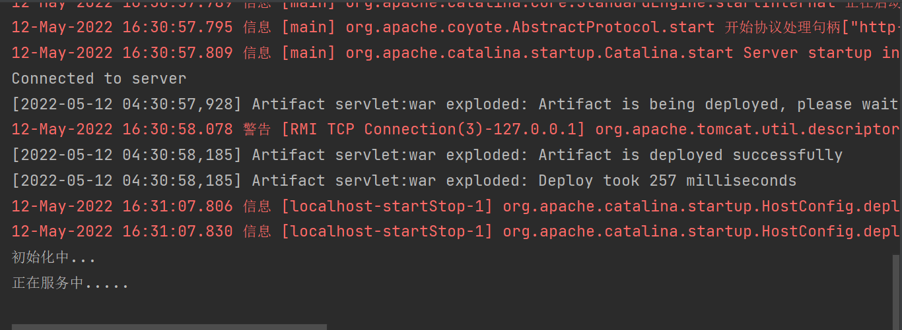
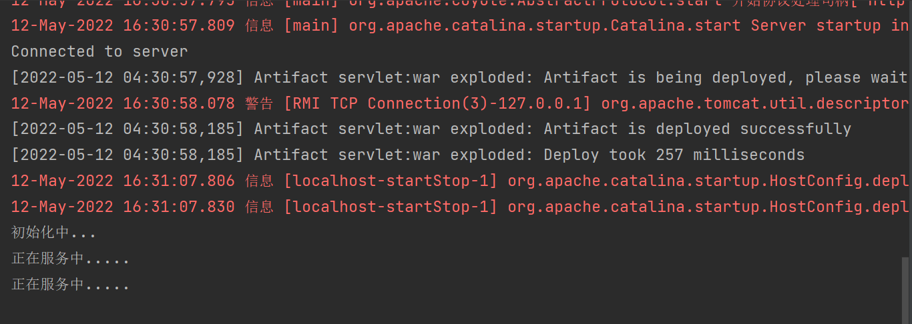
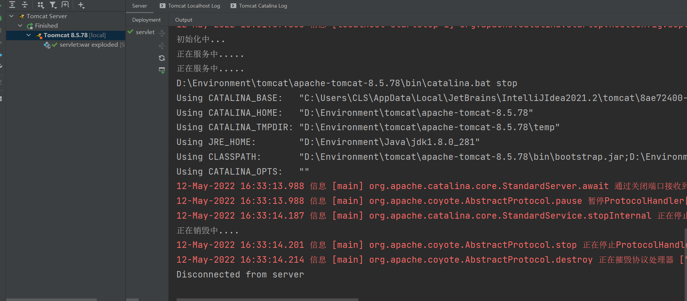
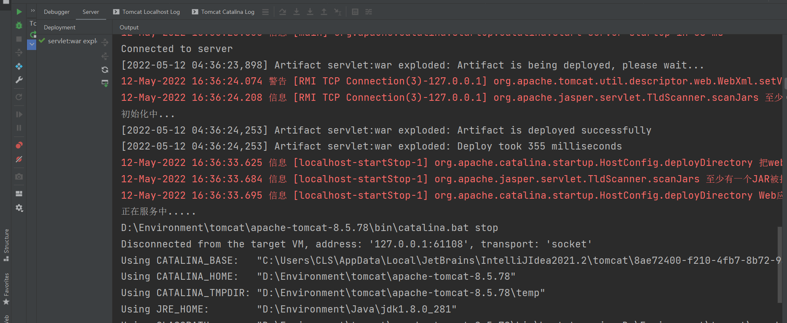
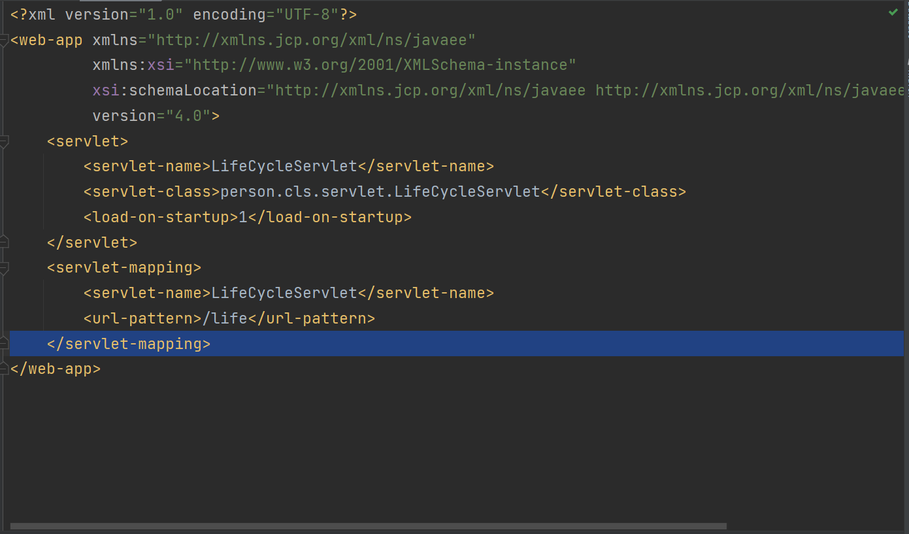
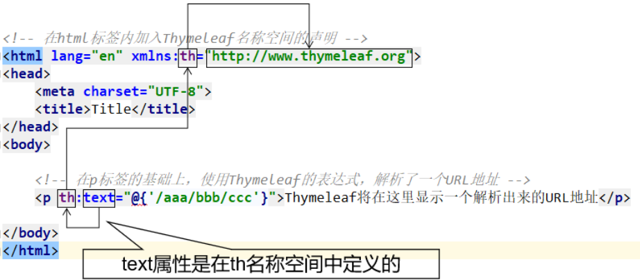
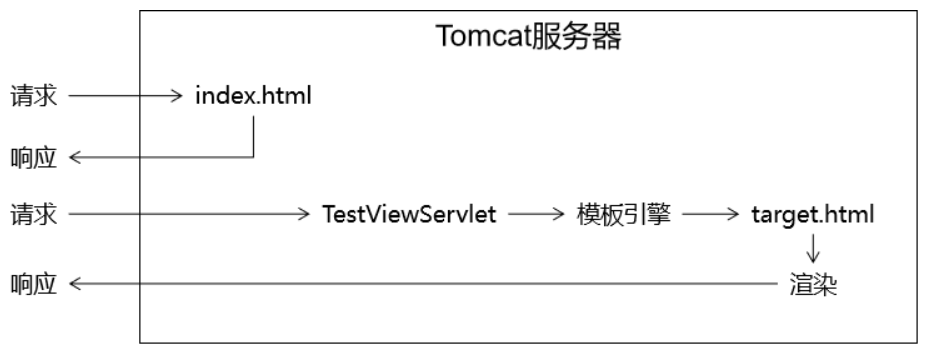
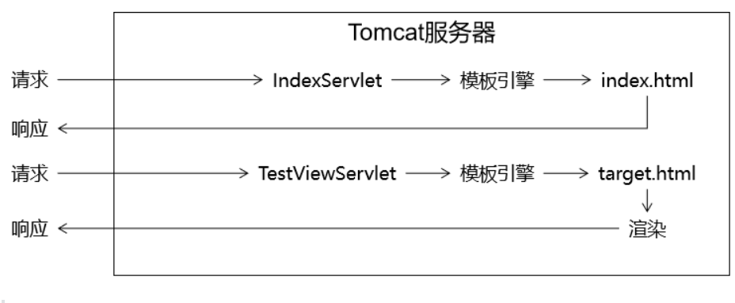

# 1. HTTP 协议

​		HTTP协议（Hyper Text Transfer Protocol，超文本传输协议），是一个客户端请求和响应的标准协议，这个协议详细规定了浏览器和万维网服务器之间互相通信的规则。用户输入地址和端口号之后可以从服务器取得所需要的网页信息。

​		通信规则规定了客户端发送给服务器的内容格式，也规定了服务器发送给客户端的内容模式。客户端发送给服务器的格式叫“**请求协议**”；服务器发送给客户端的格式叫“**响应协议**”。


## 1.1. 浏览器中的书写格式

​		服务器端资源需要通过浏览器进行，此时由浏览器将我们给出的请求解析为满足HTTP协议的格式并发出。我们发出的请求格式需要按照浏览器规定的格式来书写，在浏览器中书写格式如下：

HTTP://127.0.0.1:8080/myweb/ser01?name=zhangsan&age=20

规则+IP+端口号+资源路径+传参**（可有可不有）**


## 1.2. HTTP 协议的特点

1. ==支持客户/服务器模式。==

2. ==简单快速==：客户向服务器请求服务时，只需传送请求方法和路径。请求方法常用的 有 GET、POST。每种方法规定了客户与服务器联系类型不同。由于 HTTP 协议简单，使得HTTP服务器的程序规模小，因而通信速度很快。

3. ==灵活==：HTTP 允许传输任意类型的数据对象。传输的类型由Content-Type加以标记。

4. ==无连接==：无连接是表示每次连接只处理一个请求。服务器处理完客户的请求，并收到客户的应答后，即断开连接。采用这种方式可以节省传输时间。

   HTTP1.1 版本后支持可持续连接。通过这种连接，就有可能在建立一个 TCP 连接后，发送请求并得到回应，然后发送更多的请求并得到更多的回应。通过把建立和释放 TCP 连接的开销分摊到多个请求上，则对于每个请求而言，由于 TCP 而造成的相对开销被大大地降低了。而且， 还可以发送流水线请求,也就是说在发送请求 1 之后的回应到来之前就可以发送请求 2。也可以认为，一次连接发送多个请求，由客户机确认是否关闭连接，而服务器会认为这些请求分别来自不同的客户端。

5. ==无状态==：HTTP 协议是无状态协议。无状态是指协议对于事务处理没有记忆能力。缺少状态意味着如果后续处理需要前面的信息，则它必须重传，这样可能导致每次连接传送的数据量增大。另一方面，在服务器不需要先前信息时它的应答就较快。


## 1.3. HTTP 之 URL

​		HTTP（超文本传输协议）是一个基于请求和响应模式的、应用层的协议，常基于TCP的连接方式。绝大多数的web开发都是构建在HTTP协议之上的web应用。

​		HTTP URL （URL是一种特殊的URI，包含了用于查找某个资源的足够的信息）的格式。

```
http://host[:port]/[abc_path]
```

```
http://IP(主机/域名):端口/访问的资源路径
```

- http 表示要通过 HTTP 协议来定位网络资源;
- host 表示合法的 Internet 主机域名或者 IP 地址;
- port 指定一个端口号，为空则使用缺省端口 80；
- abs_path 指定请求资源的 URI ; 如果 URL 中没有给出 abs_path，那么当它作为请求 URI 时，必须以“/”的形式给出，通常这个工作浏览器自动帮我们完成。


## 1.4. HTTP 请求

​		HTTP 请求由三部分组成，分别是：请求行、请求头、请求正文。

​		1.GET请求（没有请求体）

​		2.POST请求

**格式**

```html
请求行
请求头1
请求头2
···
请求空行
请求体
```

请求行以一个方法符号开头，以空格分开，后面跟着请求的 URI 和协议的版本。

格式如下：Method Request-URI HTTP-Version CRLF

Method 表示请求方法;

Request-URI 是一个统—资源标识符;

HTTP-Version 表示请 求的 HTTP 协议版本；

CRLF 表示回车和换行;


## 1.5. HTTP响应

​		在接收和解释请求消息后，服务器返回一个 HTTP 响应消息。HTTP 响应也是由三个部分组成，分别是：状态行、消息报头、响应正文。


**格式**

```
状态行
响应头1
响应头2
……
响应空体
响应体
```


## 1.6. 消息头

​		HTTP 消息由客户端到服务器的请求和服务器到客户端的响应组成。请求消息和响应消息都是由开始行（对于请求消息，开始行就是请求行，对于响应消息，开始行就是状态行），消息报头（可选），空行（只有 CRLF 的行），消息正文（可选）组成。

​		每个消息报头域都是由==名字+":"+空格+值==组成，消息报头域的名字是大小写无关的。

**请求头**

​		请求报头允许客户端向服务器端传递请求的附加信息以及客户端自身信息。

- ==Referer==：该请求头指明请求从哪里来。

  ​		如果是地址栏中输入地址访问的都没有该请求头地址栏输入地址，通过请求可以看到，此时多了一个 Referer 的请求头，并且后面的值为该请求从哪里发出。比如：百度竞价，只能从百度来的才有效果，否则不算；通常用来做统计工作、防盗链。

**响应头**

​		响应报头允许服务器传递不能放在状态行中的附加响应信息，以及关于服务器的信息和对 Request-URI 所标识的资源进行下一步访问的信息。


- ==Location==：Location响应报头域用于重定向接收者到一个新的位置。

  ​						  Location响应报头域，常用在更换域名的时候。

  ```java
  response.sendRedirect("http://www.baidu.com");
  ```

- ==Refresh==：自动跳转（单位是秒），可以在页面通过 meta 标签实现，也可以在后台实现。

  ```html
  <meta http-equiv="refresh" content="3;url=http://www.baidu.com"
  ```


## 1.7. 会话

### 1.7.1. 会话跟踪技术

- 客户端第一次发请求给服务器，服务器获取 `session`，获取不到，则会创建新的，然后响应给客户端
- 下一次客户端给服务器发请求时，会把 `session ID` 带给服务器，服务器获取到进行判断从而区分客户端
- 常用的 API：
  - `request.getSession()`获取当前的会话，没有则创建一个新的会话
  - `request.getSession(true)`效果和不带参相同
  - `request.getSession(false)`获取当前会话，没有则返回`null`，不会创建新的
  - `session.getId()`获取`sessionID`
  - `session.isNew()`判断当前session是否新的
  - `session.getMaxInactiveInterval()`session的非激活间隔时长，默认 1800秒
  - `session.setMaxInactiveInterval()`设置session的非激活间隔时长
  - `session.invalidate()`强制性让会话失效
  - ······


### 1.7.2. session 保存作用域

- session保存作用域是和具体的某一个session对应的
- 常用的API：
  - `void session.setAttribute(k,v)
    ` 
  - `Object session.getAttribute(k)
     `   
  - `void removeAttribute(k)`


### 1.7.3. 内部转发以及重定向

1） 服务器内部转发 : `request.getRequestDispatcher("...").forward(request,response);`

一次请求响应的过程，对于客户端而言，内部经过了多少次转发，客户端是不知道的
**地址栏没有变化**

2） 客户端重定向： `response.sendRedirect("....");`

两次请求响应的过程。客户端肯定知道请求`URL`有变化
**地址栏有变化**


# 2. Servlet

## 2.1. 设置编码

 tomcat 8 之前，设置编码：

- `get`请求方式：

  `get`方式目前不需要设置编码（基于tomcat 8）

  如果是`get`请求发送的中文数据，转码稍微有点麻烦（在 tomcat 8之前）
  `String fname = request.getParameter("fname");`

  1. 将字符串打散成字节数组
     `byte[] bytes = fname.getBytes("ISO-8859-1");`
  2. 将字节数组按照设定的编码重新组装成字符串
     `fname = new String(bytes,"UTF-8");`

- `post`请求方式：

  从 tomcat 8开始，设置编码，只需要针对`post`方式
  ` request.setCharacterEncoding("UTF-8");`

  **注意：需要注意的是，设置编码(`post`)这一句代码必须在所有的获取参数动作之前**


## 2.2. Servlet 的继承关系

**重点查看的是服务方法`service()`**


1. 继承关系

   `javax.servlet.Servlet`接口
   `javax.servlet.GenericServlet`抽象类
   `javax.servlet.http.HttpServlet`抽象子类

   

2. 相关方法

   1. `javax.servlet.Servlet`接口：

      - `void init(config)` -> 初始化方法

      - `void service(request, response)` -> 服务方法

      - `void destory()` -> 销毁方法

   

   2. `javax.servlet.GenericServlet`抽象类：

      - `void service(request,response)` -> 仍然是抽象的

      

   3. `javax.servlet.http.HttpServlet` 抽象子类：

      `void service(request, response)` -> 不是抽象的

      

      1. `String method = req.getMethod();` 获取请求的方式

      2. 各种`if`判断，根据请求方式不同，决定去调用不同的`do`方法

         ```java
         if (method.equals("GET")) {
                     this.doGet(req,resp);
                 } else if (method.equals("HEAD")) {
                     this.doHead(req, resp);
                 } else if (method.equals("POST")) {
                     this.doPost(req, resp);
                 } else if (method.equals("PUT")) {
         ```

         

      3. 在`HttpServlet`这个抽象类中，`do`方法都差不多:

         ```java
         protected void doGet(HttpServletRequest req, HttpServletResponse resp) throws ServletException, IOException {
         	String protocol = req.getProtocol();
             String msg = lStrings.getString("http.method_get_not_supported");
             if (protocol.endsWith("1.1")) {
                 resp.sendError(405, msg);
             } else {
                 resp.sendError(400, msg);
             }
         }
         ```

         

3. 小结

   1. 继承关系： `HttpServlet` -> `GenericServlet` -> `Servlet`

   2. Servlet中的核心方法：

      1. `init()`
      2. `service()`
      3. `destroy()`

   3. 服务方法： 当有请求过来时，`service` 方法会自动响应（其实是 tomcat 容器调用的）

      在`HttpServlet`中我们会去分析请求的方式：到底是`get`、`post`、`head`还是`delete`等等

      然后再决定调用的是哪个`do`开头的方法

      那么在`HttpServlet`中这些`do`方法默认都是`405`的实现风格 - 要我们子类去实现对应的方法，否则默认会报`405`错误

   4. 因此，我们在新建`Servlet`时，我们才会去考虑请求方法，从而决定**重写**哪个`do`方法


## 2.3. 生命周期

1. 生命周期：从出生到死亡的过程。对应 Servlet 中的三个方法：`init()`,`service()`,`destroy()`

2. 默认情况下：

   第一次收到请求时，这个 Servlet 会进行实例化（调用构造方法）、初始化（调用`init()`）、然后服务（调用`service()`）

   从第二次请求开始，每一次都是服务

   当容器关闭时，其中的所有 servlet 实例会被销毁，调用销毁方法

3. 通过案例发现：

   

   

   

   - Servlet 实例 tomcat 终会创建一个，所有请求都是这个实例去响应

   - 默认情况下，第一次请求时，tomcat 才会去实例化，初始化，然后服务

     好处是提高系统启动速度

     缺点是 第一次请求时，耗时较长

   - 因此得出结论： 如果需要提高系统的启动速度，当前默认情况就是这样。如果需要提高响应速度，我们应该设置Servlet的初始化时机。

4. Servlet的初始化时机：

   

   

   - 默认是第一次接收请求时，实例化，初始化
   - 我们可以通过`<load-on-startup>`来设置servlet启动的先后顺序,数字越小，启动越靠前，最小值`0`

5. Servlet在容器中是：单例的、线程不安全的

   - 单例：所有的请求都是同一个实例去响应
   - 线程不安全：一个线程需要根据这个实例中的某个成员变量值去做逻辑判断。但是在中间某个时机，另一个线程改变了这个成员变量的值，从而导致第一个线程的执行路径发生了变化
   - 我们已经知道了 servlet 是线程不安全的，给我们的启发是： 尽量的不要在servlet中定义成员变量。
   - 如果不得不定义成员变量，那么不要去：
     - ①不要去修改成员变量的值 
     - ②不要去根据成员变量的值做一些逻辑判断


### 2.4.1. init()，init(config)

```java
public void init(ServletConfig config) throws ServletException {
	this.config = config;
	this.init();
}
```

```java
public void init() throws ServletException {

}
```

需要在初始化时获取一些自定义的操作，可以去重写无参的`init()`方法

通过`getConfig()`获取`ServletCOnfig`对象

通过`config.getInitParameter()`获取初始化参数


通过`ServletContext`获取配置的上下文参数


## 2.4. 保存作用域

原始情况下，保存作用域我么可以认为有四个：

- page：页面级别（现在几乎不用）
- request：一次请求响应范围
- session：一次会话范围有效
- application：一次应用程序范围有效（tomcat 启动到停止）


## 2.5. XML 文件

1. 概念：

   - HTML：超文本标记语言
   - XML：可扩展的标记语言

   HTML是XML的一个子集
   
   编写XML就是编写标签，与HTML非常类似，扩展名.xml
   
   良好的人机可读性：
   
   ```xml
   <employee>
   	<name>李四</name>
   	<age>18</age>
   	<height>177</height>
   </employee>
   ```
   
   


2. XML 包含三个部分

   - XML 声明，必须在 XML 文件第一行的位置

     ```xml
     <?xml version="1.0" encoding="utf-8"?>
     ```

   - DTD 文档类型定义

   - XML 正文 


3. XML与HTML的比较

   1. XML与HTML非常相似,都是编写标签
   2. XML没有预定标签,HTML存在大量预定义标签
   3. XML重点在保存与传输数据,HTML用于显示信息

   ```html
   <body>
   	<a href="index.html">首页</a>
   </body>
   ```

   ```xml
   <school>
   	<class no="G3N1">
   		<grade>六年级</grade>
   		<name>3班</name>
   	</class>
   	<class no="G3N2">
   		<grade>三年级</grade>
   		<name>4班</name>
   	</class>
   </school>
   ```


4. xml用途
   1. 程序的配置描述文件
   2. 保存程序产生的数据
   3. 网络间数据传输格式


## 2.6. MVC

MVC： Model（模型）、 View（视图）、 Controller（控制器）

视图层：用于做展示以及和用户交互的一个界面

控制层：能够接受客户端的请求，具体业务功能还是需要借助于模型组件完成

模型层：模型分为很多层：有比较简单的pojo（Plain Ordinary Java Object）、vo（value object）、有业务模型组件、有数据访问层组件

- pojo/vo：值对象
- DAO：数据访问对象
- BO：业务对象


DAO中的方法都是单精度方法（或者称作细粒度方法）。一个方法只考虑一个操作，例如：添加就是insert操作，查询就是select操作……

BO中的方法属于业务方法，而实际的业务是比较复杂的，因此业务方法的粒度是比较粗的。


## 2.7. IOC

IOC（Inversion of Control 控制反转）

对象放在容器中，统一分配


1. 耦合/依赖

   依赖指的是某某某离不开某某某
   
   在软件系统中，层与层之间是存在依赖的。我们也称之为**耦合**。
   
   我们系统架构或者是设计的一个原则是：**高内聚低耦合**。
   
   层内部的组成应该是高度聚合的，而层与层之间的关系应该是低耦合的，最理想的情况`0`耦合（就是没有耦合）


2. ioc -> 控制反转 / DI -> 依赖注入

   - 控制反转

     之前在Servlet中，我们创建service对象 ， `FruitService fruitService = new FruitServiceImpl();`

     这句话如果出现在 servlet 中的某个方法内部，那么这个`fruitService`的作用域（生命周期）应该就是这个方法级别；

     如果这句话出现在 servlet 的类中，也就是说`fruitService`是一个成员变量，那么这个`fruitService`的作用域（生命周期）应该就是这个 servlet 实例级别

     之后我们在==applicationContext.xml==中定义了这个`fruitService`。然后通过解析 XML，产生`fruitService`实例，存放在`beanMap`中，这个`beanMap`在一个`BeanFactory`中

     因此，我们转移（改变）了之前的`service`实例、`dao`实例等等他们的生命周期。

     **控制权从程序员转移到`BeanFactory`。这个现象我们称之为控制反转**

   - 依赖注入

     ​		之前我们在控制层出现代码：`FruitService fruitService = new FruitServiceImpl();`

     那么，控制层和service层存在耦合。

     ​		之后，我们将代码修改成`FruitService fruitService = null;`

     然后，在配置文件中配置：

     ```xml
     <bean id="fruit" class="FruitController">
     	<property name="fruitService" ref="fruitService"/>
     </bean>
     ```


# 3. thymeleaf

## 3.1. 导入依赖

1. `pom.xml`中加入 MySQL 数据库驱动和 thymeleaf 依赖

   ```xml
   <dependency>
   	<groupId>mysql</groupId>
   	<artifactId>mysql-connector-java</artifactId>
   	<version>5.1.45</version>
   </dependency>
   <dependency>
   	<groupId>org.thymeleaf</groupId>
   	<artifactId>thymeleaf</artifactId>
   	<version>3.0.12.RELEASE</version>
   </dependency>
   ```

**或者**

2. 导入相应得jar包


## 3.2. 配置上下文参数

在`web.xml`中加入

```xml
<!-- 在上下文参数中配置视图前缀和视图后缀 -->
<context-param>
    <param-name>view-prefix</param-name>
    <param-value>/</param-value>
</context-param>
<context-param>
    <param-name>view-suffix</param-name>
    <param-value>.html</param-value>
</context-param>
```

说明：param-value中设置的前缀、后缀的值不是必须叫这个名字，可以根据实际情况和需求进行修改。

> 为什么要放在WEB-INF目录下？
>
> 原因：WEB-INF目录不允许浏览器直接访问，所以我们的视图模板文件放在这个目录下，是一种保护。以免外界可以随意访问视图模板文件。
>
> 访问WEB-INF目录下的页面，都必须通过Servlet转发过来，简单说就是：不经过Servlet访问不了。
>
> 这样就方便我们在Servlet中检查当前用户是否有权限访问。
>
> 那放在WEB-INF目录下之后，重定向进不去怎么办？
>
> 重定向到Servlet，再通过Servlet转发到WEB-INF下。


## 3.3. 创建 Servlet 基类

```java
import org.thymeleaf.TemplateEngine;
import org.thymeleaf.context.WebContext;
import org.thymeleaf.templatemode.TemplateMode;
import org.thymeleaf.templateresolver.ServletContextTemplateResolver;

import javax.servlet.ServletContext;
import javax.servlet.ServletException;
import javax.servlet.http.HttpServlet;
import javax.servlet.http.HttpServletRequest;
import javax.servlet.http.HttpServletResponse;
import java.io.IOException;

public class ViewBaseServlet extends HttpServlet {

    private TemplateEngine templateEngine;

    @Override
    public void init() throws ServletException {

        // 1.获取ServletContext对象
        ServletContext servletContext = this.getServletContext();

        // 2.创建Thymeleaf解析器对象
        ServletContextTemplateResolver templateResolver = new ServletContextTemplateResolver(servletContext);

        // 3.给解析器对象设置参数
        // ①HTML是默认模式，明确设置是为了代码更容易理解
        templateResolver.setTemplateMode(TemplateMode.HTML);

        // ②设置前缀
        String viewPrefix = servletContext.getInitParameter("view-prefix");

        templateResolver.setPrefix(viewPrefix);

        // ③设置后缀
        String viewSuffix = servletContext.getInitParameter("view-suffix");

        templateResolver.setSuffix(viewSuffix);

        // ④设置缓存过期时间（毫秒）
        templateResolver.setCacheTTLMs(60000L);

        // ⑤设置是否缓存
        templateResolver.setCacheable(true);

        // ⑥设置服务器端编码方式
        templateResolver.setCharacterEncoding("utf-8");

        // 4.创建模板引擎对象
        templateEngine = new TemplateEngine();

        // 5.给模板引擎对象设置模板解析器
        templateEngine.setTemplateResolver(templateResolver);

    }

    protected void processTemplate(String templateName, HttpServletRequest req, HttpServletResponse resp) throws IOException {
        // 1.设置响应体内容类型和字符集
        resp.setContentType("text/html;charset=UTF-8");

        // 2.创建WebContext对象
        WebContext webContext = new WebContext(req, resp, getServletContext());

        // 3.处理模板数据
        templateEngine.process(templateName, webContext, resp.getWriter());
    }
}
```


## 3.4. index 页面

`index.html`

```html
<!DOCTYPE html>
<html lang="en" xmlns:th="http://www.thymeleaf.org">
<head>
    <meta charset="UTF-8">
    <title>Title</title>
</head>
<body>
<div id="div_container">
    <div id="div_fruit_list">
        <table id="t_fruit">
            <tr>
                <th class="w20">名称</th>
                <th class="w20">单价</th>
                <th class="w20">库存</th>
                <th>操作</th>
            </tr>
            <tr th:if="${#lists.isEmpty(session.fruitList)}">
                <td colspan="4">对不起，库存为空！</td>
            </tr>
            <tr th:unless="${#lists.isEmpty(session.fruitList)}" th:each="fruit : ${session.fruitList}">
                <td th:text="${fruit.fname}">苹果</td>
                <td th:text="${fruit.price}">5</td>
                <td th:text="${fruit.fcount}">20</td>
                <td></td>
            </tr>
        </table>
    </div>
</div>
</body>
</html>
```


## 3.5. 创建 servlet 类

创建的 `IndexServlet` 类继承 `ViewBaseServlet` 基类

```java
package person.cls.thymeleaf.fruit.servlets;

import person.cls.thymeleaf.fruit.dao.impl.FruitDAOImpl;
import person.cls.thymeleaf.fruit.pojo.Fruit;
import person.cls.thymeleaf.fruit.servlets.base.ViewBaseServlet;

import javax.servlet.ServletException;
import javax.servlet.annotation.WebServlet;
import javax.servlet.http.HttpServletRequest;
import javax.servlet.http.HttpServletResponse;
import javax.servlet.http.HttpSession;
import java.io.IOException;
import java.util.List;

/**
 * @description: TODO
 * @author: CLS
 * @date: 2022-06-14-9:41
 * @version: 1.0
 */
@WebServlet("/index")
public class IndexServlet extends ViewBaseServlet {

    @Override
    protected void doGet(HttpServletRequest req, HttpServletResponse resp) throws ServletException, IOException {

        FruitDAOImpl fruitDAO = new FruitDAOImpl();
        List<Fruit> fruitList = fruitDAO.getFruitList();

        HttpSession session = req.getSession();
        session.setAttribute("fruitList", fruitList);

        processTemplate("index", req, resp);

    }
}
```


`processTemplate()`方法会渲染路径`/index.html`的页面，这个是加上`web.xml`中配置的前、后缀。


## 3.6. thymeleaf 基本语法

### 3.6.1. th 的名称空间




### 3.6.2. 表达式语法

#### 1、修改标签文本值

```html
<p th:text="新值">
    原始值
</p>
```

**①th:text作用**

- 不经过服务器解析，直接用浏览器打开HTML文件，看到的是『标签体原始值』
- 经过服务器解析，Thymeleaf引擎根据th:text属性指定的『标签体新值』去**替换**『标签体原始值』

**②字面量**

『字面量』是一个经常会遇到的概念，我们可以对照『变量』来理解它的含义。

```java
// a是变量，100是字面量
int a = 100;
System.out.println("a = " + a);
```

- 变量：变量名字符串本身不是它的值，它指向的才是它的值
- 字面量：它就是字面上的含义，我们从『字面』上看到的直接就是它的值

现在我们在th:text属性中使用的就是『字面量』，它**不指代任何其他值**。


#### 2、修改指定属性值

```html
<input type="text" name="username" th:value="新值" value="旧值" />
```

语法：任何HTML标签原有的属性，前面加上`th`就可以用 thymeleaf 来设定新值。


#### 3、解析URL地址

**①基本语法**

```html
<p th:text="@{/aaa/bbb/ccc}">标签体原始值</p>
```

经过解析后得到：

> /view/aaa/bbb/ccc

所以`@{}`的作用是**在字符串前附加『上下文路径』**

> 这个语法的好处是：实际开发过程中，项目在不同环境部署时，Web应用的名字有可能发生变化。所以上下文路径不能写死。而通过`@{}`动态获取上下文路径后，不管怎么变都不怕啦！

②首页使用URL地址解析



如果我们直接访问index.html本身，那么index.html是不需要通过Servlet，当然也不经过模板引擎，所以index.html上的Thymeleaf的任何表达式都不会被解析。

解决办法：通过Servlet访问index.html，这样就可以让模板引擎渲染页面了：



> 进一步的好处：
>
> 通过上面的例子我们看到，所有和业务功能相关的请求都能够确保它们通过Servlet来处理，这样就方便我们统一对这些请求进行特定规则的限定。

**③给URL地址后面附加请求参数**

参照官方文档说明：

> - We are allowed to use expression for URL parameters (as you can see in `orderId=${o.id}`). The required URL-parameter-encoding operations will also be automatically performed.
> - If several parameters are needed, these will be separated by commas: `@{/order/process(execId=${execId},execType='FAST')}`


#### 4、直接执行表达式

Servlet代码：

```java
request.setAttribute("reqAttrName", "<span>hello-value</span>");
```

页面代码：

```html
<p>有转义效果：[[${reqAttrName}]]</p>
<p>无转义效果：[(${reqAttrName})]</p>
```

执行效果：

```html
<p>有转义效果：&lt;span&gt;hello-value&lt;/span&gt;</p>
<p>无转义效果：<span>hello-value</span></p>
```


# 4. 过滤器filter

**Filter也属于Servlet规范**

开发步骤：

1. 新建类实现Filter接口，然后其中有三个方法：`init()`、`doFilter()`、`destroy()`
2. 配置Filter，使用注解`@WebFilter`，或者使用过 XML 文件`<filter><filter-mapping>`
3. 放行`filterChain.doFilter(req, resp);`


过滤器链：

1. 注解执行顺序：按照全类名的先后顺序
2. xml执行顺序：按照配置的先后顺序


# 5. 事务管理


