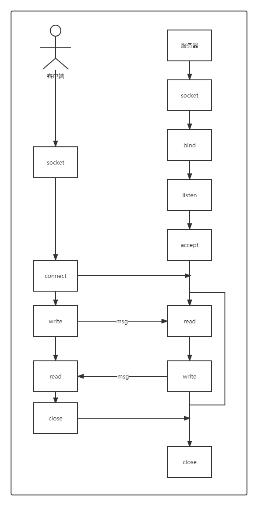
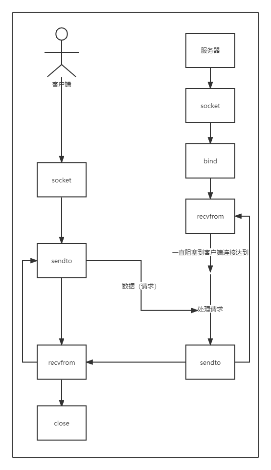
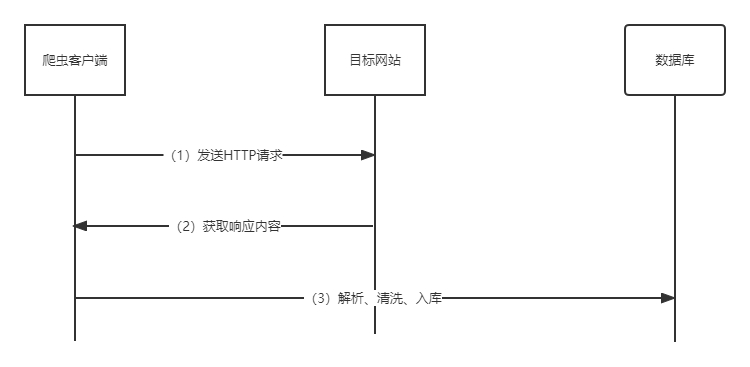
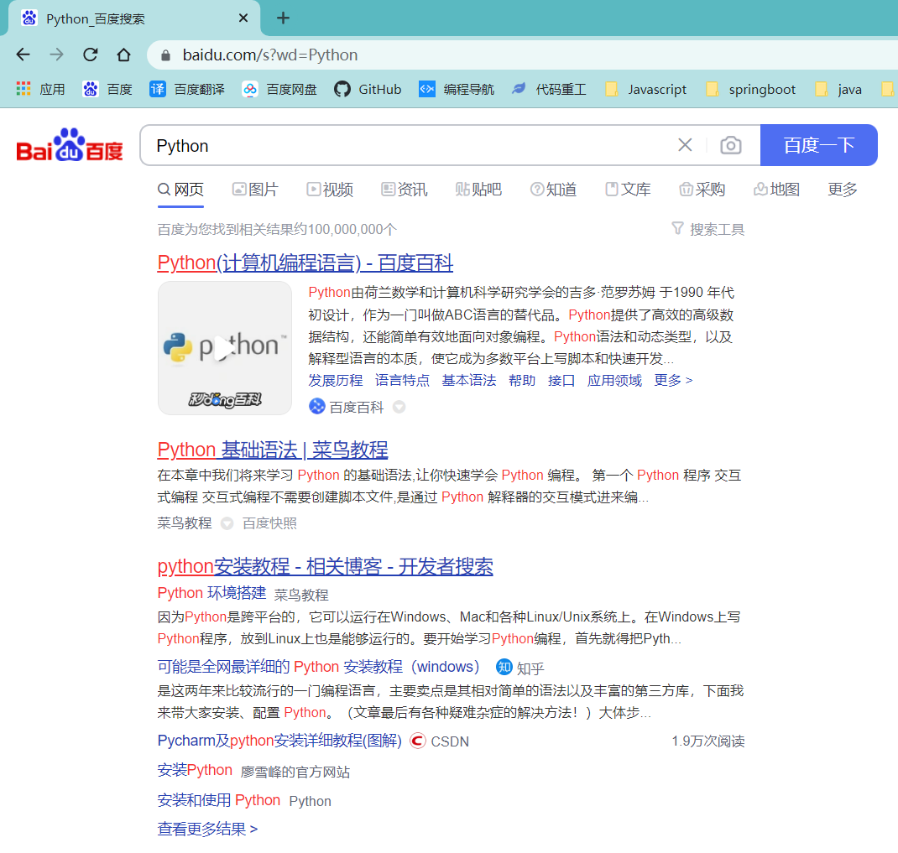
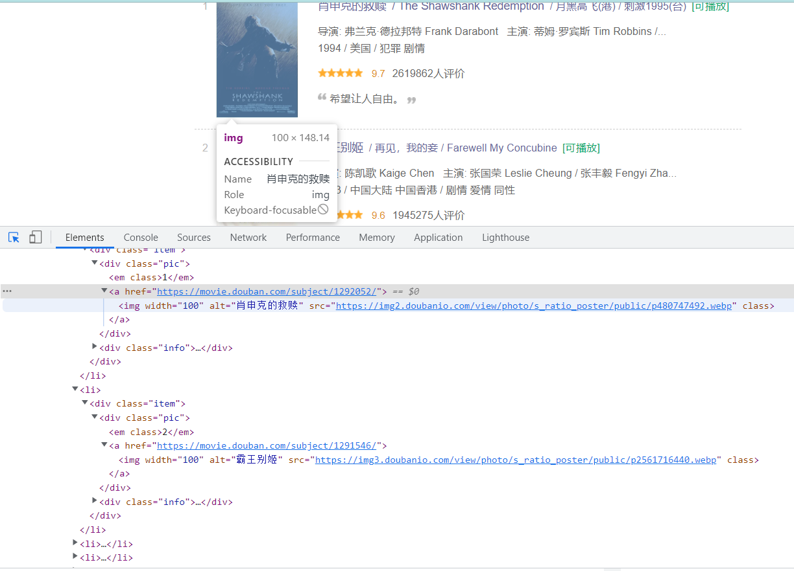

#  1. python 简介

## 1.1. Python 前世今生

Python 是著名的 “龟叔” Guido van Rossum（吉多·范·罗苏姆）在1989年圣诞节期间，为了打发无聊的圣诞节而编写的一个编程语言。

Python 语言目前已经超过27岁了，它早于HTTP 1.0 协议 5年，早于Java语言 4年。

Python 语言被吉多作为是ABC语言的一种继承，但坚决摒弃ABC语言的封闭性，走开源路线。在 Python 语言问世的时候，他在互联网上公开了源代码，让世界上更多喜欢 Python 的程序员，对 Python 进行不断的功能完善。这也就为后来 Python 的蓬勃发展奠定了坚实的基础。

现如今Python 是由一个核心开发团队在维护，吉多仍然占据着至关重要的作用，指导其进展。而在全世界程序员不断的改进和完善下，Python现今已经成为最受欢迎的程序设计语言之一。


## 1.2. Python 特点

- **Python 是一种解释型语言：** 这意味着开发过程中没有了编译这个环节。类似于PHP和Perl语言。
- **Python 是交互式语言：** 这意味着，您可以在一个 Python 提示符 **>>>** 后直接执行代码。
- **Python 是面向对象语言:** 这意味着Python支持面向对象的风格或代码封装在对象的编程技术。
- **Python 是初学者的语言：**Python 对初级程序员而言，是一种伟大的语言，它支持广泛的应用程序开发，从简单的文字处理到 WWW 浏览器再到游戏。
- 等等。。。最重要的一点**简单易学**


## 1.3. Python 用途

python **的应用领域**


## 1.4. Python 2.x 与 3.x 版本区别

Python 的 3.0 版本，常被称为 Python 3000，或简称 Py3k。相对于 Python 的早期版本，这是一个较大的升级。

为了不带入过多的累赘，Python 3.0 在设计的时候==没有考虑向下相容==。

许多针对早期 Python 版本设计的程式都无法在 Python 3.0 上正常执行。

为了照顾现有程式，Python 2.6 作为一个**过渡版本**，基本使用了 Python 2.x 的语法和库，同时考虑了向 Python 3.0 的迁移，允许使用部分 Python 3.0 的语法与函数。

新的 Python 程式建议使用 Python 3.0 版本的语法。

除非执行环境无法安装 Python 3.0 或者程式本身使用了不支援 Python 3.0 的第三方库。目前不支持 Python 3.0 的第三方库有 Twisted, py2exe，PIL等。

大多数第三方库都正在努力地相容 Python 3.0 版本。即使无法立即使用 Python 3.0，也建议编写相容 Python 3.0 版本的程式，然后使用 Python 2.6， Python 2.7 来执行。

[Python官网](https://www.python.org/)


## 1.5. 学习 python 方法

- **基础语法**：了解 Python 的数据类型、变量、判断、函数、类等等，夯实基础。
- **积极实践**：“拳不离手，曲不离口”，使用 python 做练习题，提高编程水平
- **遵守规范**：建议使用Python编程的开发者，都应遵循PEP8规范
- **自主学习**：DIY！！！
- **善于交流**：积极主动的和其他学习者交流，取长补短。


# 2. 安装Python环境

## 2.1. 选择版本

python有最小化的常规版本以及发行版本。

anaconda 是一个python的发行版，包括了python和很多常见的软件库, 和一个包管理器conda。


> 1、anaconda里面集成了很多关于python科学计算的第三方库，主要是安装方便，而python是一个编译器，如果不使用anaconda，那么安装起来会比较痛苦，各个库之间的依赖性就很难连接的很好。
>
> 2、常见的科学计算类的库都包含在里面了，使得安装比常规python安装要容易。


清华大学开源软件镜像站

https://mirrors.tuna.tsinghua.edu.cn/anaconda/archive/


https://plugins.zhile.io


## 2.2. 安装anaconda


## 2.3. 配置环境变量


**此电脑（鼠标右键）——属性——高级系统设置——环境变量——path——编辑——新建**


> D:\ProgramData\Anaconda3
>
> D:\ProgramData\Anaconda3\Scripts
>
> D:\ProgramData\Anaconda3\Library\bin
>
> D:\ProgramData\Anaconda3\Library\usr\bin
>
> D:\ProgramData\Anaconda3\Library\mingw-w64\bin


## 2.4. 检验配置


按下**win+r**输入cmd进入cmd窗口

输入`python`，出现以下画面，**安装成功**


## 2.5. 添加镜像


打开**Anaconda Prompt (Anaconda3)**


```sh
conda config --add channels https://mirrors.tuna.tsinghua.edu.cn/anaconda/pkgs/free/
```


```sh
conda config --add channels https://mirrors.tuna.tsinghua.edu.cn/anaconda/pkgs/main/
```


```sh
conda config --show channels
```


# 3. 第一个python程序

## 3.1. hello world

```python
print("Hello World")
```

print 默认是换行，需要加上`end=''`不进行换行

```python
print("你好"，end='')
print(",我今年三岁")
```

输出多个（逗号分隔大的位置是空格）

```python
print("hello","world")
```


## 3.2. hello world进阶

格式化输出

```python
name = input("请输入姓名")
age = input("请输入年龄")
print("我的名字是：{0},我今年{1}岁了".format(name,age) )
```


## 3.3. 输入

```python
var = input() # input返回的结果是字符串
```

显示一个字符串来提示用户

```python
var = input("请输入：")
```


# 4. python基础

## 4.1. 数据类型和变量

​		计算机顾名思义就是可以做数学计算的机器，因此，计算机程序理所当然地可以处理各种数值。但是，计算机能处理的远不止数值，还可以处理文本、图形、音频、视频、网页等各种各样的数据，不同的数据，需要定义不同的数据类型。在Python中，能够直接处理的数据类型有以下几种：

- 整数：

  Python可以处理任意大小的整数，当然包括负整数，在程序中的表示方法和数学上的写法一模一样，例如：`1`，`100`，`-8080`，`0`，等等。

  计算机由于使用二进制，所以，有时候用十六进制表示整数比较方便，十六进制用`0x`前缀和0-9，a-f表示，例如：`0xff00`，`0xa5b4c3d2`，等等。

  对于很大的数，例如`10000000000`，很难数清楚0的个数。Python允许在数字中间以`_`分隔，因此，写成`10_000_000_000`和`10000000000`是完全一样的。十六进制数也可以写成`0xa1b2_c3d4`。

- 浮点数：

  浮点数也就是小数，之所以称为浮点数，是因为按照科学记数法表示时，一个浮点数的小数点位置是可变的，比如，1.23x10^8和12.3x108是完全相等的。浮点数可以用数学写法，如`1.23`，`3.14`，`-9.01`，等等。但是对于很大或很小的浮点数，就必须用科学计数法表示，把10用e替代，1.23x109就是`1.23e9`，或者`12.3e8`，0.000012可以写成`1.2e-5`，等等。

  整数和浮点数在计算机内部存储的方式是不同的，整数运算永远是精确的（**除法难道也是精确的？是的！**），而浮点数运算则可能会有四舍五入的误差。

- 字符串：

  字符串是以单引号`'`或双引号`"`括起来的任意文本，比如`'abc'`，`"xyz"`等等。请注意，`''`或`""`本身只是一种表示方式，不是字符串的一部分，因此，字符串`'abc'`只有`a`，`b`，`c`这3个字符。如果`'`本身也是一个字符，那就可以用`""`括起来，比如`"I'm OK"`包含的字符是`I`，`'`，`m`，空格，`O`，`K`这6个字符。

  如果字符串内部既包含`'`又包含`"`怎么办？可以用转义字符`\`来标识，比如：

  ```python
  'I\'m \"OK\"!'
  ```

  表示的字符串内容是：

  

  转义字符`\`可以转义很多字符，比如`\n`表示换行，`\t`表示制表符，字符`\`本身也要转义，所以`\\`表示的字符就是`\`，可以在Python的交互式命令行用`print()`打印字符串看看：

  ```python
  print('\\\n\\')
  
  print('I\'m learning\nPython.')
  ```

  如果字符串里面有很多字符都需要转义，就需要加很多`\`，为了简化，Python还允许用`r''`表示`''`内部的字符串默认不转义，可以自己试试：

  ```python
  print('\\\t\\')
  print(r'\\\t\\')
  ```

  如果字符串内部有很多换行，用`\n`写在一行里不好阅读，为了简化，Python允许用`'''...'''`的格式表示多行内容，可以自己试试：

  ```python
  print('''line1
  ... line2
  ... line3''')
  ```

  

- 布尔值：

  布尔值和布尔代数的表示完全一致，一个布尔值只有`True`、`False`两种值，要么是`True`，要么是`False`，在Python中，可以直接用`True`、`False`表示布尔值（请注意大小写），也可以通过布尔运算计算出来：

  ```python
  >>> True
  True
  >>> False
  False
  >>> 3 > 2
  True
  >>> 3 > 5
  False
  ```

  布尔值可以用`and`、`or`和`not`运算。

  `and`运算是与运算，**只有所有都为`True`**，`and`运算结果才是`True`：

  ```python
  >>> True and True
  True
  >>> True and False
  False
  >>> False and False
  False
  >>> 5 > 3 and 3 > 1
  True
  ```

  `or`运算是或运算，**只要其中有一个为`True`**，`or`运算结果就是`True`：

  ```python
  >>> True or True
  True
  >>> True or False
  True
  >>> False or False
  False
  >>> 5 > 3 or 1 > 3
  True
  ```

  `not`运算是非运算，它是一个单目运算符，把`True`变成`False`，`False`变成`True`：

  ```python
  >>> not True
  False
  >>> not False
  True
  >>> not 1 > 2
  True
  ```

  布尔值经常用在条件判断中，比如：

  ```python
  if age >= 18:
      print('adult')
  else:
      print('teenager')
  ```

- 逻辑运算符：

  - and：x and y （如果 x 为False，无需计算 y 的值，返回值为 x；否则返回 y 的值）

  - or：x or y （如果 x 为True，无需计算 y 的值，返回为x；否则返回 y 的值）

  - not：not （如果 x 为True，返回值为False；如果 x 为False）

    ```python
    print(3 - 3 and 3 < 6)  Flase  0
    print(3 < 6 and 3 + 5)
    print(1 + 2 or 3 < 6)
    print(3 < 6 or 3 + 5)
    print(not 3 > 6)
    ```

    

- 空值：

  空值是Python里一个特殊的值，用`None`表示。`None`不能理解为`0`，因为`0`是有意义的，而`None`是一个特殊的空值。

  此外，Python还提供了列表、字典等多种数据类型，还允许创建自定义数据类型，我们后面会继续讲到。

- 变量：

  变量的概念基本上和初中代数的方程变量是一致的，只是在计算机程序中，变量不仅可以是数字，还可以是**任意数据类型**。

  变量在程序中就是用一个变量名表示了，变量名必须是**大小写英文、数字和`_`的组合**，且**不能用数字开头**，比如：

  ```
  a = 1
  ```

  变量`a`是一个整数。

  ```
  t_007 = 'T007'
  ```

  变量`t_007`是一个字符串。

  ```
  Answer = True
  ```

  变量`Answer`是一个布尔值`True`。

  

  在Python中，**等号`=`是赋值语句**，可以把任意数据类型赋值给变量，**同一个变量可以反复赋值**，而且可以是**不同类型**的变量，例如：

  ```python
  a = 123 # a是整数
  print(a)
  a = 'ABC' # a变为字符串
  print(a)
  ```

  **注：这种变量本身类型不固定的语言称之为*动态语言*，与之对应的是*静态语言*。**

- 常数：

  所谓常量就是不能变的变量，比如常用的数学常数π就是一个常量。在Python中，通常用全部大写的变量名表示常量：

  ```
  PI = 3.14159265359
  ```

  但事实上`PI`仍然是一个变量，Python根本没有任何机制保证`PI`不会被改变，所以，用全部大写的变量名表示常量只是一个习惯上的用法，如果你一定要改变变量`PI`的值，也没人能拦住你。

  最后解释一下整数的除法为什么也是精确的。在Python中，有两种除法，一种除法是`/`：

  ```
  >>> 10 / 3
  3.3333333333333335
  ```

  `/`除法计算结果是浮点数，即使是两个整数恰好整除，结果也是浮点数：

  ```
  >>> 9 / 3
  3.0
  ```

  还有一种除法是`//`，称为地板除，两个整数的除法仍然是整数：

  ```
  >>> 10 // 3
  3
  ```

  你没有看错，**整数的地板除`//`永远是整数**，即使除不尽。要做精确的除法，使用`/`就可以。

  因为`//`除法只取结果的整数部分，所以Python还提供一个余数运算，可以得到两个整数相除的余数：

  ```
  >>> 10 % 3
  1
  ```

  **无论整数做`//`除法还是取余数，结果永远是整数，所以，整数运算结果永远是精确的。**


小结：

​		Python支持多种数据类型，在计算机内部，可以把任何数据都看成一个“对象”，而变量就是在程序中用来指向这些数据对象的，对变量赋值就是把数据和变量给关联起来。

​		对变量赋值`x = y`是把变量`x`指向真正的对象，该对象是变量`y`所指向的。随后对变量`y`的赋值*不影响*变量`x`的指向。

​		注意：Python的整数没有大小限制，而某些语言的整数根据其存储长度是有大小限制的，例如Java对32位整数的范围限制在`-2147483648`-`2147483647`。

​		Python的浮点数也没有大小限制，但是超出一定范围就直接表示为`inf`（无限大）。


## 4.2. Python的字符串

在最新的Python 3版本中，字符串是以Unicode编码的，也就是说，Python的字符串支持多语言，例如：

```
>>> print('包含中文的str')
包含中文的str
```

对于单个字符的编码，Python提供了`ord()`函数获取字符的整数表示，`chr()`函数把编码转换为对应的字符：

```
>>> ord('A')
65
>>> ord('中')
20013
>>> chr(66)
'B'
>>> chr(25991)
'文'
```

如果知道字符的整数编码，还可以用十六进制这么写`str`：

```
>>> '\u4e2d\u6587'
'中文'
```

两种写法完全是等价的。

由于Python的字符串类型是`str`，在内存中以Unicode表示，一个字符对应若干个字节。如果要在网络上传输，或者保存到磁盘上，就需要把`str`变为以字节为单位的`bytes`。

Python对`bytes`类型的数据用带`b`前缀的单引号或双引号表示：

```
x = b'ABC'

type(x)
```

要注意区分`'ABC'`和`b'ABC'`，前者是`str`，后者虽然内容显示得和前者一样，但`bytes`的每个字符都只占用一个字节。

要计算`str`包含多少个字符，可以用`len()`函数：

```
>>> len('ABC')
3
>>> len('中文')
2
```

`len()`函数计算的是`str`的字符数，如果换成`bytes`，`len()`函数就计算字节数：

```
>>> len(b'ABC')
3
>>> len(b'\xe4\xb8\xad\xe6\x96\x87')
6
>>> len('中文'.encode('utf-8'))
6
```

可见，1个中文字符经过UTF-8编码后通常会占用3个字节，而1个英文字符只占用1个字节。

在操作字符串时，我们经常遇到`str`和`bytes`的互相转换。为了避免乱码问题，应当始终坚持使用UTF-8编码对`str`和`bytes`进行转换。

## 4.3. 字符串格式化

我们经常会输出类似`'亲爱的xxx你好！你xx月的话费是xx，余额是xx'`之类的字符串，而xxx的内容都是根据变量变化的，所以，需要一种简便的格式化字符串的方式。

在Python中，采用的格式化方式和C语言是一致的，用`%`实现，举例如下：

```
>>> 'Hello, %s' % 'world'
'Hello, world'
>>> 'Hi, %s, you have $%d.' % ('Michael', 1000000)
'Hi, Michael, you have $1000000.'
```

常见的占位符有：

| 占位符 | 替换内容     |
| :----- | :----------- |
| %d     | 整数         |
| %f     | 浮点数       |
| %s     | 字符串       |
| %x     | 十六进制整数 |

如果你不太确定应该用什么，`%s`永远起作用，它会把任何数据类型转换为字符串：

```
>>> 'Age: %s. Gender: %s' % (25, True)
'Age: 25. Gender: True'
```

有些时候，字符串里面的`%`是一个普通字符怎么办？这个时候就需要转义，用`%%`来表示一个`%`：

```
>>> 'growth rate: %d %%' % 7
'growth rate: 7 %'
```

**format()**

另一种格式化字符串的方法是使用字符串的`format()`方法，它会用传入的参数依次替换字符串内的占位符`{0}`、`{1}`……：

```
>>> 'Hello, {0}, 成绩提升了 {1:.1f}%'.format('小明', 17.125)
'Hello, 小明, 成绩提升了 17.1%'
```

**f-string**

最后一种格式化字符串的方法是使用以`f`开头的字符串，称之为`f-string`，它和普通字符串不同之处在于，字符串如果包含`{xxx}`，就会以对应的变量替换：

```
>>> r = 2.5
>>> s = 3.14 * r ** 2
>>> print(f'The area of a circle with radius {r} is {s:.2f}')
The area of a circle with radius 2.5 is 19.62
```

上述代码中，`{r}`被变量`r`的值替换，`{s:.2f}`被变量`s`的值替换，并且`:`后面的`.2f`指定了格式化参数（即保留两位小数），因此，`{s:.2f}`的替换结果是`19.62`。


## 4.4. list

Python内置的一种数据类型是列表：list。list是一种有序的集合，可以随时添加和删除其中的元素。

比如，列出班里所有同学的名字，就可以用一个list表示：

```
>>> classmates = ['Michael', 'Bob', 'Tracy']
>>> classmates
['Michael', 'Bob', 'Tracy']
```

变量`classmates`就是一个list。用`len()`函数可以获得list元素的个数：

```
>>> len(classmates)
3
```

用索引来访问list中每一个位置的元素，记得索引是从`0`开始的：

```
>>> classmates[0]
'Michael'
>>> classmates[1]
'Bob'
>>> classmates[2]
'Tracy'
>>> classmates[3]
Traceback (most recent call last):
  File "<stdin>", line 1, in <module>
IndexError: list index out of range
```

当索引超出了范围时，Python会报一个`IndexError`错误，所以，要确保索引不要越界，记得最后一个元素的索引是`len(classmates) - 1`。

如果要取最后一个元素，除了计算索引位置外，还可以用`-1`做索引，直接获取最后一个元素：

```
>>> classmates[-1]
'Tracy'
```

以此类推，可以获取倒数第2个、倒数第3个：

```
>>> classmates[-2]
'Bob'
>>> classmates[-3]
'Michael'
>>> classmates[-4]
Traceback (most recent call last):
  File "<stdin>", line 1, in <module>
IndexError: list index out of range
```

当然，倒数第4个就越界了。

list是一个可变的有序表，所以，可以往list中追加元素到末尾：

```
>>> classmates.append('Adam')
>>> classmates
['Michael', 'Bob', 'Tracy', 'Adam']
```

也可以把元素插入到指定的位置，比如索引号为`1`的位置：

```
>>> classmates.insert(1, 'Jack')
>>> classmates
['Michael', 'Jack', 'Bob', 'Tracy', 'Adam']
```

要删除list末尾的元素，用`pop()`方法：

```
>>> classmates.pop()
'Adam'
>>> classmates
['Michael', 'Jack', 'Bob', 'Tracy']
```

要删除指定位置的元素，用`pop(i)`方法，其中`i`是索引位置：

```
>>> classmates.pop(1)
'Jack'
>>> classmates
['Michael', 'Bob', 'Tracy']
```

要把某个元素替换成别的元素，可以直接赋值给对应的索引位置：

```
>>> classmates[1] = 'Sarah'
>>> classmates
['Michael', 'Sarah', 'Tracy']
```

list里面的元素的数据类型也可以不同，比如：

```
>>> L = ['Apple', 123, True]
```

list元素也可以是另一个list，比如：

```
>>> s = ['python', 'java', ['asp', 'php'], 'scheme']
>>> len(s)
4
```

要注意`s`只有4个元素，其中`s[2]`又是一个list，如果拆开写就更容易理解了：

```
>>> p = ['asp', 'php']
>>> s = ['python', 'java', p, 'scheme']
```

要拿到`'php'`可以写`p[1]`或者`s[2][1]`，因此`s`可以看成是一个二维数组，类似的还有三维、四维……数组，不过很少用到。

如果一个list中一个元素也没有，就是一个空的list，它的长度为0：

```
>>> L = []
>>> len(L)
0
```


## 4.5. tuple

另一种有序列表叫元组：tuple。tuple和list非常类似，但是tuple一旦初始化就不能修改，比如同样是列出同学的名字：

```
>>> classmates = ('Michael', 'Bob', 'Tracy')
```

现在，classmates这个tuple不能变了，它也没有append()，insert()这样的方法。其他获取元素的方法和list是一样的，你可以正常地使用`classmates[0]`，`classmates[-1]`，但不能赋值成另外的元素。

不可变的tuple有什么意义？因为tuple不可变，所以代码更安全。如果可能，能用tuple代替list就尽量用tuple。

tuple的陷阱：当你定义一个tuple时，在定义的时候，tuple的元素就必须被确定下来，比如：

```
>>> t = (1, 2)
>>> t
(1, 2)
```

如果要定义一个空的tuple，可以写成`()`：

```
>>> t = ()
>>> t
()
```

但是，要定义一个只有1个元素的tuple，如果你这么定义：

```
>>> t = (1)
>>> t
1
```

定义的不是tuple，是`1`这个数！这是因为括号`()`既可以表示tuple，又可以表示数学公式中的小括号，这就产生了歧义，因此，Python规定，这种情况下，按小括号进行计算，计算结果自然是`1`。

所以，只有1个元素的tuple定义时必须加一个逗号`,`，来消除歧义：

```
>>> t = (1,)
>>> t
(1,)
```

Python在显示只有1个元素的tuple时，也会加一个逗号`,`，以免你误解成数学计算意义上的括号。

最后来看一个“可变的”tuple：

```
>>> t = ('a', 'b', ['A', 'B'])
>>> t[2][0] = 'X'
>>> t[2][1] = 'Y'
>>> t
('a', 'b', ['X', 'Y'])
```

这个tuple定义的时候有3个元素，分别是`'a'`，`'b'`和一个list。不是说tuple一旦定义后就不可变了吗？怎么后来又变了？

别急，我们先看看定义的时候tuple包含的3个元素：


当我们把list的元素`'A'`和`'B'`修改为`'X'`和`'Y'`后，tuple变为：


表面上看，tuple的元素确实变了，但其实变的不是tuple的元素，而是list的元素。tuple一开始指向的list并没有改成别的list，所以，tuple所谓的“不变”是说，tuple的每个元素，指向永远不变。即指向`'a'`，就不能改成指向`'b'`，指向一个list，就不能改成指向其他对象，但指向的这个list本身是可变的！

理解了“指向不变”后，要创建一个内容也不变的tuple怎么做？那就必须保证tuple的每一个元素本身也不能变。


**练习：**

1、请用索引取出下面list的指定元素：

```python
L = [
    ['Apple', 'Google', 'Microsoft'],
    ['Java', 'Python', 'Ruby', 'PHP'],
    ['Adam', 'Bart', 'Lisa']
]
```

```python
# 打印Apple:
print(?)
# 打印Python:
print(?)
# 打印Lisa:
print(?)
```

2、 请问以下变量哪些是tuple类型：

 a = ()

 b = (1)

 c = [2]

 d = (3,)

 e = (4,5,6)


## 4.6. 字符串、列表和元组进阶

### 4.6.1. 访问字符串

Python 不支持单字符类型，单字符在 Python 中也是作为一个字符串使用。

Python 访问子字符串，可以使用方括号 **[]** 来截取字符串，字符串的截取的语法格式如下：

```python
lst = 'hello world'
item = lst[0:4]
print(item)
```

索引值以 **0** 为开始值，**-1** 为从末尾的开始位置。

|  h   |  e   |  l   |  l   |  o   |      |  w   |  o   |  r   |  l   |  d   |
| :--: | :--: | :--: | :--: | :--: | :--: | :--: | :--: | :--: | :--: | :--: |
|  0   |  1   |  2   |  3   |  4   |  5   |  6   |  7   |  8   |  9   |  10  |
| -11  | -10  |  -9  |  -8  |  -7  |  -6  |  -5  |  -4  |  -3  |  -2  |  -1  |

```python
str[0]
str[:]
str[0:]
str[:11]
str[-11:]
str[4:6]
```


### 4.6.2. 指定位置字符串更新

截取字符串的一部分并与其他字段拼接

```python
var1 = 'Hello World!'
 
print ("已更新字符串 : ", var1[:6] + 'jiangruan!')
```


### 4.6.3. 字符串运算符

| 操作符 | 描述                                                         | 实例                            |
| :--------- | :----------------------------------------------------------- | :------------------------------ |
| +      | 字符串连接                                                   | a + b 输出结果： HelloPython    |
| *      | 重复输出字符串                                               | a*2 输出结果：HelloHello        |
| []     | 通过索引获取字符串中字符                                     | a[1] 输出结果 **e**             |
| [ : ]  | 截取字符串中的一部分，遵循**左闭右开**原则，str[0:2] 是不包含第 3 个字符的。 | a[1:4] 输出结果 **ell**         |
| in     | 成员运算符 - 如果字符串中包含给定的字符返回 True             | **'H' in a** 输出结果 True      |
| not in | 成员运算符 - 如果字符串中不包含给定的字符返回 True           | **'M' not in a** 输出结果 True  |
| r/R    | 原始字符串 - 原始字符串：所有的字符串都是直接按照字面的意思来使用，没有转义特殊或不能打印的字符。 原始字符串除在字符串的第一个引号前加上字母 **r**（可以大小写）以外，与普通字符串有着几乎完全相同的语法。 | `print( r'\n' ) print( R'\n' )` |


```python
a = "Hello"
b = "Python"
 
print("a + b 输出结果：", a + b)
print("a * 2 输出结果：", a * 2)
print("a[1] 输出结果：", a[1])
print("a[1:4] 输出结果：", a[1:4])
 
if( "H" in a) :
    print("H 在变量 a 中")
else :
    print("H 不在变量 a 中")
 
if( "M" not in a) :
    print("M 不在变量 a 中")
else :
    print("M 在变量 a 中")
 
print (r'\n')
print (R'\n')
```


### 4.6.4. 列表截取

```python
nums = [10, 20, 30, 40, 50, 60, 70, 80, 90]
print(nums[0:4])
print ("nums[1:-2]: ", nums[1:-2])
```

| Python 表达式                         | 结果                         | 描述                 |
| :------------------------------------ | :--------------------------- | :------------------- |
| len([1, 2, 3])                        | 3                            | 长度                 |
| [1, 2, 3] + [4, 5, 6]                 | [1, 2, 3, 4, 5, 6]           | 组合                 |
| ['Hi!'] * 4                           | ['Hi!', 'Hi!', 'Hi!', 'Hi!'] | 重复                 |
| 3 in [1, 2, 3]                        | True                         | 元素是否存在于列表中 |
| for x in [1, 2, 3]: print(x, end=" ") | 1 2 3                        | 迭代                 |

| 序号 | 函数                           |
| :--- | :----------------------------- |
| 1    | [len(list)] 列表元素个数       |
| 2    | [max(list)] 返回列表元素最大值 |
| 3    | [min(list)] 返回列表元素最小值 |
| 4    | [list(seq)] 将元组转换为列表   |

| 序号 | 方法                                                         |
| :--- | :----------------------------------------------------------- |
| 1    | [list.append(obj)] 在列表末尾添加新的对象                    |
| 2    | [list.count(obj)]统计某个元素在列表中出现的次数              |
| 3    | [list.extend(seq)] 在列表末尾一次性追加另一个序列中的多个值（用新列表扩展原来的列表） |
| 4    | [list.index(obj)]从列表中找出某个值第一个匹配项的索引位置    |
| 5    | [list.insert(index, obj)]将对象插入列表                      |
| 6    | [list.pop([index=-1\])] 移除列表中的一个元素（默认最后一个元素），并且返回该元素的值 |
| 7    | [list.remove(obj)]移除列表中某个值的第一个匹配项             |
| 8    | [list.reverse()] 反向列表中元素                              |
| 9    | [list.sort( key=None, reverse=False)] 对原列表进行排序       |
| 10   | [list.clear()]清空列表                                       |
| 11   | [list.copy()]复制列表                                        |


### 4.6.5. 元组截取

| Python 表达式 | 结果                                            | 描述                                             |
| :------------ | :---------------------------------------------- | :----------------------------------------------- |
| tup[1]        | 'Runoob'                                        | 读取第二个元素                                   |
| tup[-2]       | 'Weibo'                                         | 反向读取，读取倒数第二个元素                     |
| tup[1:]       | ('Runoob', 'Taobao', 'Wiki', 'Weibo', 'Weixin') | 截取元素，从第二个开始后的所有元素。             |
| tup[1:4]      | ('Runoob', 'Taobao', 'Wiki')                    | 截取元素，从第二个开始到第四个元素（索引为 3）。 |

| Python 表达式                                | 结果                         | 描述         |
| :------------------------------------------- | :--------------------------- | :----------- |
| `len((1, 2, 3))`                             | 3                            | 计算元素个数 |
| `(1, 2, 3) + (4, 5, 6)`                      | (1, 2, 3, 4, 5, 6)           | 连接         |
| `('Hi!',) * 4`                               | ('Hi!', 'Hi!', 'Hi!', 'Hi!') | 复制         |
| `3 in (1, 2, 3)`                             | True                         | 元素是否存在 |
| `for x in (1, 2, 3):     print (x, end=" ")` | 1 2 3                        | 迭代         |

| 序号 | 方法及描述                               | 实例                                                         |
| :--- | :--------------------------------------- | :----------------------------------------------------------- |
| 1    | len(tuple) 计算元组元素个数。            | `>>> tuple1 = ('Google', 'Runoob', 'Taobao') >>> len(tuple1) 3 >>> ` |
| 2    | max(tuple) 返回元组中元素最大值。        | `>>> tuple2 = ('5', '4', '8') >>> max(tuple2) '8' >>> `      |
| 3    | min(tuple) 返回元组中元素最小值。        | `>>> tuple2 = ('5', '4', '8') >>> min(tuple2) '4' >>> `      |
| 4    | tuple(iterable) 将可迭代系列转换为元组。 | `>>> list1= ['Google', 'Taobao', 'Runoob', 'Baidu'] >>> tuple1=tuple(list1) >>> tuple1 ('Google', 'Taobao', 'Runoob', 'Baidu')` |


## 4.7. 字典

字典是另一种可变容器模型，且可存储任意类型对象。

字典的每个键值 **key=>value** 对用冒号 **:** 分割，每个对之间用逗号(**,**)分割，整个字典包括在花括号 **{}** 中 ,格式如下所示：

```python
d = {key1 : value1, key2 : value2, key3 : value3 }
```

**注意：dict** 作为 Python 的关键字和内置函数，变量名不建议命名为 **dict**。

键必须是唯一的，但值则不必。

值可以取任何数据类型，但键必须是不可变的，如字符串，数字。

```python
tinydict = {'name': 'lucy', 'likes': apple, 'url': 'www.lucy.com'}
```

另外的方式：

```python
tinydict1 = { 'abc': 456 }
tinydict2 = { 'abc': 123, 98.6: 37 }
```

**创建空字典**

使用大括号 **{ }** 创建空字典：

```python
empty_dict = {}
```

使用内置函数

```python
empty_dict = dict()
```


```python
print("Length:", len(empty_dict))
```

```python
print(type(empty_dict))
```


**访问字典里的值**

```python
tinydict = {'Name': 'Runoob', 'Age': 7, 'Class': 'First'}
print ("tinydict['Name']: ", tinydict['Name'])
print ("tinydict['Age']: ", tinydict['Age'])
```


如果用字典里没有的键访问数据，会输出错误如下：

```python
tinydict = {'Name': 'Runoob', 'Age': 7, 'Class': 'First'}
 
print ("tinydict['Alice']: ", tinydict['Alice'])
```


```shell
print ("tinydict['Alice']: ", tinydict['Alice'])
KeyError: 'Alice'
```


**修改字典**

向字典添加新内容的方法是增加新的键/值对，修改或删除已有键/值对

```python
tinydict = {'Name': 'Lucy', 'Age': 7, 'Class': 'People'}

tinydict['Age'] = 8               # 更新 Age
tinydict['School'] = "江西软件大学"  # 添加信息
```


**删除字典元素**

能删单一的元素也能清空字典，清空只需一项操作。

```python
tinydict = {'Name': 'Runoob', 'Age': 7, 'Class': 'First'}
 
del tinydict['Name'] # 删除键 'Name'
tinydict.clear()     # 清空字典
del tinydict         # 删除字典
 
print ("tinydict['Age']: ", tinydict['Age'])
print ("tinydict['School']: ", tinydict['School'])
```


**字典的特性**

字典值可以是任何的 python 对象，既可以是标准的对象，也可以是用户定义的，但键不行。

两个重要的点需要记住：

- 1）不允许同一个键出现两次。创建时如果同一个键被赋值两次，后一个值会被记住

  ```python
  tinydict = {'Name': 'Runoob', 'Age': 7, 'Name': '小菜鸟'}
   
  print ("tinydict['Name']: ", tinydict['Name'])
  ```

  

- 2）键必须不可变，所以可以用数字，字符串或元组充当，而用列表就不行

  ```python
  tinydict = {['Name']: 'Runoob', 'Age': 7}
   
  print ("tinydict['Name']: ", tinydict['Name'])
  ```


**字典内置函数&方法**

| 序号 | 函数及描述                                                   | 实例                                                         |
| :--- | :----------------------------------------------------------- | :----------------------------------------------------------- |
| 1    | len(dict) 计算字典元素个数，即键的总数。                     | `>>> tinydict = {'Name': 'Runoob', 'Age': 7, 'Class': 'First'} >>> len(tinydict) 3` |
| 2    | str(dict) 输出字典，可以打印的字符串表示。                   | `>>> tinydict = {'Name': 'Runoob', 'Age': 7, 'Class': 'First'} >>> str(tinydict) "{'Name': 'Runoob', 'Class': 'First', 'Age': 7}"` |
| 3    | type(variable) 返回输入的变量类型，如果变量是字典就返回字典类型。 | `>>> tinydict = {'Name': 'Runoob', 'Age': 7, 'Class': 'First'} >>> type(tinydict) <class 'dict'>` |


| 序号 | 函数及描述                                                   |
| :--- | :----------------------------------------------------------- |
| 1    | dict.clear() 删除字典内所有元素                              |
| 2    | dict.copy() 返回一个字典的浅复制                             |
| 3    | dict.fromkeys() 创建一个新字典，以序列seq中元素做字典的键，val为字典所有键对应的初始值 |
| 4    | dict.get(key, default=None) 返回指定键的值，如果键不在字典中返回 default 设置的默认值 |
| 5    | key in dict如果键在字典dict里返回true，否则返回false         |
| 6    | dict.items()以列表返回一个视图对象                           |
| 7    | dict.keys() 返回一个视图对象                                 |
| 8    | dict.setdefault(key, default=None) 和get()类似, 但如果键不存在于字典中，将会添加键并将值设为default |
| 9    | dict.update(dict2)把字典dict2的键/值对更新到dict里           |
| 10   | dict.values() 返回一个视图对象                               |
| 11   | pop(key,default) 删除字典给定键 key 所对应的值，返回值为被删除的值。key值必须给出。 否则，返回default值。 |
| 12   | popitem()随机返回并删除字典中的最后一对键和值。              |


## 4.8. 集合

### 4.8.1. 概念

集合（set）是一个**无序**的**不重复**元素序列。

可以使用大括号 **{ }** 或者 **set()** 函数创建集合，注意：创建一个空集合必须用 **set()** 而不是 **{ }**，因为 **{ }** 是用来创建一个空字典。

创建格式：

```python
set1 = {value1, value2, value3,...}

set(value)
```

示例

去重功能

```python
basket = {'apple', 'orange', 'apple', 'pear', 'orange', 'banana'}
print(basket)
```

判断是否在元素是否在集合内

```python
'orange' in basket
```

集合间的运算

```python
a = set('abracadabra')
b = set('alacazam')
```

集合a中包含而集合b中不包含的元素

```python
a - b
```

集合a或b中包含的所有元素

```python
a | b
```

集合a和b中都包含了的元素

```python
a & b
```

不同时包含于a和b的元素

```python
a ^ b
```


### 4.8.2. 基本操作

添加元素

```python
s.add( x )
```

将元素 x 添加到集合 s 中，如果元素已存在，则不进行任何操作。

```python
this_set = set(("Google", "Baidu", "Taobao"))
this_set.add("Facebook")
this_set.add("Google")
print(this_set)
```

update 也可以添加元素，且参数可以是列表，元组，字典等，语法格式如下：

```pytho
s.update( x )
```

x 可以有多个，用逗号分开。

```python
this_set = set(("Google", "Baidu", "Taobao"))
this_set.update({1,3})
print(thisset)
# {1, 3, 'Taobao', 'Google', 'Facebook', 'Baidu'}

this_set.update([1,4],[5,6]) 
print(thisset)
# {1, 3, 4, 5, 6, 'Baidu', 'Google', 'Facebook', 'Taobao'}
```

移除元素

```python
s.remove( x )
```

```python
this_set = set(("Google", "Runoob", "Taobao"))
this_set.remove("Taobao")
print(thi_sset)

this_set.remove("Facebook")
# 不存在会发生错误
```

移除集合中的元素，且如果元素不存在，不会发生错误。格式如下所示：

```python
s.discard( x )
```

随机删除

set 集合的 pop 方法会对集合**进行无序的排列**，然后将这个无序排列集合的**左面第一个元素**进行删除。

```python
s.pop() 
```

```python
this_set = set(("Google", "Baidu", "Taobao", "Facebook"))
x = this_set.pop()

print(x)
```

计算元素个数

```python
len(s)
```

清空集合

```python
s.clear()
```

判断元素是否在集合中存在

判断元素 x 是否在集合 s 中，存在返回 **True**，不存在返回 **False**。

```python
x in s
```


集合内置方法完整列表

| 方法                          | 描述                                                         |
| :---------------------------- | :----------------------------------------------------------- |
| add()                         | 为集合添加元素                                               |
| clear()                       | 移除集合中的所有元素                                         |
| copy()                        | 拷贝一个集合                                                 |
| difference()                  | 返回多个集合的差集                                           |
| difference_update()           | 移除集合中的元素，该元素在指定的集合也存在                   |
| discard()                     | 删除集合中指定的元素                                         |
| intersection()                | 返回集合的交集                                               |
| intersection_update()         | 返回集合的交集                                               |
| isdisjoint()                  | 判断两个集合是否包含相同的元素，如果没有返回 True，否则返回 False。 |
| issubset()                    | 判断指定集合是否为该方法参数集合的子集                       |
| issuperset()                  | 判断该方法的参数集合是否为指定集合的子集                     |
| pop()                         | 随机移除元素                                                 |
| remove()                      | 移除指定元素                                                 |
| symmetric_difference()        | 返回两个集合中不重复的元素集合                               |
| symmetric_difference_update() | 移除当前集合中在另外一个指定集合相同的元素，并将另外一个指定集合中不同的元素插入到当前集合中 |
| union()                       | 返回两个集合的并集                                           |
| update()                      | 给集合添加元素                                               |


## 4.9. 条件判断

计算机之所以能做很多自动化的任务，因为它可以自己做条件判断。

比如，输入用户年龄，根据年龄打印不同的内容，在Python程序中，用`if`语句实现：

```python
age = 20
if age >= 18:
    print('your age is', age)
    print('adult')
```

根据Python的缩进规则，如果`if`语句判断是`True`，就把缩进的两行print语句执行了，否则，什么也不做。

也可以给`if`添加一个`else`语句，意思是，如果`if`判断是`False`，不要执行`if`的内容，去把`else`执行了：

```python
age = 3
if age >= 18:
    print('your age is', age)
    print('adult')
else:
    print('your age is', age)
    print('teenager')
```

注意不要少写了冒号`:`。

当然上面的判断是很粗略的，完全可以用`elif`做更细致的判断：

```python
age = 3
if age >= 18:
    print('adult')
elif age >= 6:
    print('teenager')
else:
    print('kid')
```

`elif`是`else if`的缩写，完全可以有多个`elif`，所以`if`语句的完整形式就是：

```python
if <条件判断1>:
    <执行1>
elif <条件判断2>:
    <执行2>
elif <条件判断3>:
    <执行3>
else:
    <执行4>
```

`if`语句执行有个特点，它是从上往下判断，如果在某个判断上是`True`，把该判断对应的语句执行后，就忽略掉剩下的`elif`和`else`，所以，请测试并解释为什么下面的程序打印的是`teenager`：

```python
age = 20
if age >= 6:
    print('teenager')
elif age >= 18:
    print('adult')
else:
    print('kid')
```

`if`判断条件还可以简写，比如写：

```python
if x:
    print('True')
```

只要`x`是非零数值、非空字符串、非空list等，就判断为`True`，否则为`False`。

**再议 input**

最后看一个有问题的条件判断。很多同学会用`input()`读取用户的输入，这样可以自己输入，程序运行得更有意思：

```
birth = input('birth: ')
if birth < 2000:
    print('00前')
else:
    print('00后')
```

输入`1982`，结果报错：

```
Traceback (most recent call last):
  File "<stdin>", line 1, in <module>
TypeError: unorderable types: str() > int()
```

这是因为`input()`返回的数据类型是`str`，`str`不能直接和整数比较，必须先把`str`转换成整数。Python提供了`int()`函数来完成这件事情：

```
s = input('birth: ')
birth = int(s)
if birth < 2000:
    print('00前')
else:
    print('00后')
```

再次运行，就可以得到正确地结果。但是，如果输入`abc`呢？又会得到一个错误信息：

```
Traceback (most recent call last):
  File "<stdin>", line 1, in <module>
ValueError: invalid literal for int() with base 10: 'abc'
```

原来`int()`函数发现一个字符串并不是合法的数字时就会报错，程序就退出了。

如何检查并捕获程序运行期的错误呢？后面的错误和调试会讲到。


**练习**

小明身高1.75，体重80.5kg。请根据BMI公式（体重除以身高的平方）帮小明计算他的BMI指数，并根据BMI指数：

- 低于18.5：过轻
- 18.5-25：正常
- 25-28：过重
- 28-32：肥胖
- 高于32：严重肥胖

用`if-elif`判断并打印结果：

```python
height = 1.75
weight = 80.5
bmi = ???
if ???:
    pass
```

## 4.10. 循环

要计算1+2+3，我们可以直接写表达式：

```
>>> 1 + 2 + 3
6
```

要计算1+2+3+...+10，勉强也能写出来。

但是，要计算1+2+3+...+10000，直接写表达式就不可能了。

为了让计算机能计算成千上万次的重复运算，我们就需要循环语句。

Python的循环有两种，一种是for...in循环，依次把list或tuple中的每个元素迭代出来，看例子：

```
names = ['Michael', 'Bob', 'Tracy']
for name in names:
    print(name)
```

执行这段代码，会依次打印`names`的每一个元素：

```
Michael
Bob
Tracy
```

所以`for x in ...`循环就是把每个元素代入变量`x`，然后执行缩进块的语句。

再比如我们想计算1-10的整数之和，可以用一个`sum`变量做累加：

```
sum = 0
for x in [1, 2, 3, 4, 5, 6, 7, 8, 9, 10]:
    sum = sum + x
print(sum)
```

如果要计算1-100的整数之和，从1写到100有点困难，幸好Python提供一个`range()`函数，可以生成一个整数序列，再通过`list()`函数可以转换为list。比如`range(5)`生成的序列是从0开始小于5的整数：

```
>>> list(range(5))
[0, 1, 2, 3, 4]
```

`range(101)`就可以生成0-100的整数序列，计算如下：

```python
sum = 0
for x in range(101):
    sum = sum + x
print(sum)
```

请自行运行上述代码，看看结果是不是当年高斯同学心算出的5050。

第二种循环是while循环，只要条件满足，就不断循环，条件不满足时退出循环。比如我们要计算100以内所有奇数之和，可以用while循环实现：

```
sum = 0
n = 99
while n > 0:
    sum = sum + n
    n = n - 2
print(sum)
```

在循环内部变量`n`不断自减，直到变为`-1`时，不再满足while条件，循环退出。


**练习**

请利用循环依次对list中的每个名字打印出`Hello, xxx!`：

```python
L = ['Bart', 'Lisa', 'Adam']
```


**break**

在循环中，`break`语句可以提前退出循环。例如，本来要循环打印1～100的数字：

```
n = 1
while n <= 100:
    print(n)
    n = n + 1
print('END')
```

上面的代码可以打印出1~100。

如果要提前结束循环，可以用`break`语句：

```
n = 1
while n <= 100:
    if n > 10: # 当n = 11时，条件满足，执行break语句
        break # break语句会结束当前循环
    print(n)
    n = n + 1
print('END')
```

执行上面的代码可以看到，打印出1~10后，紧接着打印`END`，程序结束。

可见`break`的作用是提前结束循环。


**continue**

在循环过程中，也可以通过`continue`语句，跳过当前的这次循环，直接开始下一次循环。

```
n = 0
while n < 10:
    n = n + 1
    print(n)
```

上面的程序可以打印出1～10。但是，如果我们想只打印奇数，可以用`continue`语句跳过某些循环：

```
n = 0
while n < 10:
    n = n + 1
    if n % 2 == 0: # 如果n是偶数，执行continue语句
        continue # continue语句会直接继续下一轮循环，后续的print()语句不会执行
    print(n)
```

执行上面的代码可以看到，打印的不再是1～10，而是1，3，5，7，9。

可见`continue`的作用是提前结束本轮循环，并直接开始下一轮循环。


**小结**

循环是让计算机做重复任务的有效的方法。

`break`语句可以在循环过程中直接退出循环，而`continue`语句可以提前结束本轮循环，并直接开始下一轮循环。这两个语句通常都*必须*配合`if`语句使用。

*要特别注意*，不要滥用`break`和`continue`语句。`break`和`continue`会造成代码执行逻辑分叉过多，容易出错。大多数循环并不需要用到`break`和`continue`语句，上面的两个例子，都可以通过改写循环条件或者修改循环逻辑，去掉`break`和`continue`语句。


# 5. 函数

​		函数是组织好的，**可重复使用的**，用来**实现单一**，或**相关联功能**的代码段。

​		函数能提高应用的模块性，和代码的重复利用率。你已经知道Python提供了许多内建函数，比如print()。但你也可以自己创建函数，这被叫做用户自定义函数。


## 5.1. 定义函数

定义一个由自己想要功能的函数，以下是简单的规则：

- 函数代码块以 **def** 关键词开头，后接**函数标识符名称**和圆括号 **()**接上一个**:**。
- 任何传入参数和自变量必须放在圆括号中间，圆括号之间可以用于定义参数。
- 函数的第一行语句可以选择性地使用文档字符串—用于存放函数说明。
- 函数内容以冒号 **:** 起始，并且缩进。
- **return [表达式]** 结束函数，选择性地返回一个值给调用方，不带表达式的 return 相当于返回 None。


## 5.2. 语法

Python 定义函数使用 def 关键字，默认情况下，参数值和参数名称是按函数声明中定义的**顺序匹配**起来的。

```python
def 函数名(参数列表):
    函数体
```


示例

```python
def hello():
    print("hello world")
hello()
```


带参

```python
def max(a, b):
    if a > b:
        return a
    else:
        return b
    
a = 4
b = 5
print(max(a, b))
```


计算面积

```python
def area(width, height):
    return width * height
w = 4
h = 5
print("width =", w, " height =", h, " area =", area(w, h))
```


## 5.3. 函数调用

定义一个函数：给了函数一个名称，指定了函数里包含的参数，和代码块结构。

这个函数的基本结构完成以后，你可以通过另一个函数调用执行，也可以直接从 Python 命令提示符执行。


```python
# 定义函数
def printme( str ):
   # 打印任何传入的字符串
   print (str)
   return
 
# 调用函数
printme("我要调用用户自定义函数!")
printme("再次调用同一函数")
```


## 5.4. 参数传递

在 python 中，类型属于对象，对象有不同类型的区分，变量是没有类型的：

```python
a=[1,2,3]

a="Python"
```

以上代码中，**[1,2,3]** 是 List 类型，**"Python"** 是 String 类型，而变量 a 是没有类型，它仅仅是一个对象的引用（一个指针），可以是指向 List 类型对象，也可以是指向 String 类型对象。


### 5.4.1 可更改(mutable)与不可更改(immutable)对象

在 python 中，strings, tuples, 和 numbers 是不可更改的对象，而 list,dict 等则是可以修改的对象。

- **不可变类型：**变量赋值 **a=5** 后再赋值 **a=10**，这里实际是新生成一个 int 值对象 10，再让 a 指向它，而 5 被丢弃，不是改变 a 的值，相当于新生成了 a。
- **可变类型：**变量赋值 **la=[1,2,3,4]** 后再赋值 **la[2]=5** 则是将 list la 的第三个元素值更改，本身la没有动，只是其内部的一部分值被修改了。

python 函数的参数传递：

- **不可变类型：**类似 C++ 的值传递，如整数、字符串、元组。如 fun(a)，传递的只是 a 的值，没有影响 a 对象本身。如果在 fun(a) 内部修改 a 的值，则是新生成一个 a 的对象。
- **可变类型：**类似 C++ 的引用传递，如 列表，字典。如 fun(la)，则是将 la 真正的传过去，修改后 fun 外部的 la 也会受影响

python 中一切都是对象，严格意义我们不能说值传递还是引用传递，我们应该说**传不可变对象和传可变对象**。


### 5.4.2 python 传不可变对象实例

通过 **id()** 函数来查看内存地址变化

```python
def change(a):
    print(id(a))   # 指向的是同一个对象
    a=10
    print(id(a))   # 一个新对象
 
a=1
print(id(a))
change(a)
```

在调用函数前后，形参和实参指向的是同一个对象（对象 id 相同），在函数内部修改形参后，形参指向的是不同的 id。


### 5.4.3 传可变对象实例

可变对象在函数里修改了参数，那么在调用这个函数的函数里，原始的参数也被改变了。

```python
# 可写函数说明
def changeme( mylist ):
   "修改传入的列表"
   mylist.append([1,2,3,4])
   print ("函数内取值: ", mylist)
   return
 
# 调用changeme函数
mylist = [10,20,30]
changeme( mylist )
print ("函数外取值: ", mylist)
```

传入函数的和在末尾添加新内容的对象用的是同一个引用。


## 5.5. 参数

以下是调用函数时可使用的正式参数类型：

- 必需参数
- 关键字参数
- 默认参数
- 不定长参数


### 5.5.1. 必需参数

必需参数须以正确的顺序传入函数。调用时的数量必须和声明时的一样。

```python
#可写函数说明
def printme(str):
   "打印任何传入的字符串"
   print(str)
   return
 
# 调用 printme 函数
printme(str="你好")
```

```python
#可写函数说明
def printinfo( name, age ):
   "打印任何传入的字符串"
   print ("名字: ", name)
   print ("年龄: ", age)
   return
 
#调用printinfo函数
printinfo( age=50, name="runoob" )
```


### 5.5.2. 关键字参数

关键字参数和函数调用关系紧密，函数调用使用**关键字参数**来确定传入的参数值。

使用关键字参数允许函数调用时参数的顺序与声明时不一致，因为 Python 解释器能够用参数名匹配参数值。

```python
#可写函数说明
def printme( str ):
   "打印任何传入的字符串"
   print (str)
   return
 
#调用printme函数
printme( str = "菜鸟教程")
```


函数参数的使用不需要使用指定顺序：

```python
#可写函数说明
def printinfo( name, age ):
   "打印任何传入的字符串"
   print ("名字: ", name)
   print ("年龄: ", age)
   return
 
#调用printinfo函数
printinfo( age=50, name="runoob" )
```


### 5.5.3. 默认参数

调用函数时，如果没有传递参数，则会使用默认参数。以下实例中如果没有传入 age 参数，则使用默认值：

```python
#可写函数说明
def printinfo( name, age = 35 ):
   "打印任何传入的字符串"
   print ("名字: ", name)
   print ("年龄: ", age)
   return
 
#调用printinfo函数
printinfo( age=50, name="runoob" )
print ("------------------------")
printinfo( name="runoob" )
```


### 5.5.4. 不定长参数

你可能需要一个函数能处理比当初声明时更多的参数。这些参数叫做不定长参数，和上述 2 种参数不同，声明时不会命名。基本语法如下：

```python
def functionname([formal_args,] *var_args_tuple ):
   "函数_文档字符串"
   function_suite
   return [expression]
```

加了星号 ***** 的参数会以**元组(tuple)**的形式导入，存放所有未命名的变量参数。


```python
# 可写函数说明
def printinfo( arg1, *vartuple ):
   "打印任何传入的参数"
   print ("输出: ")
   print (arg1)
   print (vartuple)
 
# 调用printinfo 函数
printinfo( 70, 60, 50 )
```


如果在函数调用时没有指定参数，它就是一个空元组。我们也可以不向函数传递未命名的变量。

```python
# 可写函数说明
def printinfo( arg1, *vartuple ):
   "打印任何传入的参数"
   print ("输出: ")
   print (arg1)
   for var in vartuple:
      print (var)
   return
 
# 调用printinfo 函数
printinfo( 10 )
printinfo( 70, 60, 50 )
```


还有一种就是参数带两个星号 ****** 基本语法如下：

```python
def functionname([formal_args,] **var_args_dict ):
   "函数_文档字符串"
   function_suite
   return [expression]
```

加了两个星号 ****** 的参数会以字典的形式导入。

```python
# 可写函数说明
def printinfo( arg1, **vardict ):
   "打印任何传入的参数"
   print ("输出: ")
   print (arg1)
   print (vardict)
 
# 调用printinfo 函数
printinfo(1, a=2,b=3)
```


声明函数时，参数中星号 ***** 可以单独出现，例如:

```python
def f(a,b,*,c):
    return a+b+c
```

如果单独出现星号 ***** 后的参数必须用关键字传入。

```python
def f(a,b,*,c):
     return a+b+c
 
f(1,2,3)   # 报错
f(1,2,c=3) # 正常
```


## 5.6. 匿名函数

### 5.6.1. 介绍

Python 使用 **lambda** 来创建匿名函数。

所谓匿名，意即不再使用 **def** 语句这样标准的形式定义一个函数。

- **lambda** 只是一个表达式，函数体比 **def** 简单很多。
- **lambda** 的主体是一个表达式，而不是一个代码块。仅仅能在 lambda 表达式中封装**有限的逻辑**进去。
- **lambda** 函数拥有自己的命名空间，且不能访问自己参数列表之外或全局命名空间里的参数。
- 虽然 **lambda** 函数看起来只能写一行，却不等同于 C 或 C++ 的内联函数，后者的目的是调用小函数时不占用栈内存从而增加运行效率。


### 5.6.2. 语法

lambda 函数的语法只包含一个语句。

```python
lambda [arg1 [,arg2,.....argn]]:expression
```


### 5.6.3. 实例

设置参数 a 加上 10:

```python
x = lambda a : a + 10
print(x(5))
```


匿名函数设置两个参数：

```python
# 可写函数说明
sum = lambda arg1, arg2: arg1 + arg2
 
# 调用sum函数
print ("相加后的值为 : ", sum( 10, 20 ))
print ("相加后的值为 : ", sum( 20, 20 ))
```


我们可以将匿名函数**封装在一个函数内**，这样可以使用同样的代码来创建多个匿名函数。

以下实例将匿名函数封装在 my_fun 函数中，通过传入不同的参数来创建不同的匿名函数：

```python
def my_fun(n):
  return lambda a : a * n
 
my_doubler = my_fun(2)
my_tripler = my_fun(3)
 
print(my_doubler(11))
print(my_tripler(11))
```


## 5.7. return语句

**return [表达式]** 语句用于退出函数，选择性地向调用方返回一个表达式。**不带参数值的return语句返回None**。之前的例子都没有示范如何返回数值，以下实例演示了 return 语句的用法：

```python
# 可写函数说明
def sum( arg1, arg2 ):
   # 返回2个参数的和."
   total = arg1 + arg2
   print ("函数内 : ", total)
   return total
 
# 调用sum函数
total = sum( 10, 20 )
print ("函数外 : ", total)
```


## 5.8. 强制位置参数

Python3.8 新增了一个函数形参语法 / 用来指明函数形参必须使用指定位置参数，不能使用关键字参数的形式。

在以下的例子中，**形参 a 和 b 必须使用指定位置参数，c 或 d 可以是位置形参或关键字形参，而 e 和 f 要求为关键字形参**:

```python
def f(a, b, /, c, d, *, e, f):
    print(a, b, c, d, e, f)
```

以下使用方法是正确的:

```python
f(10, 20, 30, d=40, e=50, f=60)
```

以下使用方法会发生错误:

```python
f(10, b=20, c=30, d=40, e=50, f=60)   # b 不能使用关键字参数的形式
f(10, 20, 30, 40, 50, f=60)           # e 必须使用关键字参数的形式
```


## 5.9. 递归函数

**在函数内部，可以调用其他函数。如果一个函数在内部调用自身本身，这个函数就是递归函数。**

举个例子，我们来计算阶乘`n! = 1 x 2 x 3 x ... x n`，用函数`fact(n)`表示，可以看出：

*fact*(*n*) = *n*! = 1 × 2 × 3 × ⋅⋅⋅ × (*n*−1) × *n* = (*n*−1)! × *n* = *fact*(*n*−1) × *n*

所以，`fact(n)`可以表示为`n x fact(n-1)`，只有n=1时需要特殊处理。

于是，`fact(n)`用递归的方式写出来就是：

```python
def fact(n):
    if n==1:
        return 1
    return n * fact(n - 1)
```

上面就是一个递归函数。可以试试：

```
>>> fact(1)
1
>>> fact(5)
120
>>> fact(100)
93326215443944152681699238856266700490715968264381621468592963895217599993229915608941463976156518286253697920827223758251185210916864000000000000000000000000
```

如果我们计算`fact(5)`，可以根据函数定义看到计算过程如下：

```ascii
===> fact(5)
===> 5 * fact(4)
===> 5 * (4 * fact(3))
===> 5 * (4 * (3 * fact(2)))
===> 5 * (4 * (3 * (2 * fact(1))))
===> 5 * (4 * (3 * (2 * 1)))
===> 5 * (4 * (3 * 2))
===> 5 * (4 * 6)
===> 5 * 24
===> 120
```

**递归函数的优点是定义简单，逻辑清晰。理论上，所有的递归函数都可以写成循环的方式，但循环的逻辑不如递归清晰。**

使用递归函数需要**注意防止栈溢出**。在计算机中，函数调用是通过栈（stack）这种数据结构实现的，每当进入一个函数调用，栈就会加一层栈帧，每当函数返回，栈就会减一层栈帧。由于栈的大小不是无限的，所以，递归调用的次数过多，会导致栈溢出。可以试试`fact(1000)`：

```
>>> fact(1000)
Traceback (most recent call last):
  File "<stdin>", line 1, in <module>
  File "<stdin>", line 4, in fact
  ...
  File "<stdin>", line 4, in fact
RuntimeError: maximum recursion depth exceeded in comparison
```

解决递归调用栈溢出的方法是通过**尾递归**优化，事实上尾递归和循环的效果是一样的，所以，把循环看成是一种特殊的尾递归函数也是可以的。

尾递归是指，**在函数返回的时候，调用自身本身，并且，return语句不能包含表达式。**这样，编译器或者解释器就可以把尾递归做优化，使递归本身无论调用多少次，都只占用一个栈帧，不会出现栈溢出的情况。

上面的`fact(n)`函数由于`return n * fact(n - 1)`引入了乘法表达式，所以就不是尾递归了。要改成尾递归方式，需要多一点代码，主要是要把每一步的乘积传入到递归函数中：

```python
def fact(n):
    return fact_iter(n, 1)

def fact_iter(num, product):
    if num == 1:
        return product
    return fact_iter(num - 1, num * product)
```


可以看到，`return fact_iter(num - 1, num * product)`仅返回递归函数本身，`num - 1`和`num * product`在函数调用前就会被计算，不影响函数调用。

`fact(5)`对应的`fact_iter(5, 1)`的调用如下：

```
===> fact_iter(5, 1)
===> fact_iter(4, 5)
===> fact_iter(3, 20)
===> fact_iter(2, 60)
===> fact_iter(1, 120)
===> 120
```


尾递归调用时，如果做了优化，栈不会增长，因此，无论多少次调用也不会导致栈溢出。

遗憾的是，大多数编程语言没有针对尾递归做优化，Python解释器也没有做优化，所以，即使把上面的`fact(n)`函数改成尾递归方式，也会导致栈溢出。


# 6. 数据结构

主要结合前面所学的知识点来介绍Python数据结构。

------

## 6.1. 列表

Python中列表是**可变**的，这是它区别于字符串和元组的最重要的特点，一句话概括即：**列表可以修改，而字符串和元组不能。**

以下是 Python 中列表的方法：

| 方法              | 描述                                                         |
| :---------------- | :----------------------------------------------------------- |
| list.append(x)    | 把一个元素添加到列表的结尾，相当于 a[len(a):] = [x]。        |
| list.extend(L)    | 通过添加指定列表的所有元素来扩充列表，相当于 a[len(a):] = L。 |
| list.insert(i, x) | 在指定位置插入一个元素。第一个参数是准备插入到其前面的那个元素的索引，例如 a.insert(0, x) 会插入到整个列表之前，而 a.insert(len(a), x) 相当于 a.append(x) 。 |
| list.remove(x)    | 删除列表中值为 x 的第一个元素。如果没有这样的元素，就会返回一个错误。 |
| list.pop([i])     | 从列表的指定位置移除元素，并将其返回。如果没有指定索引，a.pop()返回最后一个元素。元素随即从列表中被移除。**（方法中 i 两边的方括号表示这个参数是可选的，而不是要求你输入一对方括号，你会经常在 Python 库参考手册中遇到这样的标记。）** |
| list.clear()      | 移除列表中的所有项，等于del a[:]。                           |
| list.index(x)     | 返回列表中第一个值为 x 的元素的索引。如果没有匹配的元素就会返回一个错误。 |
| list.count(x)     | 返回 x 在列表中出现的次数。                                  |
| list.sort()       | 对列表中的元素进行排序。                                     |
| list.reverse()    | 倒排列表中的元素。                                           |
| list.copy()       | 返回列表的浅复制，等于a[:]。                                 |


**实例**

```python
a = [66.25, 333, 333, 1, 1234.5]
print(a.count(333), a.count(66.25), a.count('x'))
2 1 0

a.insert(2, -1)
a.append(333)
[66.25, 333, -1, 333, 1, 1234.5, 333]

a.index(333)
1

a.remove(333)
[66.25, -1, 333, 1, 1234.5, 333]

a.reverse()
[333, 1234.5, 1, 333, -1, 66.25]

a.sort()
[-1, 1, 66.25, 333, 333, 1234.5]
```


**注意：类似 insert, remove 或 sort 等修改列表的方法没有返回值。**

------


## 6.2. 将列表当做堆栈使用

列表方法使得列表可以很方便的作为一个堆栈来使用，堆栈作为特定的数据结构，最先进入的元素最后一个被释放（**后进先出**）。用 **append()** 方法可以把一个元素添加到堆栈顶。用不指定索引的 **pop()** 方法可以把一个元素从堆栈顶释放出来。例如：

**实例**

```python
stack = [3, 4, 5]
stack.append(6)
stack.append(7)

[3, 4, 5, 6, 7]

stack.pop()
7

[3, 4, 5, 6]
stack.pop()
6

stack.pop()
5


[3, 4]
```


------

## 6.3. 将列表当作队列使用

也可以把列表当做队列用，只是在队列里第一加入的元素，第一个取出来；但是拿列表用作这样的目的效率不高。在列表的最后添加或者弹出元素速度快，然而在列表里插入或者从头部弹出速度却不快（**因为所有其他的元素都得一个一个地移动**）。

**实例**

```python
from collections import deque
queue = deque(["Eric", "John", "Michael"])
queue.append("Terry")      # Terry arrives
queue.append("Graham")      # Graham arrives
queue.popleft()         # The first to arrive now leaves
'Eric'
queue.popleft()         # The second to arrive now leaves
'John'

deque(['Michael', 'Terry', 'Graham'])
```


------

## 6.4. 列表推导式

列表推导式提供了从序列创建列表的简单途径。通常应用程序将**一些操作应用于某个序列的每个元素**，用其获得的结果作为生成新列表的元素，或者根据确定的判定条件创建子序列。

每个列表推导式都在 **for** 之后跟一个表达式，然后有零到多个 **for** 或 **if** 子句。返回结果是一个根据表达从其后的 **for** 和 **if** 上下文环境中生成出来的列表。**如果希望表达式推导出一个元组，就必须使用括号**。


这里我们将列表中每个数值乘三，获得一个新的列表：

```python
vec = [2, 4, 6]
[3*x for x in vec]
[6, 12, 18]
```


进阶：

```python
[[x, x**2] for x in vec]
[[2, 4], [4, 16], [6, 36]]
```


这里我们对序列里每一个元素逐个调用某方法：

**实例**

```python
freshfruit = ['banana', '  loganberry ', 'passion fruit  ']
[weapon.strip() for weapon in freshfruit]
['banana', 'loganberry', 'passion fruit']

# 我们可以用 if 子句作为过滤器：

[3*x for x in vec if x > 3]
[12, 18]
[3*x for x in vec if x < 2]
[]
```


以下是一些关于循环和其它技巧的演示：

```python
vec1 = [2, 4, 6]
vec2 = [4, 3, -9]
[x*y for x in vec1 for y in vec2]
[8, 6, -18, 16, 12, -36, 24, 18, -54]
[x+y for x in vec1 for y in vec2]
[6, 5, -7, 8, 7, -5, 10, 9, -3]
[vec1[i]*vec2[i] for i in range(len(vec1))]
[8, 12, -54]
```


列表推导式可以使用复杂表达式或嵌套函数：

```python
[str(round(355/113, i)) for i in range(1, 6)]
['3.1', '3.14', '3.142', '3.1416', '3.14159']
```


------

## 6.5. 嵌套列表解析

Python的列表还可以嵌套。

以下实例展示了3X4的矩阵列表：

```python
matrix = [
   [1, 2, 3, 4],
   [5, 6, 7, 8],
   [9, 10, 11, 12],
]
```


以下实例将3X4的矩阵列表转换为4X3列表：

```python
[[row[i] for row in matrix] for i in range(4)]

[[1, 5, 9],
 [2, 6, 10],
 [3, 7, 11],
 [4, 8, 12]]
```


以下实例也可以使用以下方法来实现：

```python
transposed = []
for i in range(4):
   transposed.append([row[i] for row in matrix])

transposed
[[1, 5, 9], [2, 6, 10], [3, 7, 11], [4, 8, 12]]

# 另外一种实现方法：

transposed = []
for i in range(4):
   # the following 3 lines implement the nested listcomp
   transposed_row = []
   for row in matrix:
     transposed_row.append(row[i])
   transposed.append(transposed_row)

transposed
[[1, 5, 9], [2, 6, 10], [3, 7, 11], [4, 8, 12]]
```


------

## 6.6. del 语句

使用 **del** 语句可以从一个列表中根据**索引**来删除一个元素，而不是值来删除元素。这与使用 pop() 返回一个值不同。可以用 del 语句从列表中删除一个切割，或清空整个列表（我们以前介绍的方法是给该切割赋一个空列表）。例如：

```python
a = [-1, 1, 66.25, 333, 333, 1234.5]
del a[0]
print(a)
[1, 66.25, 333, 333, 1234.5]
del a[2:4]
print(a)
[1, 66.25, 1234.5]
del a[:]
print(a)
[]
```


也可以用 del 删除**实体变量**：

```python
del a
```

------

## 6.7. 元组和序列

元组由若干逗号分隔的值组成，例如：

```python
t = 12345, 54321, 'hello!'
print(t[0])
12345
print(t)
(12345, 54321, 'hello!')
# Tuples may be nested:
u = t, (1, 2, 3, 4, 5)
print(u)
((12345, 54321, 'hello!'), (1, 2, 3, 4, 5))
```


如你所见，**元组在输出时总是有括号的**，以便于正确表达嵌套结构。在输入时可能有或没有括号， 不过括号通常是必须的（**如果元组是更大的表达式的一部分**）。

------

## 6.8. 集合

集合是一个**无序不重复**元素的集。基本功能包括关系测试和消除重复元素。

可以用大括号(**{}**)创建集合。注意：如果要创建一个空集合，你必须用 **set()** 而不是 **{}** ；后者创建一个空的字典，下一节我们会介绍这个数据结构。

以下是一个简单的演示：

```python
basket = {'apple', 'orange', 'apple', 'pear', 'orange', 'banana'}
print(basket)            # 删除重复的
{'orange', 'banana', 'pear', 'apple'}
print('orange' in basket)         # 检测成员
True
print('crabgrass' in basket)
False

# 以下演示了两个集合的操作

a = set('abracadabra')
b = set('alacazam')
print(a)                  	# a 中唯一的字母
{'a', 'r', 'b', 'c', 'd'}
print(a - b)                # 在 a 中的字母，但不在 b 中
{'r', 'd', 'b'}
print(a | b)                # 在 a 或 b 中的字母
{'a', 'c', 'r', 'd', 'b', 'm', 'z', 'l'}
print(a & b)                # 在 a 和 b 中都有的字母
{'a', 'c'}
print(a ^ b)                # 在 a 或 b 中的字母，但不同时在 a 和 b 中
{'r', 'd', 'b', 'm', 'z', 'l'}
```


集合也支持推导式：

```python
a = {x for x in 'abracadabra' if x not in 'abc'}
print(a)
{'r', 'd'}
```


------

## 6.9. 字典

另一个非常有用的 Python 内建数据类型是字典。

**序列是以连续的整数为索引**，与此不同的是，**字典以关键字为索引**，关键字可以是**任意不可变类型**，通常用字符串或数值。

理解字典的最佳方式是把它看做**无序的键=>值对集合**。在同一个字典之内，关键字必须是互不相同。

一对大括号创建一个空的字典：**{}**。

这是一个字典运用的简单例子：

```python
tel = {'jack': 4098, 'sape': 4139}
tel['guido'] = 4127
print(tel)
{'sape': 4139, 'guido': 4127, 'jack': 4098}
print(tel['jack'])
4098
del tel['sape']
tel['irv'] = 4127
print(tel)
{'guido': 4127, 'irv': 4127, 'jack': 4098}
print(list(tel.keys()))
['irv', 'guido', 'jack']
sorted(tel.keys())
['guido', 'irv', 'jack']
print('guido' in tel)
True
print('jack' not in tel)
False
```


构造函数 dict() 直接从键值对元组列表中构建字典。如果有固定的模式，列表推导式指定特定的键值对：

```python
dict([('sape', 4139), ('guido', 4127), ('jack', 4098)])
{'sape': 4139, 'jack': 4098, 'guido': 4127}
```


此外，字典推导可以用来创建任意键和值的表达式词典：

```python
{x: x**2 for x in (2, 4, 6)}
{2: 4, 4: 16, 6: 36}
```


如果关键字只是简单的字符串，使用**关键字参数**指定键值对有时候更方便：

```python
dict(sape=4139, guido=4127, jack=4098)
{'sape': 4139, 'jack': 4098, 'guido': 4127}
```


------

## 6.10. 遍历技巧

在**字典**中遍历时，关键字和对应的值可以使用 **items()** 方法同时解读出来：

```python
knights = {'gallahad': 'the pure', 'robin': 'the brave'}
for k, v in knights.items():
   print(k, v)

gallahad the pure
robin the brave
```


在**序列**中遍历时，索引位置和对应值可以使用 **enumerate()** 函数同时得到：

```python
for i, v in enumerate(['tic', 'tac', 'toe']):
   print(i, v)

0 tic
1 tac
2 toe
```


同时遍历两个或更多的序列，可以使用 **zip()** 组合：

```python
questions = ['name', 'quest', 'favorite color']
answers = ['lancelot', 'the holy grail', 'blue']
for q, a in zip(questions, answers):
   print('What is your {0}?  It is {1}.'.format(q, a))

# What is your name?  It is lancelot.
# What is your quest?  It is the holy grail.
# What is your favorite color?  It is blue.
```


要反向遍历一个序列，首先指定这个序列，然后调用 **reversed()** 函数：

```python
for i in reversed(range(1, 10, 2)):
   	print(i)

9
7
5
3
1
```


要按顺序遍历一个序列，使用 **sorted()** 函数返回一个已排序的序列，并**不修改原值**：

```python
basket = ['apple', 'orange', 'apple', 'pear', 'orange', 'banana']
for f in sorted(set(basket)):
	print(f)

apple
banana
orange
pear
```

------


# 7. 模块

把这些定义的方法和变量存放在文件中，为一些脚本或者交互式的解释器实例使用，这个文件被称为**模块**。

我们写的代码保存的以.py结尾的Python文件就是一个独立的模块，模块包含了对象定义和语句。

模块是一个包含所有你定义的函数和变量的文件，其后缀名是.py。模块可以被别的程序引入，以使用该模块中的函数等功能。这也是使用 python 标准库的方法。

## 7.1. import 语句

想使用 Python 源文件，只需在另一个源文件里执行 import 语句，语法：

1、导入整个模块

```python
import 模块名 [as 别名]
```

2、导入特定的函数

```python
from 模块名 import 函数名 [as 别名]
```

3、导入模块所有函数

```python
from 模块名 import *
```

------


# 8. 面向对象

​		面向对象程序设计（Object Oriented Programming，OOP）的思想主要针对大型软件设计而提出，它使得软件设计更加灵活，能够很好地支持代码复用和设计复用，并且使得代码具有更好的可读性和可扩展性。Python 完全采用了面向对象设计的思想，是真正面向对象的高级动态编程语言，完全支持面向对象的基本功能。因此，掌握面向对象程序设计思想至关重要。

------

 特性 -》属性

行为 -》方法


## 8.1. 面向对象程序设计入门

​		提到**面向对象**，自然会想到**面向过程**。**面向过程程序设计的核心是过程，过程即解决问题的步骤**，面向过程的设计就好比精心设计好一条流水线，需要考虑周全解决问题的每个步骤。

编写程序，模拟学生选课，每选一门课程，将课程名加入到学生的所选课程中，同时将课程的学分**累加**到学生的总学分中。

【问题分析】学生选课，首先需要定义一个学生和多门课程，然后再定义一个用于实现选课功能的函数，最后调用该函数。

```python
stu = {'num':'201801','name':'Jack', 'credit': 0,'course':[]}   #定义一个学生
cours1 = {'num':'01','name':'Python','credit': 3}           	#定义课程1
cours2 = {'num':'02','name':'C','credit': 4}                	#定义课程2
def choose(c):                                      			#定义实现选课功能的函数
    stu['credit'] += c['credit']              					#将课程的学分累加到学生的总学分中
    stu['course'].append(c['name'])     						#将课程名加入到学生的所选课程中
choose(cours1)                                  				#学生选课程1
choose(cours2)                                  				#学生选课程2
print(stu)                                          			#输出学生信息
```

【程序说明】这段代码中，如果新增加学生或者课程，虽然每个学生和每门课程都包括类似的信息，但都需要重新定义。

​		我们知道，**选课这个动作只能学生完成**，也就是说 choose() 函数只能由学生调用，但是程序中并没有这样的限制。假如不小心让课程调用了该函数，即将学生变量作为了该函数的参数，那么会发生什么呢？我们在上述代码的倒数第 2 行增加语句`choose(stu)`。

​		程序运行结果可以看到程序运行并没有出错，而是将学生的姓名添加到了所选课程中，并将学生的上一状态的总学分进行了累加。这显然是错误的。

​		此时最好的解决方法就是采用==面向对象程序设计思路==进行编程。使用面向对象思路实现上述问题时，可以将“学生”和“课程”分别看作两类对象，具体如下：

- 学生类：
  - 特征
    - 学号
    - 姓名
    - 总学分
    - 所选课程
  - 行为
    - 选课
- 课程类：
  - 特征
    - 课程编号
    - 课程名
    - 学分


​		有了这样的类后，我们可以很轻松地==实例化==多个学生和多门课程，执行选课操作时，也限制了只有学生能够进行选课操作。


> 总的来说，面向对象程序设计是一种解决代码**复用**的编程方法。
>
> 这种方法把软件系统中==相似==的**操作逻辑**、**数据**和**状态**以类的形式描述出来，以对象实例的形式在软件系统中复用，以达到**提高软件开发效率**的目的。

------


## 8.2. 类的定义与使用

​		在面向对象编程中，最重要的两个概念就是**类和对象（也称为实例）**。对象是某个具体存在的事物，例如，一个名叫“Jack”的学生就是一个对象。与对象相比，类是抽象的，它是对一群具有相同特征和行为的事物的统称。

例如，学校的学生，其特征包括学号、姓名、性别等，其行为包括选课、上课、考试等。


> 我们在前面的章节中已经用了很长时间的类和对象了。例如，字典类型的本质就是类，一说到字典，我们就知道是用“**{}**”表示的，由“键值”对这样的元素组成的，它还具有一些增、删、改、查的方法。但是我们并不知道字典里存储了哪些具体内容。所以说，字典这个类型就是类，而某一个具体赋值的字典就是对象。
>


### 8.2.1. 类的定义

​		**面向对象程序设计思想是把事物的特征和行为包含在类中。**其中，事物的特征作为类中的变量，事物的行为作为类的方法，而对象是类的一个实例。因此，要想创建一个对象，需要先定义一个类。定义类的基本语法格式如下：

```python
class 类名:
    类体
```

> 特征 ---> 变量
>
> 行为 ---> 方法	
>
> 对象 ---> 实例


Python 使用 **class** 关键字来定义类，class 关键字后是一个**空格**，然后是**类的名字**，再后是一个**冒号**，最后**换行并定义类的内部实现**。定义类时需要注意:

- （1）类名的**首字母**一般需要**大写**，如 Car。
- （2）类体一般包括变量的定义和方法的定义。
- （3）**类体**相对于 class 关键字**必须保持一定的空格缩进**。

例如，定义一个汽车类，包含价格特征和行驶行为，代码如下：

```python
#定义类
class Car:	
    price = 150000					#定义价格变量
    def run(self):					#定义行驶方法
        print('车在行驶中……')
```

【程序说明】上述代码中，使用 class 定义了一个名称为 Car 的类，类中有一个 price 变量和一个 run 方法。从代码中可以看出，方法和函数的格式是一样的，主要区别在于，**==方法必须显式地声明一个 self 参数，而且位于参数列表的开头==**。


### 8.2.2. 创建类的对象

​		程序想要完成具体的功能，仅有类是远远不够的，还需要根据类来创建实例对象。在Python中，创建对象的语法格式如下：

```python
对象名 = 类名()
```

创建完对象后，可以使用它来访问类中的变量和方法，具体方法是：

```python
对象名.类中的变量名
对象名.方法名([参数])
```

示例：

```python
class Car:
    price = 150000
    def run(self):
        print("车在行驶中…………")
car_1 = Car()
car_1.run()
print('车的价格是：', car_1.price)
```

### 8.2.3. self 参数

​		**类的所有方法都必须至少有一个名为 self 的参数，并且必须是方法的第 1 个参数。**

​		如果把类比作是制造汽车的图纸，那么由类实例化的对象才是真正可以开的汽车。根据一张图纸可以设计出成千上万的汽车，它们长得都差不多，但它们都有各自不同的属性，如颜色不同、内室不同等。所以 **self** 就相当于每辆车的编号，有了 self，就可以轻松投到对应的车了。

​		在 Python 中，由同一个类可以生成无数个对象，当一个对象的方法被调用时，对象会将自身的引用作为第一个参数传递给该方法，那么 Python 就知道需要操作哪个对象的方法了。

​		在类的方法中访问变量时，需要以 self 为前缀，但在外部通过对象名调用对象方法时不需要传递该参数。

self 的使用：

```python
#定义类
class Car:	
    def colour(self, col):						#定义赋值颜色方法
        self.col = col
    def show(self):
        print('The color of the car is %s.'%self.col)
car_1 = Car()
car_1.colour('red')
car_2 = Car()
car_2.colour('white')
car_1.show()
car_2.show()
```


> 小提示
>
> Python中，类定义方法时将第一个参数命名为 self 只是一个习惯，而实际上名字是可以改变的。

```python
class A:
    def show(my):
        print("hello!")
        
a = A()
a.show()
```


### 8.2.4. 构造方法

​		构造方法的固定名称为`__init__()`，当创建类的对象时，系统会自动调用构造方法，从而实现对对象进行初始化的操作。

使用构造方法：

```python
#定义类
class Car:
#构造器方法
    def __init__(self):
        self.wheelNum = 4
        self.colour = '蓝色'
#方法
    def run(self):
        print('{}个轮子的{}车在行驶中……'.format(self.wheelNum, self.colour))
BMW = Car()
BMW.run()
```

【程序说明】在该程序中,第4~6 行实现了`__init__()`方法，给 Car 添加了 wheelNum 和 colour 属性并赋了初值，在 run() 方法中访问了 wheelNum 和 colour 的值。

上面例子中，无论创建多少个 Car 对象，wheelNum 和 colour 属性的初始值都是默认值，如果想要在实例化对象时，为不同对象传入不同的参数值，可以在构造方法中设置形参。


下面通过实例进行说明。

使用带参构造方法：

```python
#定义类
class Car:
#构造器方法
    def __init__(self, wheelNum, colour):
        self.wheelNum = wheelNum
        self.colour = colour
#方法
    def run(self):
        print('{}个轮子的{}车在行驶中……'.format(self.wheelNum, self.colour))
BMW = Car(4,'红色')						#创建对象
Audi = Car(4,'白色')						#创建对象
BMW.run()								#调用方法
Audi.run()								#调用方法
```

【程序说明】在该程序中，定义了带参数的构造方法，定义了两个参数 wheelNum 和 colour，创建对象时，可为不同对象传入不同的参数值。


用面向对象程序设计思路改写《学生选课》。

【问题分析】根据分析，学生选课问题涉及到两类事物，一个是学生，其特征包括学号、姓名、总学分和所选课程，行为包括选课；另一个是课程，其特征包括课程编号、课程名和学分。因此，可设计 2 个类，其中学生类中可设计两个方法，包括用于初始化属性的构造方法和一个用于实现选课功能的方法；课程类中课设计一个用于初始化属性的构造方法。

```python
#定义学生类
class Student:
    def __init__(self, num, name, credit, course):		#构造方法定义学生属性
        self.num = num
        self.name = name
        self.credit  = credit
        self.course = course
    def choose(self, c):							#定义学生选课方法
        self.credit += c.credit
        self.course.append(c.name)
#定义课程类
class Course:
    def __init__(self, num, name, credit): 			#构造方法定义课程属性
        self.num = num
        self.name = name
        self.credit  = credit
stu_1 = Student('201801','Jack',0,[])					#创建学生1
stu_2 = Student('201802','Tom',3,['Math'])				#创建学生2
cou_1 = Course('01','Python', 3)						#创建课程1
cou_2 = Course('02','C', 4)							#创建课程2
stu_1.choose(cou_1)							#调用方法实现学生1选课程1
stu_2.choose(cou_2)							#调用方法实现学生2选课程2
#输出各学生信息
print('学号:',stu_1.num,'姓名:',stu_1.name,'总学分:',stu_1.credit,'所选课程',stu_1.course)
print('学号:',stu_2.num,'姓名:',stu_2.name,'总学分:',stu_2.credit,'所选课程',stu_2.course)
```


### 8.2.5. 析构方法

​		创建对象时，Python 解释器默认会调用构造方法：当需要删除一个对象来释放类所占的资源时，Python 解释器会调用另外一个方法，这个方法就是析构方法。析构方法的固定名称为`__del__()`，程序结束时会自动调用该方法，也可以使用 del 语句手动调用该方法删除对象。接下来，通过一个实例来演示如何使用析构方法释放资源。

通过析构方法释放资源：

```python
class Animal():
    #构造方法
    def __init__(self):
        print('---构造方法被调用---')
    #析构方法
    def __del__(self):
        print('---析构方法被调用---')
#创建对象
dog = Animal()
print('---程序结束---')
```

```python
class Animal():
    #构造方法
    def __init__(self):
        print('---构造方法被调用---')
    #析构方法
    def __del__(self):
        print('---析构方法被调用---')
#创建对象
dog = Animal()
del dog
print('---程序结束---')
```


【程序说明】以上两段代码的区别在手，代码二在程序结束前使用 del 语句手动调用析构方法删除对象，因此，先输出“---析构方法被调用---”。而代码一没有使用 del 语句，因此，在程序结束时才调用析构方法，后输出“---析构方法被调用---”。


## 8.3. 类成员和实例成员

​		在前面的例子中，定义类时，有的变量定义在构造函数中，有的变量定义在类中所有方法之外，那么它们有什么区别呢？

​		类中定义的变量又称为数据成员，或者叫广义上的属性。可以说数据成员有两种：一种是实例成员（实例属性)，另一种是类成员（类属性)。

​		实例成员一般是指在构造函数`__init__()`中定义的，定义和使用时必须以 **self** 作为前缀；类成员是在类中所有方法之外定义的数据成员。两者的区别是：==在主程序中（或类的外部），实例成员属于实例（即对象），只能通过对象名访问；而类成员属于类，可以通过类名或对象名访问。在类的方法中可以调用类本身的其他方法，也可以访问类成员以及实例成员。==

**注意：与很多面向对象程序设计语言不同，Python 允许动态地为类和对象增加成员，这是Python 动态类型特点的重要体现。**

```python
#定义类
class Car:	
    price = 150000						#类成员
    def __init__(self,colour):
        self.colour = colour					#实例成员
car_1 = Car('红色')							#创建对象
print(car_1.price,Car.price,car_1.colour)		#访问类成员和实例成员并输出
Car.name = 'Audi'							#增加类成员
car_1.wheelNum = 4						#增加实例成员
print(car_1.wheelNum, car_1.name, Car.name)	#访问类成员和实例成员并输出
```

【程序说明】 Car 类中定义的 price 和动态为类增加的 name 都为类成员，因此，它们都属于类，可以通过类名或对象名访问。但构造方法中定义的 colour 和动态为对象 car_1 增加的 wheelNum 都为实例成员，因此，它们只能通过对象名访问。如果用类名进行访向会提示错误信息，例如，在程序的末尾增加一条语句`print(Car.colour)`，程序运行出错，提示 Car 对象没有 colour 属性。

如果类中有相同名称的类成员和实例成员，那么程序又会如何访问呢？下面通过实例说明。

类中有相同名称的类成员和实例成员示例。

```python
#定义类
class Car:	
    price = 150000						#类成员
    def __init__(self):
        self.price = 100000					#实例成员
car_1 = Car()							#创建对象
print(car_1.price,Car.price)		#访问类成员和实例成员并输出
```

【程序说明】从程序运行结果中可以看出，当类成员和实例成员的名字相同时，通过对象名访问成员（car_1.price）时获取的是实例成员的值，通过类名访问成员（Car.price）时获取的是类成员的值。


## 8.4. 封裝

​		封装是面向对象的特征之一，是对象和类概念的主要特征。**封装，就是把客观事物封装成抽象的类，并规定类中的数据和方法只让可信的类或对象操作。**

​	封装可分为两个层面：

- （1）第一层面的封装，创建类和对象时，分别创建两者的名称，只能通过类名或者对象名加 “**.**” 的方式访问内部的成员和方法，前面介绍的例子其实都是这一层面的封装。
- （2）第二层面的封装，类中把某些成员和方法隐藏起来，或者定义为私有，只在类的内部使用，在类的外部无法访问，或者留下少量的接口（方法）供外部访问。本节重点介绍第二层面的封装。


​		在默认情况下，Python 中，**对象的数据成员和方法都是分开的**，可以直接同过点操作符“**.**”进行访问。为了实现更好的数据封装和保密性，可以将类中的数据成员和方法**设置成私有的**。

​		在 Python 中，私有化方法也比较简单，在准备私有化的数据成员或方法的名字前面加**两个下划线**`__`即可。下面通过实例进行说明。

```python
class A:						#定义类
    def __init__(self):
        self.__X = 10 			#定义私有变量并赋值为10
    def __foo(self): 			#定义私有方法
        print('from A')
a = A()							#创建对象
print(a.__X)					#输出私有变量值
a.__foo()						#调用私有方法
```

【程序说明】上述代码中定义了一个给私有属性赋值的构造方法，又定义了一个私有方法。运行程序后，出现错误信息，意思是“A”类中没有找到“X”属性。出现上述问题的原因是`__X`为私有属性，类的外部无访问类的私有属性。同理，如果程序执行到`a.__foo()`时，也会提示类似的错误信息。


对于这一层面的封装（隐藏)，我们需要在类中定义一个方法（也称接口函数)，在它内部访问被隐藏的属性和方法，然后外部可以通过接口函数进行访问。

修改上述代码，在类中增加一个方法（**接口函数**)，实现通过调用该方法访问内部成员及内部方法。

```python
class A:						#定义类
    def __init__(self):
        self.__X = 10 			#定义私有变量并赋值为10
    def __foo(self): 			#定义私有方法
        print('from A')
    def bar(self):				#定义接口函数
        self.__foo() 			#类内部访问私有方法
        return self.__X			#返回私有变量__X的值
a = A()							#创建对象
b = a.bar()						#调用接口函数，将返回值赋给b
print(b)						#输出b的值
```


提示：Python 目前的私有机制其实是**伪私有**，实际上，在外部可以通过`_类名__属性`访问私有变量和方法。例如，将代码改成以下形式，即可正常运行程序。

```python
class A:						#定义类
    def __init__(self):
        self.__X = 10 			#定义私有变量并赋值为10
    def __foo(self): 			#定义私有方法
        print('from A')
a = A()							#创建对象
print(a._A__X)					#通过类名访问私有变量值
a._A__foo()						#通过类名调用私有方法
```


## 8.5. 继承

​		在程序中，继承描述的是事物之间的从属关系，例如，学生和教师都属子人类，程序中就可以描述为学生和教师继承自人类。

​		设计一个新类时，如果可以继承一个已有的设计良好的类然后进行二次开发，可以大幅度减少开发工作量，并且可以很大程度地保证质量。在继承关系中，已有的、设计好的类称为**父类**或**基类**，新设计的类称为**子类**或**派生类**。继承可以分为**单继承**和**多继承**两大类。


### 8.5.1. 单继承

在 Python 中，当一个子类只有一个父类时称为单继承。子类定义如下：

```python
class 子类名(父类名):
    类体
```

**子类可以继承父类的所有公有方法，但不能继承其私有成员和私有方法。**

```python
#定义一个父类
class Person:
    name = '人'
    age = 30
    def speak(self):								#定义方法用于输出
        print ('%s 说: 我 %d 岁。' %(self.name,self.age))
#定义一个子类
class Stu(Person):
    def setName(self, newName):						#定义方法用于修改名字
        self.name = newName
    def s_speak(self):								#定义方法用于输出
        print ('%s 说: 我 %d 岁。' %(self.name,self.age))
student = Stu()										#创建学生对象
print ('student的名字为:',student.name)				#输出学生名字
print ('student的年龄为:',student.age)					#输出学生年龄
student.s_speak()									#调用子类方法用于输出
student.setName('Jack')								#调用子类方法用于修改名字
student.speak()									#调用父类方法用于输出
```

【程序说明】上述代码中定义了一个 Person 类。该类中有一个 name 属性和一个 age 属性，还有一个 speak 方法；然后定义了一个继承自 Person 类的子类 Stu，其内部包含一个 setName  方法和一个 s_speak 方法。从程序的运行结果可以看出，**子类继承了父类的属性和方法。**


### 8.5.2. 多重继承


多继承指一个子类可以有多个父类，它继承了多个父类的特性。例如，沙发床是沙发和床的功能的组合。

多继承可以看作是对单继承的扩展，其语法格式如下：

```python
class 子类名(父类名1, 父类名2……)
```

示例

```python
#定义沙发一个父类
class Sofa:
    def printA(self):
        print ('----这是沙发----')
#定义床一个父类
class Bed:
    def printB(self):
        print('----这是床----')
#定义一个子类，继承自Sofa和Bed
class Sofabed(Sofa,Bed):
    def printC(self):
        print('----这是沙发床----')
obj_C = Sofabed()                   #创建对象
obj_C.printA()                      #调用Sofa父类中的方法
obj_C.printB()                      #调用Bed父类中的方法
obj_C.printC()                      #调用自身的方法
```

【程序说明】上述代码中定义了一个 Sofa 类，该类有一个 printA 方法，然后定了一个 Bed 类，该类有一个 printB 方法。接着定义了一个继承自 Sofa 和 Bed 的子类 Sofabed，该类内部有一个 printC 方法。创建一个 Sofabed 类的对象 obj_C，分别调用 printA、printB 和 printC 方法，从程序输出结果可以看出，子类同时继承了多个父类方法。

> **提示：**在 Python 中，如果两个父类中有同名的方法，调用该同名方法时会调用先继承类中的方法。例如，如果 Sofa 和 Bed 类中有同名的方法，用 `class Sofabed(Sofa,Bed):` 语句定义子类时，子类会先继承 Sofa 类。


### 8.5.3. 重写父类方法与调用父类方法

​		在继承关系中，子类会自动继承父类中定义的方法，但如果父类中的方法功能不能满足需求，就可以在子类中重写父类的方法。**即子类中的方法会覆盖父类中同名的方法，这也称为重载。**


重写父类的方法示例。

```python
#定义一个父类
class Person:
    def speak(self):								#定义方法用于输出
        print ('我是一个人类')
#定义一个子类
class Stu(Person):
    def speak(self):								#定义方法用于输出
        print('我是一个学生')
student = Stu()										#创建学生对象
student.speak()									#调用同名方法
```

【程序说明】从程序的输出结果可以看出，在调用 Stu 类对象的 speak 方法时，只调用了子类中重写的方法，不会再调用父类的 speak 方法。

如果需要再子类中调用父类的方法，可以使用内置函数 **super()** 或通过 “**父类名.方法名()**” 的方式来实现。


子类调用父类方法示例

```python
#定义父类
class Person():
    def __init__(self, name, sex):
        self.name = name
        self.sex = sex
#定义子类
class Stu(Person):
    def __init__(self, name, sex, score):
        super().__init__(name, sex)				#调用父类中的__init__方法
        self.score = score
#创建对象实例
student = Stu('Jack','Male',90)
print("姓名:%s，性别:%s，成绩: %s"%(student.name, student.sex, student.score))
```

【程序说明】上述代码中首先定义了 Person 类，该类的 `__init__()` 方法中设置了 name 和 sex 属性。然后定义了继承自 Person 类的子类 Stu，在该类中重写了构造方法 `__init__()`，使用`super()`函数调用了父类的构造方法，并添加了自定义的属性 score，使 Stu 类即拥有自定义的属性 score，又有父类方法的属性 name 和 sex。其中，`super().__init__(name, sex)` 语句也可以用`Person.__init__(self, name, sex)` 语句替换。


## 8.6. 多态

​		**多态指的是一类事物有多种形态，如一个父类有多个子类，因而多态的概念依赖于继承**。在面向对象方法中一般是这样描述多态性的：向不同的对象发送一条信息，不同的对象在接收时会产生不同的行为（即方法）。也就是说，每个对象可以用自己的方式去响应共同的消息（调用函数）。


多态实例

```python
#定义父类
class Person:
    def __init__(self, name, gender):
        self.name = name
        self.gender = gender
    def who(self):                      #定义who方法
        print('I am a Person, my name is %s' % self.name)
#定义学生子类
class Student(Person):
    def __init__(self, name, gender, score):
        super().__init__(name, gender)
        self.score = score
    def who(self):                      #重写父类方法
        print('I am a Student, my name is %s' % self.name)
#定义教师子类
class Teacher(Person):
    def __init__(self, name, gender, course):
        super().__init__(name, gender)
        self.course = course
    def who(self):                      #重写父类方法
        print('I am a Teacher, my name is %s' % self.name)
#定义函数用于接收对象
def fun(x):
    x.who()                         #调用who方法
#创建对象
p = Person('Jack', 'Male')
s = Student('Tom', 'Male', 88)
t = Teacher('Lily', 'Female', 'English')
#调用函数
fun(p)
fun(s)
fun(t)
```

【程序说明】上述代码中首先定义了 Person 类，该类中定义了一个 who 方法，然后定义了继承自 Person 类的两个子类 Student 和 Teacher，分别在这两个类中重写了 who 方法，接着定义了一个带参数的 fun 函数，在该函数中调用了 who 方法。最后分别创建了Person 类型的对象 p、Student 类型的对象 s 和 Teacher 类型的对象  t，并作为参数调用了 fun 函数。从程序运行结果可以看出，通过向函数中传入不同的对象，who 方法输出不同的结果。


## 8.7. 类方法和静态方法

​		前面介绍的所有实例方法（公有方法和私有方法）都必须至少有一个名为 self 的参数，且实例方法只能通过对象名进行调用。在 Python 中，还有两种方法——类方法和静态方法，它们都属于类的方法。

类成员 实例成员

类方法 实例方法

### 8.7.1. 类方法

​		类方法是类所拥有的方法，需要用修饰器“@classmethod”来标识其为类方法。对于类方法，第一个参数必须是类对象，一般以 **cls** 作为第一个参数（同 self 一样只是一个习惯)，**能够通过对象名调用类方法，也可以通过类名调用类方法**。


类方法的使用

```python
#定义类
class People:
    country = 'china'					#定义类成员并赋值
#类方法，用classmethod来进行修饰
    @classmethod
    def getCountry(cls):
        return cls.country				#返回类成员的值
p = People()							#创建对象
print(p.getCountry())					#通过实例对象引用
print(People.getCountry())				#通过类对象引用
```

【程序说明】上述代码中定义了一个 People 类，首先在类中添加了类成员 country，然后在类方法 getCountry 中返回类成员的值。从运行结果可以看出，用**对象名**调用类方法和用**类名**调用类方法的效果是一样的。

> 提示
>
> 类方法可以访问类成员，但无法访问实例成员。


### 8.7.2. 静态方法

​		要在类中使用静态方法，需在类成员方法前加上 “@staticmethod” 标记符，以表示下面的成员方法是静态方法。使用静态方法的好处是，不需要实例化对象即可使用该方法。

​		静态方法可以不带任何参数，由于静态方法没有 self 参数，所以它无法访问类的实例成员；静态方法也没有 cls 参数，所以它也无法访问类成员。**静态方法既可以通过对象名调用，也可以通过类名调用**。


静态方法使用。

```python
#定义类
class Test:
#静态方法，用@staticmethod进行修饰					
    @staticmethod
    def s_print():
        print('----静态方法----')
Test.s_print()					#通过类名调用
t = Test()						#创建对象
t.s_print()						#通过对象名调用
```

【程序说明】上述程序定义了 Test 类，在该类中定义了一个静态方法，然后创建Test 类的对象 t，分别通过类名和对象名调用静态方法，得到相同的输出结果。


> 小技巧
>
> 类的对象可以访问实例方法、类方法和静态方法，使用类可以访问类方法和静态方法。一般情况下，如果要修改实例成员的值，直接使用实例方法；如果要修改类成员的值，直接使用类方法；如果是辅助功能，如打印菜单，则可以考虑使用静态方法。


## 8.8. 典型案例

猫狗大战

编写程序，模拟猫狗大战，要求：

- （1）可创建多个猫和狗的对象，并初始化每只猫和狗（包括昵称、品种、攻击力、生命值等属性）。
- （2）猫可以攻击狗，狗的生命值会根据猫的攻击力而下降；同理狗可以攻击猫，猫的生命值会根据狗的攻击力而下降。
- （3）猫和狗可以通过吃来增加自身的生命值。
- （4）当生命值小于等于 0 时，表示已被对方杀死。


【问题分析】根据要求，可定义两个类——Cat 类和 Dog 类。Cat 类中包含一个构造方法用于初始化各个属性（包括昵称、品种、攻击力、生命值等），一个攻击狗的方法（攻击狗使得狗的生命值下降），一个吃的方法（调用一次可使自身的生命值增加），一个判断是否死亡的方法（如果生命值小于等于 0，表示已被对方杀死，否则输出当前的生命值）。用类似的方式定义 Dog 类。然后创建对象，开始战斗。

参考代码

```python
#定义一个猫类
class Cat:
    role = 'cat'                        #猫的角色属性都是猫
#构造方法初始化猫
    def __init__(self, name, breed, aggressivity, life_value):
        self.name = name                #每一只猫都有自己的昵称
        self.breed = breed              #每一只猫都有自己的品种
        self.aggressivity = aggressivity    #每一只猫都有自己的攻击力
        self.life_value = life_value        #每一只猫都有自己的生命值
#定义猫攻击狗的方法
    def attack(self, dog):
        dog.life_value -= self.aggressivity #狗的生命值会根据猫的攻击力而下降
#定义增长生命值的方法
    def eat(self):
        self.life_value += 50
#定义判断是否死亡的方法
    def die(self):
        if self.life_value <= 0:            #如果生命值小于等于0表示已被对方杀死
            print(self.name,'已被杀死！')
        else:
            print(self.name,'的生命值还有',self.life_value)
#定义一个狗类
class Dog:  
    role = 'dog'                        #狗的角色属性都是狗
#构造方法初始化狗
    def __init__(self, name, breed, aggressivity, life_value):
        self.name = name                #每一只狗都有自己的昵称
        self.breed = breed              #每一只狗都有自己的品种
        self.aggressivity = aggressivity    #每一只狗都有自己的攻击力
        self.life_value = life_value        #每一只狗都有自己的生命值
#定义狗攻击猫的方法
    def bite(self,cat):
        cat.life_value -= self.aggressivity #猫的生命值会根据狗的攻击力而下降
#定义增长生命值的方法
    def eat(self):
        self.life_value += 30
#定义判断是否死亡的方法
    def die(self):
        if self.life_value <= 0:            #如果生命值小于等于0表示已被对方杀死
            print(self.name,'已被杀死！')
        else:
            print(self.name,'的生命值还有',self.life_value)
#创建实例
cat_1 = Cat('Mily','波斯猫',30,1500)       #创造了一只实实在在的猫
dog_1 = Dog('Lucky','哈士奇',50,900)       #创造了一只实实在在的狗
cat_1.die()                         #输出猫的当前状态
dog_1.die()                         #输出狗的当前状态
print('------开始战斗-----')
cat_1.attack(dog_1)                     #猫攻击狗一次
dog_1.attack(cat_1)                       #狗攻击猫一次
cat_1.die()                         #输出猫的当前状态
dog_1.die()                         #输出狗的当前状态
for i in range(29):                     #循环实现，猫攻击狗29次
    cat_1.attack(dog_1)
dog_1.die()                         #输出狗的当前状态
cat_1.eat()                         #猫吃东西一次
cat_1.die()                         #输出猫的当前状态
```

------


# 9. 文件与IO

​		如前所述，程序中数据的输入可通过 input() 函数经由键盘读入，但当数据量较大时，用户工作量将会很大，而且每次运行时都需要重复输入工作。此外，程序的运行结果可通过 print() 函数直接输出到屏幕上，但程序每次运行完毕后，程序运行结果就会被“清空”。因此，如果将数据保存在文件中，每次程序运行时对文件进行读取，并且将程序运行结果保存在另一个文件中，这样可大大减少工作量，也可长期保存数据。

​		本章首先介绍文件的概念；然后介绍文件的**打开**、**关闭**、读写和定位等基本操作；接着介绍文件与文件夹的相关操作，如文件与文件夹的重命名、移动、删除等。


## 9.1. 文件的打开与关闭

​		文件指存储在外部介质（如磁盘等）上有序的数据集合，这个数据集有一个名称，称为文件名。常见的文件有记事本文件、日志文件、各种配置文件、数据库文件、图像文件、音频和视频文件等。按数据的组织形式不同，可以将文件分为**文本文件**和**二进制文件**两大类。

​		文本文件一般由单一特定编码的字符组成，如 **UTF-8** 编码，内容容易统一展示和阅读。大部分文本文件都可以通过文本编辑软件或文字处理软件创建、修改和阅读。由于文本文件存在编码，因此。它可以被看作是存储在磁盘上的长字符串。例如，在 Windows 平台中，扩展名为 txt，log，ini 的文件都属于文本文件，可以使用记事本进行编辑。

​		二进制文件直接由比特 0 和比特1 组成，没有统一字符编码，文件内部数据的组织格式与文件用途有关。例如，图形图像文件、音频视频文件、可执行文件、各种数据库文件、各类 Office 文件等都属于二进制文件。二进制文件把信息以字节流形式存储，无法用记事本或其他普通文字处理软件直接修改和阅读，需要使用正确的软件进行解码或反序列化之后才能正确地读取、显示、修改或执行。


### 9.1.1. 文件打开

Python 对文本文件和二进制文件采用统一的操作步骤：

（1）打开文件，或者新建文件;

（2）读/写文件；

（3）关闭文件。


- 操作系统中的文件默认处于**存储状态**，首先需要将其打开，使得当前程序有权操作这个文件，如果打开不存在的文件可以创建文件。
- 打开后的文件处于**占用状态**，此时，另一个进程不能操作该文件。
- 接下来，可以通过一组方法**读取**文件的内容或向文件**写入**内容。
- 操作完成后需要**关闭文件**，关闭操作将释放对文件的控制，使文件恢复存储状态，此时，另一个进程才能操作该文件。


​		Python 内置了文件对象，通过 `open()` 函数即可按照指定**模式**打开指定文件，并创建文件对象，其语法格式如下:

```python
文件对象名 = open(文件名字, [打开方式])
```

完整语法

```python
open(file, mode='r', buffering=-1, encoding=None, errors=None, newline=None, closefd=True, opener=None)
```

参数说明:

- file: 必需，文件路径（相对或者绝对路径）。
- mode: 可选，文件打开模式
- buffering: 设置缓冲
- encoding: 一般使用utf8
- errors: 报错级别
- newline: 区分换行符
- closefd: 传入的 file 参数类型
- opener: 设置自定义开启器，开启器的返回值必须是一个打开的文件描述符。


​		其中，文件名指定了被打开的文件名称，如果使用 open() 函数打开文件时，只带一个文件名参数，那么是以**只读方式**打开文件，而且当文件不存在时会抛出异常。例如，打开一个名为 “1.txt” 的文件，代码如下：

```python
FileNotFoundError: [Error 2] No sush file or directory: '1.txt'
```


> 提示
>
> 文件名亦可包含文件路径，写文件路径时注意斜杆问题。若路径和文件名为 `c:\myfile`，应写成`c:\\myfile`。
>
> 例如：file = open('c:\\myfile')


如果想要编辑文件，就需要在打开文件时指明文件的打开方式。Python 中文件的打开方式有多种，具体表示方式及含义如下表所示。

| 模式 | 描述                                                         |
| :--- | :----------------------------------------------------------- |
| t    | 文本模式 (默认)。                                            |
| x    | 写模式，新建一个文件，如果该文件已存在则会报错。             |
| b    | 二进制模式。                                                 |
| +    | 打开一个文件进行更新(**可读可写**)。                         |
| U    | 通用换行模式（**Python 3 不支持**）。                        |
| r    | 以**只读**方式打开文件。文件的指针将会放在文件的开头。这是**默认模式**。 |
| rb   | 以二进制格式打开一个文件用于**只读**。文件指针将会放在文件的开头。这是默认模式。一般用于非文本文件如图片等。 |
| r+   | 打开一个文件用于**读写**。文件指针将会放在文件的开头。       |
| rb+  | 以二进制格式打开一个文件用于**读写**。文件指针将会放在文件的开头。一般用于非文本文件如图片等。 |
| w    | 打开一个文件只用于**写入**。如果该文件已存在则打开文件，并从开头开始编辑，即原有内容会被删除。如果该文件不存在，创建新文件。 |
| wb   | 以二进制格式打开一个文件只用于**写入**。如果该文件已存在则打开文件，并从开头开始编辑，即原有内容会被删除。如果该文件不存在，创建新文件。一般用于非文本文件如图片等。 |
| w+   | 打开一个文件用于**读写**。如果该文件已存在则打开文件，并从开头开始编辑，即原有内容会被删除。如果该文件不存在，创建新文件。 |
| wb+  | 以二进制格式打开一个文件用于**读写**。如果该文件已存在则打开文件，并从开头开始编辑，即原有内容会被删除。如果该文件不存在，创建新文件。一般用于非文本文件如图片等。 |
| a    | 打开一个文件用于**追加**。如果该文件已存在，文件指针将会放在文件的结尾。也就是说，新的内容将会被写入到已有内容之后。如果该文件不存在，创建新文件进行写入。 |
| ab   | 以二进制格式打开一个文件用于**追加**。如果该文件已存在，文件指针将会放在文件的结尾。也就是说，新的内容将会被写入到已有内容之后。如果该文件不存在，创建新文件进行写入。 |
| a+   | 打开一个文件用于**读写**。如果该文件已存在，文件指针将会放在文件的结尾。文件打开时会是追加模式。如果该文件不存在，创建新文件用于读写。 |
| ab+  | 以二进制格式打开一个文件用于**追加**。如果该文件已存在，文件指针将会放在文件的结尾。如果该文件不存在，创建新文件用于读写。 |


- （1）用只读方式 “r” 打开文件时，该文件必须已经存在，否则出错，且只能进行读取操作，打开时文件位置指针在文件的开头。
- （2）用只写方式 “w” 打开文件时，如文件不存在，则以指定的文件名新建文件。若打开的文件已经存在，则原文件内容消失，重新写入内容且只能进行写操作。
- （3）用追加方式 “a” 打开文件时，如果文件已存在，文件位置指针在文件的结尾，也就是说，新的内容被写入到己有内容之后，如果文件不存在，则创建新文件进行写入。
- （4）“r+” “w+” “a+” 都是既可读亦可写，区别在于 “r+” 与 “r” 一样，文件必须已经存在：“w+” 和 “w” 一样，如文件不存在则新建文件，写后可以读：“a+” 则是打开文件后可以在文件末尾增加新数据亦可以读取文件。
- （5）打开方式带上 “b” 表示是以二进制文件格式进行操作。


### 9.1.2. 文件关闭

在 Python 中，虽然文件会在程序退出后自动关闭，但是考虑到**数据的安全性**，在每次使用完文件后，都需要使用 close() 方法关闭文件，其语法格式如下：

```python
文件对象名.close()
```


例如，以只写方式打开一个名为 “test.txt” 的文件，然后关闭文件，代码如下：

```python
file = open('test.txt, 'w')		#以只写方式打开一个名为“test.txt”的文件
file.close()					#关闭文件
```


### 9.1.3. 上下文管理语句 with

​		Python 中的 with 语句用于对资源进行访问，保证不管处理过程中是否发现错误或者异常，都会执行规定的`__exit__(清理)`操作，释放被访问的资源，常用于文件操作、数据库连接、网络通信连接、多线程与多进程同步时的锁对象管理等场所。

语法格式如下：

```python
with context_expression[as target(s)]:
    with-body
```

其中，context_expression 为表达式，target(s) 为对象名。

例如，用于文件内容读写时，with 语句的用法如下：

```python
with open(文件名[,打开方式]) as 文件对象名
	# 通过文件对象名读写文件内容语句
```


> 提示
>
> 在实际开发中，读写文件应优先考虑使用上下文管理语句 with。


## 9.2. 文件的读写

​		当文件被打开后，根据打开的方式不同可以对文件进行相应的读写操作。当文件以文本方式打开时，按照字符串方式进行读写，采用当前计算机使用的编码或指定编码；当文件以二进制文件方式打开时，按照字节流方式进行读写。


> 提示
>
> 对于所有读操作，文件都必须以读或者读写方式打开；对于所有写操作，文件都必须以写、读写或者追加方式打开；如希望重建文件，可采用只写或读写方式打开文件；如希望保留原文件内容，从后面开始增加新内容，可采用追加或追加式读写方式打开文件。


### 9.2.1. 写文件

Python 提供了两个与文件写入有关的方法：**write()** 和 **writelines()** 方法。


1. write() 方法

   write() 方法用于像文件中写入只当字符串，其语法格式如下：

   ```python
   文件对象名.write(str)
   ```

   其中，str 为要写入文件的字符串。

   

   示例：

   向 “testfile.txt” 文件中写入下列数据：

   - Interface options
   - Generic options
   - Miscellaneous options
   - Options you should't use

   【问题分析】首先以只写方式打开文件（当文件不存在时会创建文件）；然后向文件中写入数据，这里需要注意的是 write() 方法不会自动在字符串的末尾添加换行符，因此，当输入多行时，需要在 write() 语句中包含换行符；最后关闭文件。
   
   ```python
   file = open('testfile.txt', 'w')
   # 向文件中输入字符串
   file.write('Interface options\n')
   file.write('Generic options\n')
   file.write('Miscellaneous options\n')
   file.write('Options you should’t use\n')
   file.close()
   ```
   
   
   
   > 提示
   >
   > 如果打开文件时，文件打开方式带 “b”，那么写入文件内容时，str（参数）要用 encode 方法转化为字节流形式，否则报错。
   >
   > 例如，`file.write('Interface options'.encode())`
   
   
   
2. writelines() 方法

   writelines() 用于向文件中写入一序列的字符串。这一序列字符串可以是由**迭代对象产生**的，如一个字符串列表，语法：

   ```python
   文件对象名.writelines(sequence)
   ```

   其中，sequence 为要写入文件的字符串序列。

   使用 writelines() 方法向已有的 “testfile.txt” 文件中追加如下数据。

   - Environment
   - variable

   
   
   【问题分析】要向文件中追加数据，需要用追加方式 “a” 打开文件。使用 writelines() 方法写入数据时，同样不会自动在列表后面增加换行符，需要手动加入。
   
   ```python
   ls = ['Environment\n', 'variables']
   with open('testfile.txt', 'a') as file:
       file.writelines(ls)
   ```
   
   

### 9.2.2. 读文件

3个常用的文件内容读取方法：

- read()
- readline()
- readlines()


1. read() 方法

   read() 方法用于从文件中读取**指定的字节数**，如果未给定参数为负，则读取整个文件内容，语法如下：

   ```python
   文件对象名.read([size])
   ```

   其中，size 为从文件读取的字节数，该方法返回**从文件中读取的字符串**。
   
   
   
   使用 read() 方法读取 testfile.txt 文件
   
   ```python
   with open('testfile.txt', 'r') as file:
       line = file.read(10)
       print(line)
       print('*' * 30)
       context = file.read()
       print(context)
   ```
   
   【程序说明】打开文件时，打开文件时，文件位置指针在文件的开头，运行 “line = fileread(10)” 语句，就会从文件的开头读取 10 个字符，因此输出 “Interface ”（后面包含了一个空格）当执行 “content = file.read()” 语句时，文件的指针已经在第 10 个字符处，因此，执行该语句时，读取了文件中剩余的所有内容（不包括前 10 个字符)。
   
   
   
2. readline() 方法

   readline() 方法用于从文件中**读取整行**，包括 “**\n**” 字符。如果指定了一个非负数的参数，则表示读入指定大小的字符串，其语法格式如下：

   ```python
   文件对象名.readline([size])
   ```

   其中，size 为从文件中读取的字节数。

   【实例】使用 readline() 方法读取 “testfile.txt” 文件。

   ```python
   with open('testfile.txt', 'r') as file:
       line = file.readline()
       print(line)
       print('*' * 30)
       line = file.readline(10)
       print(line)
   ```

   

3. readlines() 方法

   readlines() 方法用于读取所有行（**直到结束符 EOF**）并返回**列表**，列表中每个元素为文件中的一行数据，其语法格式如下：

   ```python
   文件对象名.readlines()
   ```

   【实例】使用 readlines() 方法读取 “testfile.txt” 文件。

   ```python
   with open('testfile.txt', 'r') as file:
       content = file.realines()
   print('*'*60)
   for temp in content:
   	print(temp)
   ```

   【程序说明】从运行结果可以看出，使用 readlines() 方法读取文件后返回的值为列表。遍历列表时，由于每个元素后面有一个“\n”，而 print 语句也会加上一个换行符，因此会多出来空白行。

   上述代码存在一个缺点：当读取文件非常大时，一次性将内容读取到列表中会占用很多内存，影响程序执行速度。可以将文件本身作为一个行序列进行读取，遍历文件的所有行可以直接用下面的代码实现。

   ```python
   with open('testfile.txt', 'r') as file:
       for line in file:
           print(line)
   ```

   【实例】将文件 “testfile.txt” 中的内容复制到另一个文件 “copy.txt” 中。

   ```python
   with open('testfile.txt', 'r') as file1, open('copy.txt', 'w') as file2:
       file2.write(file1.read())
   ```

   

## 9.3. 文件的定位

​		所谓文件位置指针，是系统设置的用来指向文件当前读写位置的指针，不需要用户定义，但会随着文件的读写操作而移动，因此，在对文件进行操作前，需先清楚当前文件位置指针的位置，在不同位置进行操作时，也需将文件位置指针定位在相应位置。


### 9.3.1. 获取当前读写位置

​		在读写文件的过程中，如果想知道当前文件位置指针的位置，可以通过调用 **tell()** 方法来获取。**tell()** 方法返回文件的当前位置，即文件位置指针当前位置。其语法格式如下:

```python
文件对象名.tell()
```


【实例】使用 tell() 方法获取文件当前的读写位置。

```python
with open('testfile.txt', 'r') as file:
    line = file.read(8)
    print(line)
    p = file.tell()
    print('当前位置：', p) # 8
    line = file.read(4)
    print(line)
    p = file.tell()
    print('当前位置：', p) # 12
```


### 9.3.2. 定位到某个位置

​		如果在读写文件的过程中，需要从指定的位置开始读写操作，就可以使用 **seek()** 方法实现。**seek()** 方法用于移动文件位置指针到指定位置，其语法格式如下：

```python
文件对象名.seek(offset[,whence])
```

其中，参数介绍如下：

- （1）**offset**：表示偏移量，也就是需要**偏移的字节数**。
- （2）**whence**：可选，默认值为 0，表示起始点，即位移量的参考点，有三种取值，==0代表“文件开始位置”==，==1 代表“当前位置”==，==2 代表“文件末尾位置”==。下面通过实例进行介绍。

【实例】创建名为 “seek.txt” 的文件，输入 “This is a test!” 并存放进文件中，读取单词 “test” 并输出到终端。

【问题分析】首先创建并打开指定的文件，文件名由终端输入。然后在文件中写入 “This is a test!” 字符串，接着利用 seek() 方法将文件位置指针指向 “test” 单词的字母 “t” 处，最后读取单词 “test” 并输出到终端。

```python
filename = input('请输入新建的文件名：')
with open(filename, 'w+') as file:
    file.write('This is a test!')
    file.seek(10)
    con = file.read(4)
    print(con)
```

【程序说明】将文件位置指针移到从文件起始位置开始的第 10 个字符处，这里省略了 `whence` 参数，该语句也可以写成 “`file.seek(10, 0)`”。


> 提示
>
> 以**文本文件格式**打开文件时，seek() 方法中的 whence 参数取值只能是 0，即只允许从文件开始位置计算偏移量。若想从**当前位置**或文件**末尾位置**计算偏移量，**需要使用 “b” 模式（二进制格式）打开文件**。


【示例】读取 “seek.txt” 文件中倒数第 2 个字符。

```python
with open('seek.txt', 'rb') as file:
    # 将文件位置指针定位到倒数第二个字符处
    file.seek(-2, 2)
    con = file.read(1)
    print(con)
```

【程序说明】上述代码中，如果以文本文件格式打开文件，即第一条语句中的 `open()`  方法改为 `open('seek.txt', 'r')`，运行程序将会提示错误信息。


## 9.4. 文件与文件夹操作

​		前面主要介绍了对文件内容进行操作的方法，接下来介绍文件级别的操作和文件夹操作，例如文件重命名、文件删除、创建文件夹、删除文件夹等。


### 9.4.1. os 模块

​		Python 标准库的 os 模块除了提供使用操作系统功能和访问文件系统的简便方法之外，还提供了大量文件级操作的方法，下面列举几个常用的方法。


| 方法                  | 功能说明                                                     |
| --------------------- | ------------------------------------------------------------ |
| os.rename(src, dst)   | 重命名（从 src 到 dst）文件或者目录，可以实现文件的移动，若目标文件已存在则抛出异常 |
| os.remove(path)       | 删除路径为 path 的文件，如果 path 是一个文件夹，则抛出异常   |
| os.mkdir(path[,mode]) | 创建目录，要求上级目录必须存在，参数 mode 为创建目录的权限，默认创建的目录权限为可读可写可执行 |
| os.getcwd()           | 返回当前工作目录                                             |
| os.chdir(path)        | 将 path 设为当前工作目录                                     |
| os.listdir(path)      | 返回 path 目录下的文件和目录列表                             |
| os.rmdir(path)        | 删除 path 指定的空目录，如果目录非空，则抛出异常             |
| os.removedirs(path)   | 删除多级目录，目录中不能有文件                               |


【示例】

```python
import os
os.getcwd()

os.mkdir('ostest')
os.chdir('ostest')
os.mkdir('mktest')

f = open('1.txt', 'w')
f.close()

os.rename('1.txt', '2.txt')
os.listdir('ostest')

os.rmdir('mktest')
os.listdir('ostest')

os.remove('2.txt')
os.listdir('ostest')
```


【示例】批量修改文件名，在 “ostest” 目录下的文件名前加上编号，修改前和修改后的文件名。

- 修改前
  - 计科
  - 软件
  - 通信
  - 信工
- 修改后
  - 1信工
  - 2计科
  - 3软件
  - 4通信

【问题分析】首先将当前工作目录切换到 “ostest” 目录下，最后利用 for 循环遍历列表的同时调用 rename() 方法重命名每个文件名。

```python
import os
dir_list = os.listdir('ostest')
i = 1
os.chdir('ostest')
for name in dir_list:
    print(name)
    new_name = str(i) + name
    i += 1
    print(new_name)
    os.rename(name, new_name)
```


### 9.4.2. os.path 模块

os.path 模块提供了大量用于路径判断、文件属性获取的方法，列举常用方法。


| 方法                   | 功能说明                                                     |
| ---------------------- | ------------------------------------------------------------ |
| os.path.abspath(path)  | 返回给定路径的绝对路径                                       |
| os.path.split(path)    | 将 path 分割成目录和文件名二元组返回                         |
| os.path.splitext(path) | 分离文件名与扩展名；默认返回（fname，fextension）元组，可做分片操作 |
| os.path.exists(path)   | 如果 path 存在，返回 True；如果 path 不存在，返回 False      |
| os.path.getsize(path)  | 返回 path 文件的大小（字节）                                 |
| os.path.getatime(path) | 得到指定文件最后一次的访问时间                               |
| os.path.getctime(path) | 得到指定文件的创建时间                                       |
| os.path.getmtime(path) | 得到指定文件最后一次的修改时间                               |

【示例】

```python
import os.path
p1 = os.path.abspath('ostest')
print(p1)

os.path.split('ostest')

os.path.splitext('test.py')

os.path.exists('ostest')

os.path.getsize('test.py')
```


> 知识库
>
> getatime、getctime、getmtime 分别用于获取文件的最近访问时间、创建时间和修改时间。不过返回值是浮点型秒数，可用 time 模块的 gmtime 或 localtime 方法换算。例如：
>
> ```python
> import os.path
> import time
> temp = time.localtime(os.path.getatime('testfile.txt'))
> print('testfile.txt被访问时间是：{}'.format(time.strftime('%d %b %Y %H:%M:%S', temp)))
> ```


### 9.4.3. shutil 模块

shutil 模块也是提供了大量方法支持文件和文件夹操作，常用方法如下。


| 方法                       | 功能说明                                                   |
| -------------------------- | ---------------------------------------------------------- |
| shutil.copy(src, dst)      | 复制文件内容以及**权限**                                   |
| shuhil.copy2(src, dst)     | 复制文件内容以及**文件的所有状态信息**                     |
| shutil.copyfile(src, dst） | 复制文件，**不复制文件属性**，如果目标文件已存在则直接覆盖 |
| shutil.copytree(src, dst)  | 递归复制文件內容及**状态信息**                             |
| shutil.rmtree(path)        | 递归删除文件夹                                             |
| shutil.move(src, dst)      | 移动文件或递归移动文件夹，也可给文件和文件夹重命名         |


【示例】

```python
import shutil
shuti.copy('testfile.txt', 'copytest.txt')

shutil.copytree('ostest','copytest')

shutil.rmtree('copytest')
```


## 9.5. 典型案例

### 9.5.1. 文本词频统计

​		【示例】统计《三国演义》中人物出场次数。

​		【问题分析】人物出场统计涉及对词汇的统计（即词频统计)，从思路上看，词频统计只是累加问题，即对文档中每个词设计一个计数器，词语每出现一次，相关计数器加 1。如果以“词语”为键，“计数器”为值，可以采用字典来解决词频统计问题。

​		英文文本以空格或标点符号来分隔词语，获取单词并统计数量相对容易。但中文字符之闻没有天然的分隔符，在进行词频统计之前，需要对中文文本进行分词。


> 知识库
>
> jieba 是 Python 中一个重要的第三方中文分词函数库。由于 jieba 库是第三方库，不是 Python 安裝包自带的，因此，需要通过 pip 指令进行安裝，pip 安装命令如下：
>
> ```python
> pip3 install jieba
> ```
>
> 安装完成后，可调用库中的 `lcut()` 函数进行分调，例如：
>
> ```python
> import jieba
> jieba.lcut('我们正在努力学习 Python 语言')
> 
> ['我们', '正在', '努力学习', 'Python', '语言']
> ```

【参考】

```python
import jieba							#导入jieba库
with open("三国演义.txt", "r")as file:
    txt =file.read()						#打开文件并读取文件内容
words = jieba.lcut(txt)					#进行分词，将结果放入words列表中
counts = {}							#定义字典用于存储词语和计数器
for word in words:
    if len(word) == 1:					#排除单个字符的分词结果
        continue
    else:
        counts[word] = counts.get(word,0) + 1		#计数器累加
items = list(counts.items())						#将字典元素转换为列表
items.sort(key=lambda x:x[1], reverse=True)		#排序 对元素第二个字段排序
for i in range(15):								#输出前15项
    word, count = items[i]
    # 输出第一个（0）变量时，左对齐（<），最小宽度为10，第二个（1）右对齐（>），最小宽度为5。
    print ("{0:<10}{1:>5}".format(word, count))
```


【程序说明】观察输出结果，结果中出现了“玄德”“玄德曰”，读者应该知道“玄德”就是“刘备”，同一个人物会有不同的名字，这种情况需要整合处理。同时，需要排除一些与人名无关的词汇，如“荆州”“主公”“如此”“却说”等。进一步完善代码，增加同一人物不同名字的处理功能和排除词库功能。


```python
import jieba                            #导入jieba库
excludes = {"将军","却说","主公","荆州","二人","不可","不能","如此"}        #词库
with open("三国演义.txt", "r") as file:
    txt =file.read()                        #打开文件并读取文件内容
words = jieba.lcut(txt)                 #进行分词，将结果放入words列表中
counts = {}                         #定义字典用于存储词语和计数器
for word in words:                      #遍历words
    if len(word) == 1:                  #排除单个字符的分词结果
        continue
#同一人物不同名字的处理功能
    elif word == "诸葛亮" or word == "孔明曰":
        rword = "孔明"
    elif word == "关公" or word == "云长":
        rword = "关羽"
    elif word == "玄德" or word == "玄德曰":
        rword = "刘备"
    elif word == "孟德" or word == "丞相":
        rword = "曹操"
    else:
        rword = word
    counts[rword] = counts.get(rword,0) + 1     #计数器累加
for word in excludes:                           #排除词库中内容
    del(counts[word])
items = list(counts.items())                        #将字典元素转换为列表
items.sort(key=lambda x:x[1], reverse=True)         #排序
for i in range(5):                              #输出前5项
    word, count = items[i]
    print("{0:<10}{1:>5}".format(word, count))
```


### 9.5.2. 学生管理系统（文件版）

- 添加保存数据功能
- 添加恢复数据功能


> 提示
>
> `eval()`函数用于执行一个一个字符串表达式，并返回表达式的值。


```python
stuInfos=[]                                 #用来保存学生的所有信息
def printMenu():                                #打印功能提示
    print("="*20)
    print(" 学生管理系统V2.0 ")
    print("1.添加学生信息")
    print("2.删除学生信息")
    print("3.显示所有学生信息")
    print("4.保存数据")
    print("5.恢复数据")
    print("0.退出系统")
    print("="*20)
#添加一个学生信息
def addStuInfo():
    newNum = input("请输入新学生的学号：")    #提示并获取学生的学号
    newName = input("请输入新学生的姓名：")   #提示并获取学生的姓名
    newSex = input("请输入新学生的性别（男/女）：")   #提示并获取学生的性别
    newInfo = {}                                #定义字典
    #赋值
    newInfo['num'] = newNum
    newInfo['name'] = newName
    newInfo['sex'] = newSex
    stuInfos.append(newInfo)                    #将元素添加到列表中
#删除一个学生信息
def delStuInfo(student):
    del_num = input("请输入要删除的学生的学号：")    #提示并获取学生学号
    for stu in student:                         #遍历列表
        if stu['num'] == del_num:               #判断是否与输入的学号相同
            student.remove(stu)                 #删除该学生信息
#显示所有学生信息
def showStuInfo():
    print("=" * 20)
    print("学生的信息如下:")
    print("=" * 20)
    print("序号    学号    姓名   性别")
    i = 1
    #遍历存储学生信息的列表，输出每个学生的详细信息
    for tempInfo in stuInfos:
        print("%d      %s      %s     %s" % (i, tempInfo['num'],tempInfo['name'], tempInfo['sex']))
        i += 1
#保存到文件
def save_file():
    with open('student.txt','w') as file:
        file.write(str(stuInfos))               #将字典转换为字符串后写入到文件
#恢复数据
def recover_data():
    global stuInfos
    with open('student.txt','r') as file:
        content = file.read()
        stuInfos = eval(content)                #将数据转换为其原来的类型
#main函数控制整个程序的流程
def main():
    while True:
        printMenu()                     #打印功能菜单
        key = input("请输入功能对应的数字")#获取用户输入
        if key == '1':                      #添加学生信息
            addStuInfo()
        elif key == '2':                        #删除学生信息
            delStuInfo(stuInfos) 
        elif key == '3':                        #显示学生信息
            showStuInfo()
        elif key == '4':
            save_file()
        elif key == '5':
            recover_data()
        elif key == '0':                        #退出循环
            quit_con = input("确定退出吗？（Yes or No）：")
            if quit_con == 'Yes':
                break
main()                                  #调用main函数
```


# 10. 异常

​		**程序运行过程中，由于程序本身设计问题或者外界环境改变而引发的错误称为异常。**引发异常的原因有很多，如==下标越界==、==文件不存在==、==网络异常==、==数据类型错误==等。如果这些异常得不到正确处理就会导致程序终止运行，而合理地使用异常处理可以使得程序更加健壮，并具有更强的容错性。


## 10.1. 语法错误和异常

​		在刚学习 Python 编程的时候，经常会遇到到一些报错信息。Python 中有两种常见的错误：==语法错误==和==异常==。


1. ==语法错误==

   语法错误也称为**解析错误**，是初学者经常会遇到的问题，例如：

   ```python
   a = 1
   if a == 1 print("Yes")
   ```

   得到一个`SyntaxError:invalid syntax`的提示。

   ​		提示语法错误时，会首先打印出出现语法错误的语句，然后在离语法错误最近的位置标记一个小小的箭头`^`，该例子中，`print()`函数被检查到有错误，是它前面缺少了一个冒号`:`。

2. ==异常==

   ​		即使 Python 程序的语法是正常的，在运行时也有可能发生错误，**这种在运行期间检测到的错误称为==异常==**。

   例如：

   ```python
   a = '2' + 2
   ```

   会抛出异常`TypeError`异常。


## 10.2. Python 中的异常

在前面的章节中，每次执行程序遇到异常时，如果没有对该异常对象进行处理和捕获，程序就会用所谓的回溯（==Traceback==，一种错误信息）终止执行，这些信息包括错误的名称（如`TypeError`）、原因和错误发生的行号。以下为 10 个常见异常。


1. ==TypeError==

   当将不同的类型的数据进行运算操作时，有时会引发 TypeError（不同类型间的无效操作）异常。

   ```python
   birth = input('birth:')
   if birth < 2000:
       print('00前')
   else:
       print('00后')
   ```

   

   上述例子中，`input()`函数返回的数据类型是字符串，当与 `2000` 进行比较时，出现如下错误信息：

   ```python
   birth:1998
   Traceback(most recent call last):
       File "1.py",line 2, in <module>
       	if birth < 2000:
   TypeError: '<' not supported between instances of 'str' and 'int'
   ```

   `str`型数据不能直接与`int`型数据进行比较。

2. ==ZeroDivisionError==

   当除数为零时，会引发`ZeroDivisionError`（除数为零）异常。

   ```python
   print(1 / 0)
   ```

   错误信息：

   ```python
   Traceback (most recent call last):
     File "E:/PythonProject/C201004/1.py", line 1, in <module>
       print(1/0)
   ZeroDivisionError: division by zero
   ```

   除数不能为零。

3. ==NameError==

   当尝试访问一个未声明的变量时，会引发`NameError`（尝试访问一个不存在的变量）异常。

   ```python
   a = 1
   c = a + b
   print(c)
   ```

   错误信息：

   ```python
   Traceback (most recent call last):
     File "E:/PythonProject/C201004/1.py", line 2, in <module>
       c = a + b
   NameError: name 'b' is not defined
   ```

   解释器在任何命名空间里都没有找到变量`b`。

4. ==SyntaxError==

   当解释器发现语法错误时，会引发`SyntaxError`（Python 语法错误）异常。

   ```python
   list_1 = [1, 2, 3, 4]
   for i in list_1
   	print(i)
   ```

   由于`for`循环的后面缺少冒号，所以导致程序出现如下错误：

   ```python
     File "E:/PythonProject/C201004/1.py", line 2
       for i in list_1
                     ^
   SyntaxError: invalid syntax
   ```

   

   在`list_1`附近有一个错误，当遇到`SyntaxError`时，Python 代码并不能继续执行，需要先找到并改正错误。

5. ==IndentationError==

   Python 最具特色的就是依靠代码块的缩进来体现代码之间逻辑关系，当缩进错误时，会引发 `IndentationError`（缩进错误）异常。

   ```python
   list_1 = [1, 2, 3, 4]
   for i in list_1:
   print(i)
   ```

   由于`for`循环语句块没有缩进，所以导致程序出现如下错误：

   ```python
     File "E:/PythonProject/C201004/1.py", line 3
       print(i)
       ^
   IndentationError: expected an indented block
   ```

   `print(i)`语句缩进错误。

6. ==IndexError==

   当使用序列中不存在的索引时，会引发`IndexError`（索引超出序列的范围）异常。

   ```python
   list_1 = [1, 2, 3, 4]
   print(list_1[4])
   ```

   `list_1`列表中没有索引为`4`的元素，使用索引`4`访问列表元素时，出现如下错误：

   ```python
   Traceback (most recent call last):
     File "E:/PythonProject/C201004/1.py", line 2, in <module>
       print(list_1[4])
   IndexError: list index out of range
   ```

   列表的索引值超出了列表的范围。

7. ==KeyError==

   当使用字典中不存在的键时，会引发`KeyError`（字典中查找一个不存在的关键字）异常。

   ```python
   dict_1 = {'one': 1, 'two': 2}
   print(dict_1['one'])
   print(dict_1['three'])
   ```

   字典中只有`one`和`two`两个键，获取`three`键对应的值时，出现如下错误：

   ```python
   Traceback (most recent call last):
     File "E:/PythonProject/C201004/1.py", line 3, in <module>
       print(dict_1['three'])
   KeyError: 'three'
   1
   ```

   使用了字典中没有的键。

8. ==ValueError==

   当传给函数的参数类型不正确时，会引发`ValueError`（传入无效参数）异常。

   ```python
   a = int('b')
   ```

   错误信息：

   ```python
   Traceback (most recent call last):
     File "E:/PythonProject/C201004/1.py", line 1, in <module>
       a = int('b')
   ValueError: invalid literal for int() with base 10: 'b'
   ```

   `int()`函数传入了无效的字符串型参数。

9. ==FileNotFoundError==

   当试图用只读方式打开一个不存在的文件时，会引发`FileNotFoundError`（Python 3.2以前是 `IOError`）异常。

   ```python
   file = open('1.txt')
   ```

   使用`open()`方法打开名为`1.txt`的文件，当该文件不存在时：

   ```python
   Traceback (most recent call last):
     File "E:/PythonProject/C201004/1.py", line 1, in <module>
       file = open('1.txt')
   FileNotFoundError: [Errno 2] No such file or directory: '1.txt'
   ```

   没有找到名为`1.txt`的文件或目录。

10. ==AttributeError==

    当尝试访问未知的对象属性时，会引发`AttributeError`（尝试访问未知的对象属性）异常。

    ```python
    class Car:
        color = 'black'
    car = Car()
    print(car.color)
    print(car.name)
    ```

    

    `Car`没有定义`name`属性，在创建`Car`类的实例后，访问它的`name`属性时，报错：
    
    ```python
    black
    Traceback (most recent call last):
      File "E:/PythonProject/C201004/1.py", line 5, in <module>
        print(car.name)
    AttributeError: 'Car' object has no attribute 'name'
    ```
    
    在`Car`类中没有定义`name`属性，所以访问`name`属性时出现异常。


## 10.3. 异常检测和处理

Python 提供了多种不同形式的异常处理结构，思路基本一致：首先尝试运行代码，没有问题就是正常执行，如果发生错误就尝试捕获和处理异常。


### 10.3.1. try-except

1. ==捕获单个异常==

   try-except 语句用于检测和处理异常

   ```python
   try:
       # 可能发生异常的代码块
   except:
       # 出现异常后执行的代码块
   ```

   

   其中，Exception 为异常类的名称。该结构类似于**单分支选择结构**，其中==try子句==中的代码块包含可能会引发异常的子句，而==except子句==则用来捕获相应的异常。如果==try子句==中的代码引发异常并被==except子句==捕获，就执行==except子句==的代码块；如果==try==中的代码块没有出现异常，就继续往下执行异常处理结构后面的代码；如果出现的异常没有被==except==捕获并处理，程序崩溃并将该异常呈现给用户。

   

   【示例】捕获两数相除除数为`0`的异常。
   
   ```python
   try:
       a = float(input('请输入被除数：'))
       b = float(input('请输入除数：'))
       c = a / b
       print('商为：', c)
   except ZeroDivisionError:
       print('除数不能为0！')
   ```

   【说明】

   在==try子句==中要求输入被除数和除数，当除数为`0`时，程序引发`ZeroDivisionError`异常，此时，==except子句==就会捕获这个异常并输出`除数不能为0!`。程序产生异常时，不会再出现终止程序的情况，而是将程序中设定的提示信息输出。
   
   > 运行程序时，只要捕获到异常，程序就会执行`except`子句，并且不会再执行`try`子句中未执行的语句。


2. ==针对不同异常设置多个`except`==

   ```python
   try:
       a = float(input('请输入被除数：'))
       b = float(input('请输入除数：'))
       c = a / b
       print('商为：', c)
   except ZeroDivisionError:
       print('除数不能为0！')
   ```

   在运行上述的代码时，如果输入的为**非数字类型**的值，就会产生另一个传入无效参数的异常。

   ```python
   请输入被除数：a
   Traceback (most recent call last):
     File "E:/PythonProject/C201004/1.py", line 2, in <module>
       a = float(input('请输入被除数：'))
   ValueError: could not convert string to float: 'a'
   
   Process finished with exit code 1
   ```

   上述信息表明，由于输入了一个无效参数，导致程序出现`ValueEirror`异常。这是因为代码中的`except`语句只能捕获`ZeroDivisionError`异常，程序没有处理新异常的语句而导致终止运行。为了让程序能够检测到`ValueError`异常，可以再增加一个处理该异常的`except`语句。此时，需要用到**处理多个异常**的`try-except`语句，其语法格式如下：

   ```python
   try:
       # 可能发生异常的代码块
   except Exception1:
       # 处理异常类型 1 的代码块
   except Exception2:
       # 处理异常类型 2 的代码块
   except Exception3:
       # 处理异常类型 3 的代码块
       ...
   ```

   【改进】

   ```python
   try:
       a = float(input('请输入被除数：'))
       b = float(input('请输入除数：'))
       c = a / b
       print('商为：', c)
   except ZeroDivisionError:
       print('除数不能为0！')
   except ValueError:
       print('除数和被除数应为数值类型！')
   ```


3. ==对多个异常统一处理==

   在实际开发中，有时会为几种不同的异常设计相同的异常处理代码。为减少代码量，Python 允许将多个异常类型放到一个元组中，然后使用一个`except`子句同时捕捉多种异常，并且共用同一段异常处理代码。

   

   【示例】将 2 中两个异常合并到一个`except`子句中。

   ```python
   try:
       a = float(input('请输入被除数:'))
       b = float(input('请输入除数:'))
       c = a / b
       print('商为:', c)
   except (ZeroDivisionError, ValueError):
       print('捕获到异常！')
   ```

   无论捕获到的是哪种异常，都打印出一样的错误信息，这样我们无法从打印出的信息中获取有效信息。为了区分不同的错误信息，可以使用`as`获取系统反馈的错误信息。

   

   【示例】捕获异常的描述信息。

   ```python
   try:
       a = float(input('请输入被除数:'))
       b = float(input('请输入除数:'))
       c = a / b
       print('商为:', c)
   except (ZeroDivisionError, ValueError) as r:
       print(f'捕获到异常：{r}')
   ```

   当监控到`ZeroDivisionError`或者`ValueError`异常，就会将异常描述信息保存到变量`r`中，然后进行输出。


4. ==捕获所有异常==

   如果无法确定要对哪一类异常进行处理，只是希望在`try`语句块出现任何异常时，都给用户一个提示信息，那么可以在`except`子句中不指明异常类型。

   

   【示例】捕获所有异常

   ```python
   try:
       a = float(input('请输入被除数:'))
       b = float(input('请输入除数:'))
       c = a / b
       print('商为:', c)
   except:
       print('出错啦！')
   ```

   由于 Exception 类是左右异常类的父类，因此，还可以在 except 语句后使用 Exception 类表示将所有异常捕获。
   
   【示例】
   
   ```python
   try:
       a = float(input('请输入被除数:'))
       b = float(input('请输入除数:'))
       c = a / b
       print('商为:', c)
   except Exception as r:
       print('捕获到异常：{}'.format(r))
   ```


### 10.3.2. try-except-else

`try-except`语句还有一个可选的`else`子句，如要使用该子句，必须将其放在所有`except`子句之后。该子句将在`try`子句没有发生任何异常时执行。该结构的语法格式如下:

```python
try:
    #可能会引发异常的代码块
except Exception [as reason]:
    #出现异常后执行的代码块
else:
	#如果 try 子句中的代码没有引发异常，则执行该代码块
```


【示例】以只读方式打开文件，并统计文件中文本的行数，如果文件不存在则给出提示信息。

```python
arg = '1.txt'
try:
    f = open(arg, 'r')
except FileNotFoundError:
    print(arg,'文件不存在')
else:
    print(arg, '文件有', len(f.readlines()), '行')
    f.close()
```


> 提示
>
> 建议在 try 子句中只放真的有可能会引发异常的代码，将其余代码放在 else 子句中。


### 10.3.3. try-except-finally

运行以下代码时，如果`1.txt`文件存在，`open()`函数正常返回文件对象，但异常却发生在成功打开文件后的`print(a)`语句上，此时 Python 将直接执行 except 语句。也就是说，文件打开了，但并没有执行关闭文件的操作。

```python
try:
    f = open('1.txt')
    print(a)
    f.close()
except:
    print('出错啦！')  
```

在程序中，类似上述情况，无论是否捕获到异常，都需要执行一些终止行为（如关闭文件)，Python 引入了 finally 子句来扩展 try，该结构的语法格式如下：

```python
try：
	#可能会引发异常的代码块
except Exception [as reason]:
    #出现异常后执行的代码块
finally:
    #无论 try 子句中的代码有没有引发异常，都会执行的代码块
```


【示例】

```python
try:
    f = open('1.txt')
    print(a)
except:
    print('出错啦！')
finally:
    f.close()
```

【程序说明】如果 try 子句中没有出现异常，会跳过 except 子句执行 finally 子句的内容。如果出现异常，则会先执行 except 子句的内容，再执行 finally 子句的内容。**总之，finally子句中的内容就是无论如何都要被执行的内容。**

> 提示
>
> 异常处理结构不是万能的，并不是采用了异常处理结构就万事大吉了， finally子句中的代码也可能会引发异常。例如，运行上述示例时，如果“1.txt”文件不存在，就会在 finally 子句中关闭文件时引发异常。


### 10.3.4. 同时包含多个 except、else 和 finally 子句

Python 异常处理结构中可以同时包含多个`except`子句、`else`子句和`finally`子句，其语法格式如下:

```python
try:
    #可能会引发异常的代码块
except Exception1:
    #处理异常类型 1 的代码块
except Exception2:
    #处理异常类型 2 的代码块
else:
	#如果 try 子句中的代码没有引发异常，则执行该代码块
finally:
    #无论 try 子句中的代码有没有引发异常，都会执行的代码块
```


【示例】同时包含多个 except、else 和 finally 子句的异常处理。

```python
try:
    a = float(input('请输入被除数：'))
    b = float(input('请输入除数：'))
    c = a/b
    print('商为:',c)
except ZeroDivisionError:
    print('除数不能为0！')
except ValueError:
    print('被除数和除数应为数值类型！')
except:
    print('其他错误！')
else:
    print('运行没有错误！')
finally:
    print('运行结束！')
```

【程序说明】首先执行 try 子句中的语句块，如果发生异常，则中断当前在 ty 子句中的执行，跳转到对应的异常处理块中开始执行；如果没有发生异常，则程序在执行完 ty子句后会进入 else 子句中执行；无论是否发生异常，程序执行的最后一步总是执行 finally子句中的语句块。


> 提示
>
> （1）在上述语句中，异常处理结果必须以“try”→“except”→“else”→“finally”的顺序出现，即所有的 except 必须在 else 和 finally 之前，else 必须在 finally 之前，否则会出现语法错误。
>
> （2）else 和 finally 都是可选的。
>
> （3）else 的存在必须以 except 语句为前提。就是说，如果在没有 except 语句的 try 语句中使用 else 语句会引发语法错误。


## 10.4. 抛异常

在 Python 中，程序运行出现错误时会引发异常。在程序中主动抛出异常，可以使用`raise`和`assert`语句。


### 10.4.1. raise 语句

Python 使用`raise`语句抛出一个指定异常。


1. ==使用异常名引发异常==

   语法：

   ```python
   raise 异常名称
   ```

   当`raise`语句指定异常名时，会创建该类的实例对象，然后引发异常。

   ```python
   raise NameError
   ```

   结果：

   ```python
   Traceback (most recent call last):
     File "E:/PythonProject/C200105/1.py", line 1, in <module>
       raise NameError
   NameError
   ```


2. ==使用异常类的实例引发异常==

   ```python
   raise 异常名称('命名描述')
   ```

   通过显式地创建异常类的实例，直接使用该实例对象来引发异常，同时还能给异常类指定描述信息。

   ```python
   raise NameError('命名错误')
   ```

   结果：

   ```python
   Traceback (most recent call last):
     File "E:/PythonProject/C200105/1.py", line 1, in <module>
       raise NameError('命名错误')
   NameError: 命名错误
   ```

   

   如果没有`try`和`except`语句覆盖抛出异常得到`raise`语句，该程序就会崩溃，并显示异常的出错信息。因此，我们通常将`raise`语句放在一个函数中，在`try`和`except`语句块中调用该函数，用于判断传入的参数是否满足要求，如果不满足要求则抛出异常。

   【示例】raise语句使用实例。

   ```python
   #定义输出矩形的函数
   def boxPrint(s, w, h):
       if len(s) != 1:                     #当输入的字符不为单个字符时抛出异常
           raise Exception('输入的符号必须是单个字符！')
       if w <= 2:                      #当输入的宽度小于等于2时抛出异常
           raise Exception('宽必须大于2！')
       if h <= 2:                      #当输入的高度小于等于2时抛出异常
           raise Exception('高必须大于2！')
   #输出矩形
       print(s * w)
       for i in range(h - 2):
           print(s + (' ' * (w - 2)) + s)
       print(s * w)
   #给s, w, h赋不同的值
   for s, w, h in (('*', 3, 3), ('#', 4, 4), ('$$', 3, 3), ('@', 1, 3),('+', 3, 2)):
   #异常处理
       try:
           boxPrint(s, w, h)
       except Exception as err:
           print('发生了一个异常: ' + str(err))
   ```

   
   
   【程序说明】在函数内部设置了三个条件用于抛出异常，即当输入值的字符不为单个字符时抛出异常，当输入宽度小于等于`2`时抛出异常，当输入高度小于等于`2`时抛出异常。在调用函数的过程中使用了`try`和`except`语句用于异常处理。


3. ==传递异常==

   捕获到了异常，但是又想重新引发它（传递异常），可以使用**不带参数**的`raise`语句。

   ```python
   try:
       raise NameError('命名错误')
   except NameError:
       print('出现了一个异常！')
       raise
   ```

   

   上述示例中，`try`子句中使用了`raise`语句抛出了`NameError`异常，程序会跳转到`except`子句中执行，输出打印语句，然后使用`raise`再次引发刚刚发生的异常，导致程序出现错误而终止程序。
   
   ```python
   出现了一个异常！
   Traceback (most recent call last):
     File "E:/PythonProject/C200105/1.py", line 2, in <module>
       raise NameError('命名错误')
   NameError: 命名错误
   ```
   
   

### 10.4.2. assert 语句

`assert`语句又称为**断言**，断言表示为一些逻辑表达式，程序员相信，在程序中的某个特定点该表达式为真，如果为假，就会触发`AssertionError`异常。assert语句的基本语法如下：

```python
assert 逻辑表达式 [,参数]
```


`assert`后面紧跟逻辑表达式，参数为一个字符串，当表达式的值为假时，作为异常类的描述信息使用。逻辑上等同于：

```python
if not 逻辑表达式:
    raise AssertionError(参数)
```


例如：

```python
a = 3
assert a > 5, 'a 的值应该大于5'
```

上述示例中，结果如下：

```python
Traceback (most recent call last):
  File "E:/PythonProject/C200105/1.py", line 2, in <module>
    assert a > 5, 'a 的值应该大于5'
AssertionError: a 的值应该大于5
```


`assert`语句用来收集用户定义的约束条件，而不是捕获内在的程序设计错误。

```python
while True:
    try:
        score = int(input('请输入百分制成绩：'))
        assert 0 <= score <= 100, '分数必须在1~100之间'
        if score >= 90:
            print('优')
        elif score >= 80:
            print('良')
        elif score >= 70:
            print('中')
        elif score >= 60:
            print('及格')
        else:
            print('不及格')
    except Exception as r:
        print('发生异常：', r)
        break
```

【程序说明】整个程序位于`while`循环内部，循环中通过`try-except`进行异常处理在`try`子句中，通过键盘获取了`int`类型的数据`score`，然后断言`score`的值必须是在 `0~100`分之间。如果输入的数据不在`0～100`之间，则会抛出`AssertionError`异常，从而执行`except`子句，输出提示信息并跳出循环，结束程序。


## 10.5. 自定义异常

Python 的异常分为两种：一种是**内建异常**，就是系统内置的异常，在某些错误出现时自动触发；另一种是用户自定义异常，就是用户根据自己的需求设置的异常。

**`Exception`类是所有异常的基类，因此，用户自定义异常类需从`Exception`类继承。**


【示例】用户注册账户时，输入的性别只能是`男`或`女`，要求自定义异常，当输入数据不是`男`或`女`时抛出异常。

```python
# 用户自定义异常类
class SexException(Exception):
    def __init__(self, msg, value):
        self.msg = msg
        self.value = value


# 定义函数，用于输入性别并判断是否输入的是“男”或“女”
def f():
    sex = input('请输入性别:')
    if sex != '男' and sex != '女':
        raise SexException('性别只能输入男或者女', sex)  # 抛出异常


# 异常处理
try:
    f()
except Exception as ex:
    print('错误信息是:%s,输入的性别是：%s' % (ex.msg, ex.value))
```


# 11. 网络编程

## 11.1. 通信协议

计算机为了联网，就必须规定通信协议，早期的计算机网络，都是由各厂商自己规定一套协议，IBM、Apple 和 Microsoft 都有各自的网络协议，互不兼容，这就好比一群人有的说英语，有的说中文，有的说德语，说同一种语言的人可以交流，不同的语言之间就不行了。

为了把全世界的所有不同类型的计算机都连接起来，就必须规定一套全球通用的协议，为了实现互联网这个目标，**互联网协议簇（Internet Protocol Suite）就是通用协议标准**。Internet 是由 inter 和 net 两个单词组合起来的，原意就是**连接“网络”的网络**，有了Internet，任何私有网络，只要支持这个协议，就可以联入互联网。


### 11.1.1. TCP/IP 协议

因为互联网协议包含了上百种协议标准，但是最重要的两个协议是 TCP 和 IP 协议，所以，大家把互联网的协议简称TCP/IP协议。


1. ==IP 协议==

   通信的时候，双方必须知道对方的标识，好比发邮件必须知道对方的邮件地址。**互联网上每个计算机的唯一标识就是 IP 地址**，类似`123.123.123.123`。如果一台计算机同时接入到两个或更多的网络，比如路由器，它就会有两个或多个 IP 地址，所以，IP 地址对应的实际上是计算机的网络接口，通常是网卡。

   IP 协议负责把数据从一台计算机通过网络发送到另一台计算机。数据被分割成一小块一小块，然后通过IP包发送出去。由于互联网链路复杂，两台计算机之间经常有多条线路，因此，路由器就负责决定如何把一个 IP 包转发出去。**IP 包的特点是按块发送，途径多个路由，但不保证能到达，也不保证顺序到达。**

   

   IP 地址实际上是一个 32 位整数（称为`IPv4`），以字符串表示的 IP 地址如`192.168.0.1`实际上是把 32 位整数按 8 位分组后的数字表示，目的是便于阅读。其二进制格式为：`11000000.10101000.00000000.00000001 `

   `IPv6`地址实际上是一个`128`位整数，它是目前使用的`IPv4`的升级版，以字符串表示类似于`2001:0db8:85a3:0042:1000:8a2e:0370:7334`。


2. ==TCP 协议==

   TCP 协议则是建立在 IP 协议之上的。TCP 协议负责在两台计算机之间建立**可靠连接**，保证数据包按顺序到达。**TCP 协议会通过握手建立连接，然后，对每个 IP 包编号，确保对方按顺序收到，如果包丢掉了，就自动重发。**

   

   TCP 协议会通过 3 次握手建立可靠连接。其过程如下：

   1. 客户端发送 SYN（SEQ=x）报文给服务器端，进入 `SYN_SEND` 状态。
   2. 服务器端收到 SYN 报文，回应一个 SYN （SEQ=y）ACK（ACK=x+1）报文，进入`SYN_RECV` 状态。
   3. 客户端收到服务器端的 SYN 报文，回应一个 ACK（ACK=y+1）报文，进入`Established` 状态。

   三次握手完成，TCP客户端和服务器端成功地建立连接，可以开始传输数据了。

   

   

   许多常用的更高级的协议都是建立在 TCP 协议基础上的，比如用于浏览器的 HTTP 协议、发送邮件的 SMTP 协议等。

   一个 TCP 报文除了包含要传输的数据外，还包含源 IP 地址和目标 IP 地址，源端口和目标端口。

   端口有什么作用？在两台计算机通信时，只发送 IP 地址是不够的，因为同一台计算机上跑着多个网络程序。一个 TCP 报文来了之后，到底是交给浏览器还是QQ，就需要端口号来区分。每个网络程序都向操作系统申请唯一的端口号，这样，两个进程在两台计算机之间建立网络连接就需要各自的 IP 地址和各自的端口号。

   一个进程也可能同时与多个计算机建立链接，因此它会申请很多端口。端口不是随意使用的，而是按照一定的规定进行分配的。例如：80 端口分配给 HTTP 服务，21 端口分配给 FTP 服务。


### 11.1.2. UDP 协议

TCP 是建立可靠连接，并且通信双方都可以**以流的形式**发送数据。相对 TCP，UDP 则是面向无连接的协议。

**使用 UDP 协议时，不需要建立连接，只需要知道对方的 IP 地址和端口号，就可以直接发数据包。但是，能不能到达就不知道了。**

虽然用 UDP 传输数据不可靠，但它的优点是和 TCP 比，**速度快**，对于不要求可靠到达的数据，就可以使用 UDP 协议。


### 11.1.3. Socket 套接字

Socket 是网络编程的一个抽象概念。通常我们用一个 Socket 表示“打开了一个网络链接”，而打开一个 Socket 需要知道目标计算机的 IP 地址和端口号，再指定协议类型即可。


为了让两个程序通过网络进行通信，两者均必须使用 Socket（套接字）。Socket 的英文原意是“**孔**”或“**插座**”，通常也称为“**套接字**”。用于描述 IP 地址和端目，它是不通信链的句柄，可以用来实现不同虚拟机或不同计算机之间的通信。


Socket 正如其英文原意那样，像一个多孔插座。一台主机犹如布满各种插座的房间，每个插座有一个编号，有的插座提供 220 伏交流电，有的提供 110 伏交流电。客户软件将插头插到不同编号的插座，就可以得到不同的服务。

在 Python 中使用 socket 模块的`socket()`函数可以实现网络通信，语法格式如下：

```python
s = socket.socket(AddressFamily, Type)
```


参数说明如下：

- Address Family：可以是 AF_INET （用于 Internet 进程之间的通信）或 AF_UNIX（于同一台主机进程之间的通信)，在实际工作中常用 AF_INET。


- Type：套接字类型，可以是 SOCK_STREAM（流式套接字，主要用于 TCP 协议）或 SOCK_DGRAM（数据报套接字，主要用于 UDP 协议）。


例如，为了创建 `TCP/IP` 套接字，可以用下面的方式调用`socket.socket()`：

```python
tcpSock = socket.socket(socket.AF_INET, socket.SOCK_STREAM)
```

同样地，为了创建 `UDP/IP` 套接字，需要执行以下语句：

```python
udpSock = socket.socket(socket.AF_INET, socket.SOCK_DGRAM)
```


创建完成后，生成一个 socket 对象，socket 对象的主要函数及其说明：

| 函数         | 说明                                                         |
| ------------ | ------------------------------------------------------------ |
| `bind()`     | 绑定地址到套接字。在 AF_INFT 下，以**元组**的形式表示地址    |
| `listen()`   | 开始 TCP监听，backlog 指定在拒绝连接之前，操作系统可以挂起的最大连接数量。该值至少为 `1`，大部分应用程序设置为 `5` 就可以了 |
| `accept()`   | 被动接受 TCP 客户端连接（**阻塞式**），等待连接的到来        |
| `connect()`  | 主动初始化 TCP 服务器连接，一般 address 的格式为**元组**`(hostname, port)`。如果连接出错，则返回`socket.error`错误 |
| `recv()`     | 接收 TCP 数据，数据以**字符串**形式返回，bufsize 指定要接收的最大数据量。flag 提供有关消息的其他信息，通常可以忽略 |
| `send()`     | 发送 TCP 数据，将 string 中的数据发送到连接的套接字。返回值是要发送的字节数量，该数量可能小于 string 的字节大小 |
| `sendall()`  | 完整发送 TCP 数据。将 string 中的数据发送到连接的套接字，但在返回之前会尝试发送所有数据。如果成功，则返回 None，失败则抛出异常 |
| `recvfrom()` | 接收 UDP 数据，与`rcev()`函数类似，但返回值是`(data,address)`，其中，data 是包含接收数据的字符串，address 是发送数据的套接字地址 |
| `sendto()`   | 发送 UDP 数据，将数据发送到套接字，address 是形式为`(ipaddr,port)`的元组，指定远程地址。返回值是发送的字节数 |
| `close()`    | 关闭套接字                                                   |


## 11.2. TCP 编程

### 11.2.1. 客户端

大多数连接都是可靠的 TCP 连接。创建 TCP 连接时，主动发起连接的叫客户端，被动响应连接的叫服务器。


创建一个基于 TCP 连接的 Socket，可以这样做：

```python
# 导入socket库:
import socket

# 创建一个socket:
s = socket.socket(socket.AF_INET, socket.SOCK_STREAM)
# 建立连接:
s.connect(('www.baidu.com', 80))
```


> 提示
>
> 创建`Socket`时，`AF_INET`指定使用IPv4协议，如果要用更先进的IPv6，就指定为`AF_INET6`。`SOCK_STREAM`指定使用面向流的TCP协议，这样，一个`Socket`对象就创建成功，但是还没有建立连接。


客户端要主动发起 TCP 连接，必须知道服务器的 IP 地址和端口号。百度网站的 IP 地址可以用域名`www.baidu.com`自动转换到 IP 地址，但是怎么知道百度服务器的端口号呢？

答案是作为服务器，提供什么样的服务，**端口号就必须固定下来**。由于我们想要访问网页，因此百度提供网页服务的服务器必须把端口号固定在`80`端口，**因为`80`端口是Web服务的标准端口**。其他服务都有对应的标准端口号，例如 SMTP 服务是`25`端口，FTP 服务是`21`端口，等等。端口号小于 1024 的是 Internet 标准服务的端口，端口号大于 1024 的，可以任意使用。


建立 TCP 连接后，我们就可以向百度服务器发送请求，要求返回首页的内容：

```python
# 发送数据:
s.send(b'GET / HTTP/1.1\r\nHost: www.baidu.com\r\nConnection: close\r\n\r\n')
```


TCP连接创建的是**双向通道**，双方都可以同时给对方发数据。但是谁先发谁后发，怎么协调，要根据具体的协议来决定。例如，HTTP 协议规定客户端必须先发请求给服务器，服务器收到后才发数据给客户端。

发送的文本格式必须符合 HTTP 标准，如果格式没问题，接下来就可以接收百度服务器返回的数据了：

```python
# 接收数据:
buffer = []
while True:
    # 每次最多接收1k字节:
    d = s.recv(1024)
    if d:
        buffer.append(d)
    else:
        break
data = b''.join(buffer)
```

接收数据时，调用`recv(max)`方法，一次最多接收指定的字节数，因此，在一个`while`循环中反复接收，直到`recv()`返回空数据，表示接收完毕，退出循环。

当我们接收完数据后，调用`close()`方法关闭 Socket，这样，一次完整的网络通信就结束了：

```python
# 关闭连接
s.close()
```

接收到的数据包括 HTTP 头和网页本身，我们只需要把 HTTP 头和网页分离一下，把 HTTP 头打印出来，网页内容保存到文件：

```python
header, html = data.split(b'\r\n\r\n', 1)
print(header.decode('utf-8'))
# 把接收的数据写入文件:
with open('baidu.html', 'wb') as f:
    f.write(html)
```

现在，只需要在浏览器中打开这个`baidu.html`文件，就可以看到百度的首页了。

完整代码：

```python
import socket

s = socket.socket(socket.AF_INET, socket.SOCK_STREAM)
s.connect(('www.baidu.com', 80))
# 发送数据:
s.send(b'GET / HTTP/1.1\r\nHost: www.baidu.com\r\nConnection: close\r\n\r\n')
# 接收数据:
buffer = []
while True:
    # 每次最多接收1k字节:
    d = s.recv(1024)
    if d:
        buffer.append(d)
    else:
        break
data = b''.join(buffer)
# 关闭连接
s.close()

header, html = data.split(b'\r\n\r\n', 1)
print(header.decode('utf-8'))
# 把接收的数据写入文件:
with open('baidu.html', 'wb') as f:
    f.write(html)
    f.close()
```


### 11.2.2. 服务端

**简介**

和客户端编程相比，服务器编程就要复杂一些。

服务器进程首先要绑定一个端口并监听来自其他客户端的连接。如果某个客户端连接过来了，服务器就与该客户端建立 Socket 连接，随后的通信就靠这个 Socket 连接了。

所以，服务器会打开固定端口（比如`80`）监听，每来一个客户端连接，就创建该 Socket 连接。由于服务器会有大量来自客户端的连接，所以，服务器要能够区分一个 Socket 连接是和哪个客户端绑定的。一个 Socket 依赖 4 项：**服务器地址**、**服务器端口**、**客户端地址**、**客户端端口**来唯一确定一个 Socket。

**但是服务器还需要同时响应多个客户端的请求，所以，每个连接都需要一个新的进程或者新的线程来处理，否则，服务器一次就只能服务一个客户端了。**


**简单的服务器程序**

首先，创建一个基于 IPv4 和 TCP 协议的 Socket：

```python
s = socket.socket(socket.AF_INET, socket.SOCK_STREAM)
```

然后，我们要绑定监听的地址和端口。服务器可能有多块网卡，可以绑定到某一块网卡的 IP 地址上，也可以用`0.0.0.0`绑定到所有的网络地址，还可以用`127.0.0.1`绑定到本机地址。`127.0.0.1`是一个特殊的 IP 地址，表示本机地址，如果绑定到这个地址，客户端必须同时在本机运行才能连接，也就是说，外部的计算机无法连接进来。

端口号需要预先指定。因为我们写的这个服务不是标准服务，所以用`9999`这个端口号。**请注意，小于`1024`的端口号必须要有管理员权限才能绑定**：

```python
# 绑定端口:
s.bind(('127.0.0.1', 9999))
```

紧接着，调用`listen()`方法开始监听端口，传入的参数指定等待连接的最大数量：

```python
s.listen(5)
print('Waiting for connection...')
```

接下来，服务器程序通过一个**永久循环**来接受来自客户端的连接，`accept()`会等待并返回一个客户端的连接：

```python
while True:
    # 接受一个新连接:
    sock, addr = s.accept()
    # 创建新线程来处理TCP连接:
    t = threading.Thread(target=tcp_link, args=(sock, addr))
    t.start()
```

每个连接都必须创建新线程（或进程）来处理，否则，单线程在处理连接的过程中，无法接受其他客户端的连接：

```python
def tcp_link(sock, addr):
    print('接收一个新的连接:{}...'.format(addr))
    sock.send(b'Welcome!')
    while True:
        data = sock.recv(1024)
        time.sleep(1)
        if not data or data.decode('utf-8') == 'exit':
            break
        sock.send(('Hello, %s!' % data.decode('utf-8')).encode('utf-8'))
    sock.close()
    print('来自%s的连接:%s 连接关闭。' % addr)
```

连接建立后，服务器首先发一条欢迎消息，然后等待客户端数据，并加上`Hello`再发送给客户端。如果客户端发送了`exit`字符串，就直接关闭连接。

完整代码：

```python
import socket
import threading
import time

s = socket.socket(socket.AF_INET, socket.SOCK_STREAM)


def tcp_link(sock, addr):
    print('接收一个新的连接:{}...'.format(addr))
    sock.send(b'Welcome!')
    while True:
        data = sock.recv(1024)
        time.sleep(1)
        if not data or data.decode('utf-8') == 'exit':
            break
        sock.send(('Hello, %s!' % data.decode('utf-8')).encode('utf-8'))
    sock.close()
    print('来自%s的连接:%s 连接关闭。' % addr)


# 绑定IP和端口
s.bind(('127.0.0.1', 9999))
# 最大监听数（客户端同时连接数）
s.listen(5)
print('等待连接中。。。')
while True:
    # 接受一个新连接:
    sock, addr = s.accept()
    # 创建新线程来处理TCP连接:
    t = threading.Thread(target=tcp_link, args=(sock, addr))
    t.start()
```


测试这个服务器程序，还需要编写一个客户端程序：

```python
import socket


s = socket.socket(socket.AF_INET, socket.SOCK_STREAM)
# 建立连接:
s.connect(('127.0.0.1', 9999))
# 接收欢迎消息:
print(s.recv(1024).decode('utf-8'))
for data in ['张三', '李四', '王五']:
    # 发送数据:
    s.send(data.encode())
    print(s.recv(1024).decode('utf-8'))
s.send(b'exit')
s.close()
```


### 11.2.3. 小结

服务端：

1. 使用`socket()`函数创建一个套接字
2. 使用`bind()`函数绑定 IP 和端口号（例如：`bing(('127.0.0.1', 9999))`）
3. 使用`listen()`函数使套接字变为可被动连接
4. 使用`accept()`函数等待客户端的连接
5. 使用`recv()`和`send()`函数接收发送数据
6. 使用`close()`关闭套接字


客户端：

1. 使用`socket()`函数创建一个套接字
2. 使用`connect()`函数连接目标服务器（例如：`connect(('127.0.0.1', 9999))`）
3. 使用`recv()`和`send()`函数接收发送数据
4. 使用`close()`关闭套接字


### 11.2.4. c/s 结合

**TCP 客户端和服务器的通信模型**




实现简易聊天窗口：

当接收到`bye`信息聊天结束，窗口关闭。


服务器：

```python
import socket

# 1 创建套接字
s = socket.socket(socket.AF_INET, socket.SOCK_STREAM)

# 2 绑定IP端口号
s.bind(('127.0.0.1', 9999))

# 3 监听连接
s.listen(1)
print('等待连接中...')

# 4 阻塞等待连接中
sock, addr = s.accept()
print(f'同{addr}已建立连接')

# decode()解码
info = sock.recv(1024).decode()

while info != 'bye':
    if info:
        print('接收到的内容：' + info)

    send_info = input('输入发送的内容：')
    sock.send(send_info.encode())
    if send_info == 'bye':
        print('通话结束。')
        break
    info = sock.recv(1024).decode()
sock.close()
s.close()

```


客户端：

```python
import socket

s = socket.socket(socket.AF_INET, socket.SOCK_STREAM)

s.connect(('127.0.0.1', 9999))
print('已同(\'127.0.0.1\', 9999)建立连接')
info = ''
while info != 'bye':
    if info:
        print('接收到消息：' + info)
    send_info = input('输入发送内容：')
    s.send(send_info.encode())
    if send_info == 'bye':
        print('通话结束。')
        break
    info = s.recv(1024).decode()
s.close()
```


## 11.3. UDP 编程

TCP 是建立可靠连接，并且通信双方都可以以流的形式发送数据。相对 TCP，**UDP 则是面向无连接的协议**。

UDP 是面向消息的协议，如果通信时不需要建立连接，那么数据传输自然是不可靠的，UDP 协议一般用于多点通信和实时的数据业务，如下：

- 语音广播
- 视频
- 聊天软件
- TFTP（简单文件传送）
- SNMP（简单网络管理协议）
- RIP（路由信息协议，如报告股票市场、航空信息）
- DNS（域名解释）

和TCP类似，使用UDP的通信双方也分为客户端和服务器。


### 11.3.1. UDP 服务器

服务器首先需要绑定端口：

```python
import socket
s = socket.socket(socket.AF_INET, socket.SOCK_DGRAM)
# 绑定端口:
s.bind(('127.0.0.1', 9999))
```

创建 Socket 时，`SOCK_DGRAM`指定了这个 Socket 的类型是 UDP。绑定端口和 TCP 一样，但是不需要调用`listen()`方法，而是直接接收来自任何客户端的数据：

```python
print('Bind UDP on 9999...')
while True:
    # 接收数据:
    data, addr = s.recvfrom(1024)
    print('Received from %s:%s.' % addr)
    s.sendto(b'Hello, %s!' % data, addr)
```

`recvfrom()`方法返回数据和客户端的地址与端口，这样，服务器收到数据后，直接调用`sendto()`就可以把数据用 UDP 发给客户端。


### 11.3.2. UDP 客户端

客户端使用 UDP 时，首先仍然创建基于 UDP 的 Socket，然后，不需要调用`connect()`，直接通过`sendto()`给服务器发数据：

```python
import socket
s = socket.socket(socket.AF_INET, socket.SOCK_DGRAM)
for data in [b'Michael', b'Tracy', b'Sarah']:
    # 发送数据:
    s.sendto(data, ('127.0.0.1', 9999))
    # 接收数据:
    print(s.recv(1024).decode('utf-8'))
s.close()
```

从服务器接收数据仍然调用`recv()`方法。


### 11.3.3. 小结

**服务器**

1. 使用`socket()`函数创建一个套接字
2. 使用`bind()`函数绑定 IP 和端口号
3. 使用`recvfrom()`和`sendto()`函数接收和发送数据
4. 使用`close()`关闭套接字


**客户端**

1. 使用`socket()`函数创建一个套接字
2. 使用`recvfrom()`和`sendto()`函数接收和发送数据
3. 使用`close()`关闭套接字


### 11.2.4. c/s 结合

**UDP 客户端和服务器的通信模型**




在客户端输入要转换的摄氏温度，然后发送到服务器，服务器根据转换公式，将摄氏温度转换为华氏温度，发送到客户端显示。

华氏

温度 = 摄氏温度*1.8+32

服务器：

```python
import socket

s = socket.socket(socket.AF_INET, socket.SOCK_DGRAM)
s.bind(('127.0.0.1', 9999))
data, addr = s.recvfrom(1024)
print("从{}收到数据".format(addr))
# 转换公式
data = round(float(data) * 1.8 + 32, 2)
send_data = '转换为华氏温度为：' + str(data)
s.sendto(send_data.encode(), addr)
s.close()
```


客户端：

```python
import socket

s = socket.socket(socket.AF_INET, socket.SOCK_DGRAM)
data = input('请输入要转换的温度（单位：摄氏温度）：')
s.sendto(data.encode(), ('127.0.0.1', 9999))
print(s.recv(1024).decode())
s.close()
```


# 12. 网络爬虫

## 12.1. 概述

网络爬虫（Web Spider）又称网络蜘蛛或网络机器人，是一段用来实现自动采集网站数据的程序。如果我们把互联网比作一个大的蜘蛛网，数据便是存放于蜘蛛网的各个节点，而爬虫就是一只蜘蛛，沿着网络抓取自己的猎物（数据）。

网络爬虫不仅能够为搜索引擎采集网络信息，而且还可以作为定向信息采集器，定向采集某些网站中的特定信息，如汽车票价、招聘信息、租房信息、微博评论等。

对于定向信息的爬取，网络爬虫主要采取数据抓取、数据解析、数据入库的操作流程，如图所示。

1. 数据抓取：发送构造的 HTTP 请求，获得包含所需数据的 HTTP 响应；
2. 数据解析：对 HTTP 响应的原始数据进行分析、清洗，以提取出所需要的数据；
3. 数据入库：将数据进一步保存到数据库（或文本文件）中，用于构建知识库。



Python 提供了许多与网络爬虫相关的库。其中，在数据抓取方面包括 urllib2 (urllib3)，requests，mechanize，selenium，splinter 等；在数据解析方面包括 re（正则表达式），Beautifulsoup4， pyquery 等。本章将详细介绍其中最重要且最主流的 3个函数库：requests，re（正则表达式）和 beautifulsoup4。

> Robots 协议（也称为爬虫协议）的全程是“网络爬虫爬除标准”（Robots Exclusion Protocol），它是网站管理者表达是否希望爬虫自动获取网络信息意愿的方法。管理者可以在网站根目录中放置一个 `robots.txt` 文件，并在文件中列出哪些链接不允许爬虫获取，一般搜索引擎的爬虫会首先捕获这个文件，并根据文件要求爬取网站内容。
>


## 12.2. 数据抓取

### 12.2.1. requests 库概述

Python 的标准库 urllib 提供了大部分 HTTP 功能，但使用起来较繁琐。通常，我们会使用另外一个优秀的第三方库 requests。requests 库的最大优点是，程序编写过程更接近正常 URL 访问过程。

requests 库提供了很多功能特性，几乎涵盖了所有 Web 服务的需求，包括 URL 获取、HTTP 长连接和连接缓、HTTP 会话、浏览器式的 SSL 验证、身份认证、Cookie 会话、文件分块上传、流下载、HTTP(S)代理功能、连接超时处理等。有关 requests 库的更多介绍可访问 http://docs.python-requests.org/。

由于 requests 库是第三方库，因此，需要通过 pip3 指令进行安装，pip3 安装命令如下：

```bash
pip3 install requests
```

安装完 requests 库后，在 Python 交互模式下输入导入 requests 库的语句：

```python
import requests
```

如果没有提示错误，则说明安装成功。


### 12.2.2. 使用 requests 库

网络爬虫工作流程的第一步是数据的抓取，也就是使用 requests 库实现发送 HTTP 请求和获取 HTTP 响应的内容。


1. ==发送 HTTP 请求==

   requests 库提供了几乎所有的 HTTP 请求方法，如表所示。

   | 函数                                | 描述                                                         |
   | :---------------------------------- | ------------------------------------------------------------ |
   | `get(url[,timcout,=n))`             | 对于 HTTP 的 GET 方法，请求指定的页面信息，并返回实体主体；是获取网页最常用的方法，可通过 timeout = n 设置每次请求超时时间为 n 秒 |
   | `head(url)`                         | 对应用于 HTTP 的 HEAD 方法，类似于 get 请求，只不过返回的响应中没有具体的内容，用于获取报头 |
   | `post(url,data = {'key': 'value'})` | 对应用于 HTTP 的 POST 方法，向指定资源提交数据，并处理请求（如提交表单或者上传文件）；其中字典用于传递客户数据 |
   | `delete(url)`                       | 对应用于 HTTP 的 DELETE 方法，请求服务器删除指定的页面       |
   | `options(url)`                      | 对应用于 HTTP 的 OPTIONS 方法，允许客户端查看服务器性能      |
   | `put(url,data = {'key': 'value'})`  | 对应用于 HTTP 的 PUT 方法，从客户端向服务器传送的数据取代指定的文档内容。其中字典用于传递客户数据 |

   调用`get()`函数是获取网页最常用的方式，在调用`requests.get()`函数后，返回的网页内容会保存为一个 Response 对象。

   ```python
   import requests
   r = requests.get('http://www.baidu.com')
   print(type(r))  # <class 'requests.moduls.Response'>
   ```

   > 在深入了解 HTTP 协议后，会对上述函数的用法和意义有更深刻的理解，本书不进行过多介绍，从爬虫应用角度来看，只需要掌握`get()`函数即可获取网页信息。

   有时我们需要在 URL 中传递参数。例如，在采集百度搜索结果时，需要传递 wd 参数(搜索词)。requests 允许使用 params 关键字参数，以一个字符串字典来提供这些参数。

   例如：

   ```python
   import requests
   payload={'wd':'Python'}
   r= requests.get("http://www.baidu.com/s", params=payload)
   print(r.url)
   ```

   

   通过打印输出该 URL，可以看到 URL 已被正确编码，用浏览器打开被编码的 URL得到百度搜索关键字“Python”的结果。


2. ==获取 HTTP 响应的内容==

   和浏览器的交互过程一样，`requests.get()`代表发送 HTTP 请求的过程，它返回的 Response 对象代表 HTTP 响应。我们可以通过 Response 对象的不同属性来获取不同内容。其语法格式如下:

   ```python
   对象名.属性名
   ```

   

   Response 对象常用的属性：

   | 属性          | 描述                                                         |
   | ------------- | ------------------------------------------------------------ |
   | `text`        | HTTP 响应内容的字符串形式，即 URL 对应的页面内容             |
   | `content`     | HTTP 响应内容的二进制形式                                    |
   | `encoding`    | HTTP 响应内容的编码方式                                      |
   | `status_code` | HTTP 请求的返回状态，为整数，如`200`表示连接成功、`404`表示连接失败 |

   > encoding 属性给出了返回页面内容的编码方式，我们可以通过对 encoding 属性赋值来更改编码方式，以便于处理中文字符。status_code 属性返回请求 HTTP后的状态，一般情况下，需要在处理数据之前先判断状态情况，如果请求未被响应，则终止内容的处理。

   示例：

   ```python
   import requests
   r = requests.get("http://www.baidu.com")
   print(r.text)
   print(r.content)
   print(r.encoding)
   print(r.status_code)
   ```

   除了属性，Response 对象还提供了两个常用方法：

   1. `json()`方法：如果 HTTP 响应内容包含 JSON 格式数据，则该方法解析 JSON 数据。

      > JSON 的全称是“JavaScript Object Notation”，即 JavaScript 对象表示法，是一种基于文本又独立于语言的轻量级数据交换格式，易于阅读和理解。

   2. `raise_for_status()`方法：该方法能在非成功响应后产生异常，即只要返回的请求状态 status_code 不是 200，该方法就会产生一个异常，可用 try-except 异常处理结果进行处理。

      > 一般情况下，需要在发送 HTTP 请求之后，调用`raise_for_status()`方法判断有无发生异常，如果没有发生异常，则进行数据的处理，否则不进行数据处理。


### 12.2.3. 简单应用

```python
import requests

try:
    url = 'https://www.jd.com/'
    headers = {
        'user-agent': 'Mozilla/5.0 (Windows NT 10.0; Win64; x64) AppleWebKit/537.36 (KHTML, like Gecko) Chrome/101.0.4951.67 Safari/537.36'
    }
    r = requests.get(url=url, headers=headers)
    r.raise_for_status()
    r.encoding = 'utf-8'
    print(r.text)
except Exception as e:
    print(e)
```


## 12.3. 数据解析

抓取到数据后，可对 HTTP 响应的原始数据进行分析、清洗，以提取所需要的数据。解析 HTML 数据可使用正则表达式（re 模块）或第三方解析库，如 beautifulsoup4，pyquery等。


### 12.3.1. 正则表达式


1. ==正则表达式基础==

   正则表达式是用于处理字符串的强大工具，它使用预定义的特定模式去匹配一类具有共同特征的字符串，主要用于快速、准确地完成复杂字符串地查找、替换等。

   

   Python 支持地常用正则表达式元字符和语法：

   1. 字符：

      | 元字符和语法 | 说明                         | 表达式实例                                      |
      | ------------ | ---------------------------- | ----------------------------------------------- |
      | `一般字符`   | 匹配自身                     | `python`匹配`python`                            |
      | `.`          | 匹配除换行符外的任意单个字符 | `a.c`匹配`abc`，`acc`等                         |
      | `\`          | 转义字符                     | `a\.c`匹配`a.c`；`a\\c`匹配`a\c`                |
      | `[]`         | 用来表示一组字符             | `a[bcd]e`（同`a[b-d]e`）匹配`abc`，`ace`和`ade` |
      | `[^]`        | 不在`[]`中的字符             | `[^abc]`匹配除`a`，`b`，`c`之外的字符           |

      

   2. 预定义字符集（可用在字符集`[]`中）

      | 元字符和语法 | 说明                                 | 表达式实例                 |
      | ------------ | ------------------------------------ | -------------------------- |
      | `\d`         | 匹配任意数字，等价于`[0-9]`          | `a\dc`匹配`a1c`，`a2c`等   |
      | `\D`         | 匹配任意非数字                       | `a\Dc`匹配`abc`，`asc`等   |
      | `\s`         | 匹配任意空白字符，等价于`[\t\n\r\f]` | `a\sc`匹配`a c`            |
      | `\S`         | 匹配任意非空字符                     | `a\Sc`匹配`abc`等          |
      | `\w`         | 匹配任意数字、字母、下划线           | `a\wc`匹配除`a1c`，`abc`等 |
      | `\W`         | 匹配任意非数字、字母、下划线         | `a\Wc`匹配除`a c`          |

      

   3. 数量词

      | 元字符和语法 | 说明                                                         | 表达式实例                  |
      | ------------ | ------------------------------------------------------------ | --------------------------- |
      | `*`          | 匹配位于`*`之前的字符 0 次或多次                             | `abc*`匹配`ab`，`abccc`等   |
      | `+`          | 匹配位于`+`之前的字符 0 次或多次                             | `abc+`匹配`ab`，`abccc`等   |
      | `?`          | 匹配位于`?`之前的字符 0 次或 1 次，当此字符紧随任何其他限定字符（*、+、?、{m}、{m,n}）之后时，匹配模式为“非贪婪” | `abc?`匹配`a b`和`abc`      |
      | `{m}`        | 匹配前一个字符 m 次                                          | `ab{2}c`匹配`abbc`          |
      | `{m,n}`      | 匹配前一个字符 m 至 n 次，省略 m 则匹配 0 至 n 次；省略 n 则匹配 m 至无限次 | `ab{1,2}c`匹配`abc`和`abbc` |
   
      
   
   4. 边界匹配
   
      | 元字符和语法 | 说明     | 表达式实例                |
      | ------------ | -------- | ------------------------- |
      | `^`          | 匹配行首 | `^abc`匹配以`abc`开头的行 |
      | `$`          | 匹配行尾 | `abc$`匹配以`abc`结尾的行 |
   
      
   
   5. 逻辑、分组
   
      | 元字符和语法 | 说明                         | 表达式实例             |
      | ------------ | ---------------------------- | ---------------------- |
      | `|`          | 匹配位于`|`之前或之后的字符  | `a|b`匹配`a`或`b`      |
      | `()`         | 匹配`()`内的内容作为一个整体 | `(abc){2}`匹配`abcabc` |
   
   
   
   > 正则表达式通常用于在文本中查找匹配的字符串。Python 中数量词默认是**贪婪**的，即总是尝试匹配尽可能多的字符；相反，非贪婪总是尝试匹配尽可能少的字符。
   >
   > 例如：正则表达式`ab*`如果用于查找字符串`abbbc`，将找到`abbb`；而如果使用表达式`ab*?`，将找到`a`。
   
   
   
   具体应用时，可以单独使用某种类型的元字符，但处理复杂字符串时，经常需要将多个正则表达式元字符进行组合。
   
   1. `[a-zA-Z0-9]`可以匹配一个任意大小写字母或数字。
   2. `^(\w){6,15}$`匹配长度为 6～15 的字符串，可以包含数字、字母和下划线。
   3. `^\w+@(\w+\.)+\w+$`检查给定字符审是否为合法电了邮件地址。
   4. `\d{1,3}\.\d{1,3}\.\d{1,3}\.\d{1,3}$`检查给定字符串是否为合法 IP 地址。


2. ==re 模块==

   

   在 Python 中,主要使用 re 模块来实现止则表达式的操作，该模块的常用方法如表：

   | 方法                                                         | 描述                                                         |
   | ------------------------------------------------------------ | ------------------------------------------------------------ |
   | `re.compile(pattern[,flags])`                                | 用于编译正则表达式，生成一个正则表达式（Pattern）对象        |
   | `re.search(pattern, string[,flags])`或`search(string[,pos[,endpos]])` | 扫描整个字符串并返回第一个成功的匹配                         |
   | `re.match(pattern,string[,flags])`或`match(string[,pos[,endpos]])` | 尝试从字符串的起始位置匹配一个模式，返回`match()`对象或`none` |
   | `re.findall(pattern,string[,flags])`或`findall(string[,pos[,endpos]])` | 在字符串中找到正则表达式所匹配的所有字串，并返回一个列表，如果没有匹配到的，则返回空列表 |
   | `re.sub(pattern,repl,string[,flags])`或`sub(repl,string[,count])` | 用于替换字符串中的匹配项                                     |
   | `re.split(pattern,string[,maxsplit=0])`或`split(string[,maxsplit])` | 按照能够匹配的字符串字符串分割后返回列表                     |

   

   其中，函数参数 pattern 为`正则表达式`；参数 string 为`字符串`：参数 flags 的值可以是`re.I`（忽略大小写)、`re.M`（多行匹配模式）等。

   具体使用时，既可直接使用 re 模块的方法进行字符串处理，也可将模式编译为正则表达式对象，然后使用正则表达式对象的方法操作字符串。

   1. 直接使用 re 模块方法

      可以直接使用 re 模块的方法实现正则表达式操作，例如：

      ```python
      import re
      
      text = 'Python.C.Java...PHP'
      re.split('[\.]+', text) # ['Python', 'C', 'Java', 'PHP']
      re.findall('[a-zA-Z]+', text) # ['Python', 'C', 'Java', 'PHP']
      ```

   2. 使用正则表达式对象

      编译后的正则表达式对象不仅可以提高字符串的处理速度，还提供了更加强大的字符串处理功能。

      ```python
      import re
      
      p = re.compile(r'\d+')
      print(p.findall('one1two2three3four4')) # ['1', '2', '3', '4']
      ```

      

### 12.3.2. beautifulsoup4 库

官方中文文档https://beautifulsoup.readthedocs.io/zh_CN/v4.4.0/

beautifulsoup4 库也称为 Beautiful Soup 库或 bs4 库，用于解析和处理 HTML 和 XML 文件，其最大优点是能够根据 HTML 和 XML 语法建立解析树，进而提高解析效率。例如，有以下 HTML 文件：

```html
<html>
	<head></head>
		<body>
            <a>first</a>
			<a>second</a>
		</body>
</html>
```


由于 beautifulsoup4 库是第三方库，因此，需要通过 pip3 指令进行安装，pip3 安装命令如下：

```bash
pip3 install beautifulsoup4
```

beautifulsoup4 库中最重要的类是 BeautifulSoup，它的实例化对象相当于一个页面。可采用 from-impont 语句导入库中的 BeautifulSoup类，然后使用 `BeautifulSoup()`创建一个BeautifulSoup 对象。

```python
import requests
from bs4 import BeautifulSoup

r = requests.get('https://www.baidu.com')
r.encoding = 'utf8'
soup = BeautifulSoup(r.text)
print(type(soup))
# <class 'bs4.BeautifulSoup'>
```


创建的 BeautifulSoup 对象是一个树形结构，它包含 HTML 页面中的标签元素，如`<head>`、`<body>`等。也就是说，HTML 中的主要结构都变成了 BeautifulSoup 对象的一个属性，可通过`对象名.属性名`形式获取属性值。其中，属性名采用 HTML 中标签的名字。


> BeautifulSoup 对象的属性于 HTML 的标签名称相同，结合 HTML 语法理解。


每一个标签在 beautifulsoup4 库中又是一个对象，称为 Tag 对象。Tag 对象有 4 个常用的属性。

- name：字符串，标签的名字，如 head、title 等
- attrs：字典，包含了页面标签的所有事件（尖括号内的其他项），如 href
- contents：列表，这个标签下所有子标签的内容
- strings：字符串，标签所包围的文字，网页中真实的文字（尖括号之间的内容）


> 按照 HTML 语法，可以在标签中嵌套其他标签，因此，string 属性的返回值遵循如下原则：
>
> 1. 如果标签内部没有其他标签，string 属性返回其中的内容。
> 2. 如果标签内部没有其他标签，但只有一个标签，string 属性返回最里面标签的内容。
> 3. 如果标签内部还有其他标签，且不止一个标签，string 属性返回 None。


#### 12.3.2.1. 结合案例

豆瓣top250的电影海报下载到本地，并以电影名称命名

目标地址：https://movie.douban.com/top250

首先导入所需要的库

```python
import requests
from bs4 import BeautifulSoup
```

抓取目标网址HTML文本

```python
url = 'https://movie.douban.com/top250'
headers = {
    'User-Agent': 'Mozilla/5.0 (Windows NT 10.0; Win64; x64) AppleWebKit/537.36 (KHTML, like Gecko) Chrome/101.0.4951.64 Safari/537.36 Edg/101.0.1210.47'}
r = requests.get(url=url, headers=headers)
r.encoding = 'utf8'
text = r.text
```

保存到本地

```python
with open('douban.html','w',encoding='utf8') as f:
    f.write(text)
    f.close
```

创建`Beautifulsoup`对象

```python
soup = BeautifulSoup(text, 'lxml')
```

网页分析



获取<div class="item"> 下的 <div class="pic"> 下的 <a>之下所有的

使用过滤器`find_all()`，遍历获取所有网址和电影名称

```python
pics = soup.find_all('div', attrs={'class': 'pic'})
for tag in pics:
    print(tag.find('img').attrs['src'])
    print(tag.find('img').attrs['alt'])
```


将文件保存到本地，通过`os.path`模块下的分割扩展名方法获取资源的后缀名

```python
pics = soup.find_all('div', attrs={'class': 'pic'})
for tag in pics:
    print(tag.find('img').attrs['src'])
    print(tag.find('img').attrs['alt'])
    src = tag.find('img').attrs['src']
    name = tag.find('img').attrs['alt']
    name = name + os.path.splitext(src)[1]
    image_reps = requests.get(src, headers=headers)
    with open(name, 'wb') as img:
        img.write(image_reps.content)
        print(name + '下载完成...')
        img.close()
```

完整代码

```python
import requests
from bs4 import BeautifulSoup
import os

url = 'https://movie.douban.com/top250?start=0&filter='
headers = {
    "user-agent": "Mozilla/5.0 (Windows NT 10.0; Win64; x64) AppleWebKit/537.36 (KHTML, like Gecko) Chrome/96.0.4664.45 Safari/537.36"}
r = requests.get(url=url, headers=headers)
r.encoding = 'utf8'
text = r.text

with open('douban.html', 'r', encoding='utf8') as f:
    f.write(text)
    f.close()

soup = BeautifulSoup(text, 'lxml')

pics = soup.find_all('div', attrs={'class': 'pic'})
for tag in pics:
    print(tag.find('img').attrs['src'])
    print(tag.find('img').attrs['alt'])
    src = tag.find('img').attrs['src']
    name = tag.find('img').attrs['alt']
    name = name + os.path.splitext(src)[1]
    image_reps = requests.get(src, headers=headers)
    with open(name, 'wb') as img:
        img.write(image_reps.content)
        print(name + '下载完成...')
        img.close()
```


# 数据分析

## NumPy

## Pandas

## Matplotlib


NumPy是一个python的一个科学计算的库，提供了**矩阵运算**的功能代表了“Numeric Python”。它是一个由多维数组对象和用于处理数组的例程集合组成的库，其一般与Scipy、matplotlib一起使用。其实list已经提供了类似于矩阵的表示，不过numpy提供了更多的函数，**矩阵分解**

存取数据

基于数组的（数据向量化）--->矩阵

便于对数据进行图像化分析

python中独有的数据结构：numpy、pandas、list、tuple、dict、set

数据结构：带**结构**的数据

Ndarray对象3


导包

```python
import numpy
from numpy import random
import numpy as np
```

第一种加载所有，第二种导入指定包，第三种是做一个别名，推荐第三种


