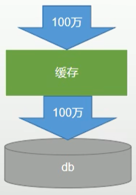
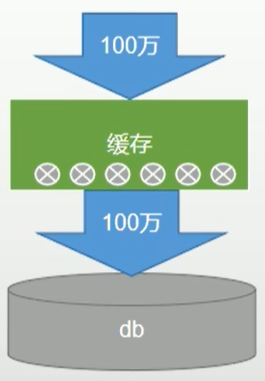
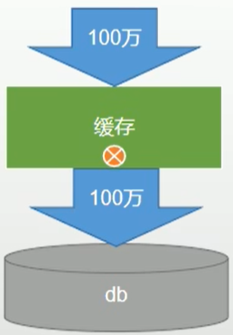

# Redis简介

## NoSQL

NoSQL指一种非关系型数据库，即Not Only SQL。

用于超大规模数据的储存。这些类型的数据储存不需要固定的模式，无需多余操作就可以横向扩展。

解决高并发，海量数据，高可用等问题。

## 背景

NoSQL一词最早出现在1998年，是Carlo Strozzi开发的一个轻量级、开源、不提SQl功能的关系型数据库。

2009年，NoSQL主要指非关系型、分布式、不提供ACID的数据库设计模式。同年，在亚特兰大举行的“no:sql(easy)”讨论会是一个里程碑，其口号“select fun profit from real_world where relational=false”。

## RDBMS vs NoSQL

**RDBMS**

- 高度组织化结构化数据
- 结构化查询语言SQL
- 数据和关系都储存在单独的表中
- 数据操纵语言，数据定义语言
- 严格的一致性
- 事务处理ACID

**NoSQL**

- 代表着不仅仅是SQl
- 没有声明性查询语言
- 没有预定义的模式
- 键值对储存Redis，列储存Hbase，文档储存MongoDB，图形储存Neo4J
- 最终一致性，而非ACID特性
- 非结构化和不可预知性的数据
- CPA定理
- 高性能，高可用性和伸缩性

## NoSQL数据库

### Memcache

- 很早出现的NoSQL数据库
- 数据都内存中，一般不支持持久层
- 支持简单的key-value模式，支持类型单一
- 一般是作为缓存数据库辅助持久化的数据库

### Redis

- 几乎覆盖Memcache的绝大部分功能
- 数据都在内存中，支持==持久化==，主要用作备份恢复
- 除了支持简单的key-value模式，还支持多种数据结构的储存，比如list,set,hash,zset等
- 一般是作为==缓存数据库==辅助持久化数据库

### MongoDB

- 高性能、开源、模式自由（schema free）的==文档型数据库==
- 数据都在内存中，如果内存不足，把不常用的数据保存到硬盘
- 虽然是key-value模式，但是对value（尤其是==json==）提供了丰富的查询功能
- 支持二进制数据及大型对象
- 可以根据数据的特点==替代RDBMS==，成为独立的数据结构，或者配合RDBMS，成为独立的数据库，或者RDBMS，储存特定的数据

# Redis安装

## 安装

需要gcc

```shell
yum install gcc
```

上传压缩包到`/opt`

```shell
rz -E
```

解压缩

```shell
tar -zxvf redis-6.2.6.tar.gz
```

编译

```shell
cd redis-6.2.5/
make
```

安装

```shell
make install
```

默认安装在`/usr/local/bin`

查看进程

```shell
ps -ef | grep redis
```

redis.conf

默认不开启进程守护

```
daemonize no
```

改成yes开启

## 相关知识

### 端口

端口6379（Merz一个女明星名字）

默认16个库初始从**第0号库**使用

统一密码管理，所有库的密码一样。

### 命令

使用命令`select <dbid>`切换数据库。例如，select 8

`dbsize`查看当前数据库的key的数量

`flushdb`清空当前库

`flushall`==通杀全部库==

### 单线程+多路IO复用技术

多路复用是指使用一个线程来检查多个我呢见描述符（Socket）的就绪状态，比如调用select和poll函数，传入多个文件描述符，如果有一个文件描述符就绪，则返回，否则阻塞直到超时。得到就绪状态后进行真正的操作可以在同一个进程里执行，也可以启动线程执行（比如使用线程池）。

串行 vs 多线程+锁（memcached） vs 单线程+多路IO复用（Redis）

与memcached不同：支持持久化、支持多数据类型，单线程+多路IO复用


## 常用命令

登录客户端

```
redis-cli
```

认证

```
auth 密码
```


# 五大常用数据类型

## 类型

- 字符串`String`
- 列表`List`
- 集合`Set`
- 有序集合`Zset`
- 哈希`Hash`


### String字符串

String字符串是二进制安全的，意味着 redis 的 string 可以包含任何数据。例如：数字、字符串、jpg图片或者序列化对象。


| 命令   | 简述                     | 使用                |
| ------ | ------------------------ | ------------------- |
| get    | 获取存储在给定键中的值   | get name            |
| set    | 设置存储在给定键中的值   | set name value      |
| del    | 删除存储在给定键中的值   | del name            |
| incr   | 将键存储的值加1          | incr name           |
| decr   | 将键存储的值减1          | decr name           |
| incrby | 将键存储的值加上指定整数 | incrdy name integer |
| decrby | 将键存储的值减去指定整数 | decrby name integer |

**使用场景：**

1. 缓存：将常用信息存入redis，redis作为缓存层，MySQL作为持久层，降低MySQL的 IO 压力
2. 计数器：redis是单线程模式，命令是一个一个执行，同时数据可以一步落实到其他数据源
3. session：spring session + redis实现session共享


### List列表

redis的列表使用**双端链表**实现

> **双端链表**：链表中保存着对**最后一个节点的引用**
>
> **双向链表**：每个节点除了保存下一个节点的引用之外，同时还保存着对前一个节点的引用

最新消息排队功能、消息队列


| 命令   | 简述                                                         | 使用               |
| ------ | ------------------------------------------------------------ | ------------------ |
| lpush  | 将给定值推入到列表左端                                       | lpush key value... |
| rpush  | 将给定值推入到列表右端                                       | rpush key value... |
| lpop   | 从列表的左端弹出一个值，并返回被弹出的值                     | lpop key           |
| rpop   | 从列表的右端弹出一个值，并返回被弹出的值                     | rpop key           |
| lrange | 获取列表在给定范围上的所有值(正向索引从`0`开始`0,1,2,3...`，反向索引从`-1`开始`-1,-2,-3,-4`) | lrange key 0 -1    |
| lindex | 通过索引获取列表中的元素。你也可以使用负数下标，以 -1 表示列表的最后一个元素， -2 表示列表的倒数第二个元素，以此类推。 | lindex key 0       |

**使用场景：**

- 微博TimeLine：有人发微博，用`lpush`加入时间轴，展示新的列表数据
- 消息队列

## 键操作命令

查看当前库下所有key

```shell
keys *
```

判断某个key是否存在

```shell
exists key 
```

查看key是什么类型

```shell
type key
```

删除指定key的数据

```shell
del key
```

根据value选择非阻塞删除(仅将keys从keyspace元数据中删除，真正的删除会在后续异步操作)

```shell
unlink key
```

10秒钟：为给定的key设置过期时间

```shell
 expire key 10
```

查看还有多少秒过期，-1表示永不过期，-2表示已过期

```shell
ttl key
```

切换数据库(切换到1数据库)

```shell
select 1
```

查看当前数据库的key的数量

```shell
dbsize
```

清空当前库

```shell
flushdb
```

追加(对key追加abc)

```shell
append key abc
```


# 高并发下缓存失效

## 缓存穿透



### 定义

指查询一个**一定不存在**的数据，由于缓存是不命中，将去查询数据库，但是数据库也无此记录，我们没有将这次查询的`null`写入缓存，**这将导致这个不存在的数据每次请求都要到存储层去查询**，失去了缓存的意义


### 风险

利用不存在的数据进行攻击，数据库瞬时压力增大，最终导致崩溃


### 解决

`null`结果缓存，并加入短暂过期时间


## 缓存雪崩



### 定义

缓存雪崩是指在我们设置缓存时`key`采用了**相同的过期时间**，导致缓存在某一时刻同时失效，请求全部转发到 DB，DB 瞬时压力过重而雪崩。


### 解决

原有的失效时间基础上增加一个随机值，比如`1-5`分钟随机，这样每一个缓存的过期时间的重复率就会降低，就很难引发集体失效的事件。


## 缓存击穿



### 定义

- 对于一些设置了过期时间的 key，如果这些 key 可能会在某些时间点被超高并发地访问，是**一种非常“热点”的数据**
- 如果这个 key 在大量请求同时进来前**正好失效**，那么所有对这个 key 的数据查询都落到 db，我们称为缓存击穿


### 解决

**加锁**
大量并发只让一个去查，其他人等待，查到以后释放锁其他人获取到锁，先查缓存，就会有数据，不用去 db


# 分布式锁

