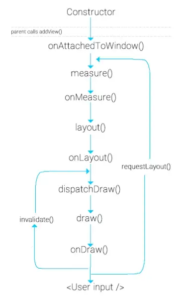
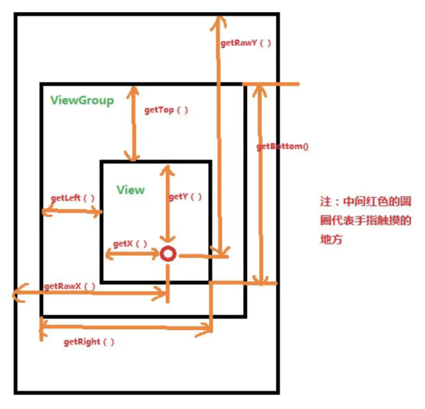

# Android架构层次

- 应用层
- 框架层
- Android操作系统层
- 内核层


# adb

Android Debug Bridge（android 调试桥）

[Android 调试桥 (adb)  | Android 开发者  | Android Developers (google.cn)](https://developer.android.google.cn/studio/command-line/adb?hl=zh-cn)

```shell
Android Debug Bridge version 1.0.41
Version 33.0.3-8952118
Installed as D:\Projects\android_sdk\platform-tools\adb.exe

global options:
 -a                       listen on all network interfaces, not just localhost
 -d                       use USB device (error if multiple devices connected)
 -e                       use TCP/IP device (error if multiple TCP/IP devices available)
 -s SERIAL                use device with given serial (overrides $ANDROID_SERIAL)
 -t ID                    use device with given transport id
 -H                       name of adb server host [default=localhost]
 -P                       port of adb server [default=5037]
 -L SOCKET                listen on given socket for adb server [default=tcp:localhost:5037]
 --one-device SERIAL|USB  only allowed with 'start-server' or 'server nodaemon', server will only connect to one USB device, specified by a serial number or USB device address.
 --exit-on-write-error    exit if stdout is closed

general commands:
 devices [-l]             list connected devices (-l for long output)
 help                     show this help message
 version                  show version num

networking:
 connect HOST[:PORT]      connect to a device via TCP/IP [default port=5555]
 disconnect [HOST[:PORT]]
     disconnect from given TCP/IP device [default port=5555], or all
 pair HOST[:PORT] [PAIRING CODE]
     pair with a device for secure TCP/IP communication
 forward --list           list all forward socket connections
 forward [--no-rebind] LOCAL REMOTE
     forward socket connection using:
       tcp:<port> (<local> may be "tcp:0" to pick any open port)
       localabstract:<unix domain socket name>
       localreserved:<unix domain socket name>
       localfilesystem:<unix domain socket name>
       dev:<character device name>
       jdwp:<process pid> (remote only)
       vsock:<CID>:<port> (remote only)
       acceptfd:<fd> (listen only)
 forward --remove LOCAL   remove specific forward socket connection
 forward --remove-all     remove all forward socket connections
 reverse --list           list all reverse socket connections from device
 reverse [--no-rebind] REMOTE LOCAL
     reverse socket connection using:
       tcp:<port> (<remote> may be "tcp:0" to pick any open port)
       localabstract:<unix domain socket name>
       localreserved:<unix domain socket name>
       localfilesystem:<unix domain socket name>
 reverse --remove REMOTE  remove specific reverse socket connection
 reverse --remove-all     remove all reverse socket connections from device
 mdns check               check if mdns discovery is available
 mdns services            list all discovered services

file transfer:
 push [--sync] [-z ALGORITHM] [-Z] LOCAL... REMOTE
     copy local files/directories to device
     --sync: only push files that are newer on the host than the device
     -n: dry run: push files to device without storing to the filesystem
     -z: enable compression with a specified algorithm (any/none/brotli/lz4/zstd)
     -Z: disable compression
 pull [-a] [-z ALGORITHM] [-Z] REMOTE... LOCAL
     copy files/dirs from device
     -a: preserve file timestamp and mode
     -z: enable compression with a specified algorithm (any/none/brotli/lz4/zstd)
     -Z: disable compression
 sync [-l] [-z ALGORITHM] [-Z] [all|data|odm|oem|product|system|system_ext|vendor]
     sync a local build from $ANDROID_PRODUCT_OUT to the device (default all)
     -n: dry run: push files to device without storing to the filesystem
     -l: list files that would be copied, but don't copy them
     -z: enable compression with a specified algorithm (any/none/brotli/lz4/zstd)
     -Z: disable compression

shell:
 shell [-e ESCAPE] [-n] [-Tt] [-x] [COMMAND...]
     run remote shell command (interactive shell if no command given)
     -e: choose escape character, or "none"; default '~'
     -n: don't read from stdin
     -T: disable pty allocation
     -t: allocate a pty if on a tty (-tt: force pty allocation)
     -x: disable remote exit codes and stdout/stderr separation
 emu COMMAND              run emulator console command

app installation (see also `adb shell cmd package help`):
 install [-lrtsdg] [--instant] PACKAGE
     push a single package to the device and install it
 install-multiple [-lrtsdpg] [--instant] PACKAGE...
     push multiple APKs to the device for a single package and install them
 install-multi-package [-lrtsdpg] [--instant] PACKAGE...
     push one or more packages to the device and install them atomically
     -r: replace existing application
     -t: allow test packages
     -d: allow version code downgrade (debuggable packages only)
     -p: partial application install (install-multiple only)
     -g: grant all runtime permissions
     --abi ABI: override platform's default ABI
     --instant: cause the app to be installed as an ephemeral install app
     --no-streaming: always push APK to device and invoke Package Manager as separate steps
     --streaming: force streaming APK directly into Package Manager
     --fastdeploy: use fast deploy
     --no-fastdeploy: prevent use of fast deploy
     --force-agent: force update of deployment agent when using fast deploy
     --date-check-agent: update deployment agent when local version is newer and using fast deploy
     --version-check-agent: update deployment agent when local version has different version code and using fast deploy
     (See also `adb shell pm help` for more options.)
 uninstall [-k] PACKAGE
     remove this app package from the device
     '-k': keep the data and cache directories

debugging:
 bugreport [PATH]
     write bugreport to given PATH [default=bugreport.zip];
     if PATH is a directory, the bug report is saved in that directory.
     devices that don't support zipped bug reports output to stdout.
 jdwp                     list pids of processes hosting a JDWP transport
 logcat                   show device log (logcat --help for more)

security:
 disable-verity           disable dm-verity checking on userdebug builds
 enable-verity            re-enable dm-verity checking on userdebug builds
 keygen FILE
     generate adb public/private key; private key stored in FILE,

scripting:
 wait-for[-TRANSPORT]-STATE...
     wait for device to be in a given state
     STATE: device, recovery, rescue, sideload, bootloader, or disconnect
     TRANSPORT: usb, local, or any [default=any]
 get-state                print offline | bootloader | device
 get-serialno             print <serial-number>
 get-devpath              print <device-path>
 remount [-R]
      remount partitions read-write. if a reboot is required, -R will
      will automatically reboot the device.
 reboot [bootloader|recovery|sideload|sideload-auto-reboot]
     reboot the device; defaults to booting system image but
     supports bootloader and recovery too. sideload reboots
     into recovery and automatically starts sideload mode,
     sideload-auto-reboot is the same but reboots after sideloading.
 sideload OTAPACKAGE      sideload the given full OTA package
 root                     restart adbd with root permissions
 unroot                   restart adbd without root permissions
 usb                      restart adbd listening on USB
 tcpip PORT               restart adbd listening on TCP on PORT

internal debugging:
 start-server             ensure that there is a server running
 kill-server              kill the server if it is running
 reconnect                kick connection from host side to force reconnect
 reconnect device         kick connection from device side to force reconnect
 reconnect offline        reset offline/unauthorized devices to force reconnect

usb:
 attach                   attach a detached USB device
 detach                   detach from a USB device to allow use by other processes
environment variables:
 $ADB_TRACE
     comma-separated list of debug info to log:
     all,adb,sockets,packets,rwx,usb,sync,sysdeps,transport,jdwp
 $ADB_VENDOR_KEYS         colon-separated list of keys (files or directories)
 $ANDROID_SERIAL          serial number to connect to (see -s)
 $ANDROID_LOG_TAGS        tags to be used by logcat (see logcat --help)
 $ADB_LOCAL_TRANSPORT_MAX_PORT max emulator scan port (default 5585, 16 emus)
 $ADB_MDNS_AUTO_CONNECT   comma-separated list of mdns services to allow auto-connect (default adb-tls-connect)
```


## adb 工作原理

启动 adb 客户端时，会检查是否运行 adb 服务器进程。

没有会先启动服务器进程。

服务器进程与本地 TCP 的默认端口 5037 绑定，监听 adb 客户端命令。

服务器与正在运行的所有设备建立连接，扫描 5555 至 5585 之间的端口，以奇数号端口查找模拟器。发现 adb 守护进程（adbd），就与对应端口连接。例如：

```
模拟器 1，控制台：5554
模拟器 1，adb：5555
模拟器 2，控制台：5556
模拟器 2，adb：5557
依此类推
```


## adb 常用命令

列出所有已连接设备

```bash
adb devices [-l]
```


把命令发送给指定设备

```
adb -s 设备序列号 ...
```


# manifest清单表

## 属性

`android:process`属性

1. 以`.`开头开启一个**全局**的**独立**进程
2. 以`:`开头开启一个**此应用私有**的**独立**进程

`android:exported="true"`主要作用是：是否支持其它应用调用当前组件。

```xml
<activity android:name=".ui.activity.AgreementActivity"
          android:exported="false"
          android:process=":web" />
```

进程名为应用包名加`:web` -> `com.txznet.lebobo:web`


## activity启动模式

| 模式           | 说明                                             |
| -------------- | ------------------------------------------------ |
| standard       | 多实例，可叠加                                   |
| singleTask     | 单实例，在task中独一份                           |
| singleTop      | 多实例，在栈顶时不创建而走`onNewIntent`          |
| singleInstance | 单实例，运行在单独的task中（不允许其他实例存在） |


## 文字效果

```
SpannableStringBuilder
```


# 权限

## 等级

- **normal**

  默认值。具有较低风险的权限，此类权限允许请求授权的应用访问隔离的应用级功能，对其他应用、系统或用户的风险非常小。 **系统会自动向在安装时请求授权的应用授予此类权限**，无需征得用户的明确许可（但用户始终可以选择在安装之前查看这些权限）。

- **dangerous**

  具有较高风险的权限，此类权限允许请求授权的应用访问用户私人数据或获取可对用户造成不利影响的设备控制权。由于此类权限会带来潜在风险，因此系统可能不会自动向请求授权的应用授予此类权限。例如，应用请求的任何危险权限都可能会向用户显示并且获得确认才会继续执行操作，或者系统会采取一些其他方法来避免用户自动允许使用此类功能。（动态申请）

- **signature**

  只有在请求授权的应用使用与声明权限的应用相同的证书进行签名时系统才会授予的权限。如果证书匹配，则系统会在不通知用户或征得用户明确许可的情况下自动授予权限。

- **signatureOrSystem**

  `signature|privileged` 的旧同义词。在 API 级别 `23` 中已弃用。

  系统仅向位于 Android 系统映像的专用文件夹中的应用或使用与声明权限的应用相同的证书进行签名的应用授予的权限。不要使用此选项，因为 `signature` 保护级别应足以满足大多数需求，无论应用安装在何处，该保护级别都能正常发挥作用。“`signatureOrSystem`”权限适用于以下特殊情况：多个供应商将应用内置到一个系统映像中，并且需要明确共享特定功能，因为这些功能是一起构建的。

## 权限列表

https://developer.android.com/reference/android/Manifest.permission


# 动画

ObjectAnimator 对象 通过 **setter** 方法设置属性值，即为动画属性需要有 setter

调用`start()`开启动画


# res资源包

## shape

渐变色

```xml
<?xml version="1.0" encoding="utf-8"?>
<shape xmlns:android="http://schemas.android.com/apk/res/android">
    <gradient
        android:angle="0"
        android:startColor="#000000"
        android:endColor="#ffffff"
        android:type="linear"
        android:useLevel="true" />
</shape>
```

angle范围`[0, 315]`

0：从左到右（默认）

90：从下到上

180：从右到左

270：从上到下

逆时针转动


# 四大组件

## activity

横竖屏切换, ac会被销毁

```java
//1.拨打电话
// 给移动客服10086拨打电话
Uri uri = Uri.parse("tel:10086");
Intent intent = new Intent(Intent.ACTION_DIAL, uri);
startActivity(intent);

//2.发送短信
// 给10086发送内容为“Hello”的短信
Uri uri = Uri.parse("smsto:10086");
Intent intent = new Intent(Intent.ACTION_SENDTO, uri);
intent.putExtra("sms_body", "Hello");
startActivity(intent);

//3.发送彩信（相当于发送带附件的短信）
Intent intent = new Intent(Intent.ACTION_SEND);
intent.putExtra("sms_body", "Hello");
Uri uri = Uri.parse("content://media/external/images/media/23");
intent.putExtra(Intent.EXTRA_STREAM, uri);
intent.setType("image/png");
startActivity(intent);

//4.打开浏览器:
// 打开Google主页
Uri uri = Uri.parse("http://www.baidu.com");
Intent intent  = new Intent(Intent.ACTION_VIEW, uri);
startActivity(intent);

//5.发送电子邮件:(阉割了Google服务的没戏!!!!)
// 给someone@domain.com发邮件
Uri uri = Uri.parse("mailto:someone@domain.com");
Intent intent = new Intent(Intent.ACTION_SENDTO, uri);
startActivity(intent);
// 给someone@domain.com发邮件发送内容为“Hello”的邮件
Intent intent = new Intent(Intent.ACTION_SEND);
intent.putExtra(Intent.EXTRA_EMAIL, "someone@domain.com");
intent.putExtra(Intent.EXTRA_SUBJECT, "Subject");
intent.putExtra(Intent.EXTRA_TEXT, "Hello");
intent.setType("text/plain");
startActivity(intent);
// 给多人发邮件
Intent intent=new Intent(Intent.ACTION_SEND);
String[] tos = {"1@abc.com", "2@abc.com"}; // 收件人
String[] ccs = {"3@abc.com", "4@abc.com"}; // 抄送
String[] bccs = {"5@abc.com", "6@abc.com"}; // 密送
intent.putExtra(Intent.EXTRA_EMAIL, tos);
intent.putExtra(Intent.EXTRA_CC, ccs);
intent.putExtra(Intent.EXTRA_BCC, bccs);
intent.putExtra(Intent.EXTRA_SUBJECT, "Subject");
intent.putExtra(Intent.EXTRA_TEXT, "Hello");
intent.setType("message/rfc822");
startActivity(intent);

//6.显示地图:
// 打开Google地图中国北京位置（北纬39.9，东经116.3）
Uri uri = Uri.parse("geo:39.9,116.3");
Intent intent = new Intent(Intent.ACTION_VIEW, uri);
startActivity(intent);

//7.路径规划
// 路径规划：从北京某地（北纬39.9，东经116.3）到上海某地（北纬31.2，东经121.4）
Uri uri = Uri.parse("http://maps.google.com/maps?f=d&saddr=39.9 116.3&daddr=31.2 121.4");
Intent intent = new Intent(Intent.ACTION_VIEW, uri);
startActivity(intent);

//8.多媒体播放:
Intent intent = new Intent(Intent.ACTION_VIEW);
Uri uri = Uri.parse("file:///sdcard/foo.mp3");
intent.setDataAndType(uri, "audio/mp3");
startActivity(intent);

//获取SD卡下所有音频文件,然后播放第一首=-= 
Uri uri = Uri.withAppendedPath(MediaStore.Audio.Media.INTERNAL_CONTENT_URI, "1");
Intent intent = new Intent(Intent.ACTION_VIEW, uri);
startActivity(intent);

//9.打开摄像头拍照:
// 打开拍照程序
Intent intent = new Intent(MediaStore.ACTION_IMAGE_CAPTURE); 
startActivityForResult(intent, 0);
// 取出照片数据
Bundle extras = intent.getExtras(); 
Bitmap bitmap = (Bitmap) extras.get("data");

//另一种:
//调用系统相机应用程序，并存储拍下来的照片
Intent intent = new Intent(MediaStore.ACTION_IMAGE_CAPTURE); 
time = Calendar.getInstance().getTimeInMillis();
intent.putExtra(MediaStore.EXTRA_OUTPUT, Uri.fromFile(new File(Environment
.getExternalStorageDirectory().getAbsolutePath()+"/tucue", time + ".jpg")));
startActivityForResult(intent, ACTIVITY_GET_CAMERA_IMAGE);

//10.获取并剪切图片
// 获取并剪切图片
Intent intent = new Intent(Intent.ACTION_GET_CONTENT);
intent.setType("image/*");
intent.putExtra("crop", "true"); // 开启剪切
intent.putExtra("aspectX", 1); // 剪切的宽高比为1：2
intent.putExtra("aspectY", 2);
intent.putExtra("outputX", 20); // 保存图片的宽和高
intent.putExtra("outputY", 40); 
intent.putExtra("output", Uri.fromFile(new File("/mnt/sdcard/temp"))); // 保存路径
intent.putExtra("outputFormat", "JPEG");// 返回格式
startActivityForResult(intent, 0);
// 剪切特定图片
Intent intent = new Intent("com.android.camera.action.CROP"); 
intent.setClassName("com.android.camera", "com.android.camera.CropImage"); 
intent.setData(Uri.fromFile(new File("/mnt/sdcard/temp"))); 
intent.putExtra("outputX", 1); // 剪切的宽高比为1：2
intent.putExtra("outputY", 2);
intent.putExtra("aspectX", 20); // 保存图片的宽和高
intent.putExtra("aspectY", 40);
intent.putExtra("scale", true);
intent.putExtra("noFaceDetection", true); 
intent.putExtra("output", Uri.parse("file:///mnt/sdcard/temp")); 
startActivityForResult(intent, 0);

//11.打开Google Market 
// 打开Google Market直接进入该程序的详细页面
Uri uri = Uri.parse("market://details?id=" + "com.demo.app");
Intent intent = new Intent(Intent.ACTION_VIEW, uri);
startActivity(intent);

//12.进入手机设置界面:
// 进入无线网络设置界面（其它可以举一反三）  
Intent intent = new Intent(android.provider.Settings.ACTION_WIRELESS_SETTINGS);  
startActivityForResult(intent, 0);

//13.安装apk:
Uri installUri = Uri.fromParts("package", "xxx", null);   
returnIt = new Intent(Intent.ACTION_PACKAGE_ADDED, installUri);

//14.卸载apk:
Uri uri = Uri.fromParts("package", strPackageName, null);      
Intent it = new Intent(Intent.ACTION_DELETE, uri);      
startActivity(it); 

//15.发送附件:
Intent it = new Intent(Intent.ACTION_SEND);      
it.putExtra(Intent.EXTRA_SUBJECT, "The email subject text");      
it.putExtra(Intent.EXTRA_STREAM, "file:///sdcard/eoe.mp3");      
sendIntent.setType("audio/mp3");      
startActivity(Intent.createChooser(it, "Choose Email Client"));

//16.进入联系人页面:
Intent intent = new Intent();
intent.setAction(Intent.ACTION_VIEW);
intent.setData(People.CONTENT_URI);
startActivity(intent);

//17.查看指定联系人:
Uri personUri = ContentUris.withAppendedId(People.CONTENT_URI, info.id);//info.id联系人ID
Intent intent = new Intent();
intent.setAction(Intent.ACTION_VIEW);
intent.setData(personUri);
startActivity(intent);
```


Task 和 Back Stack 

Task 是frameworker层的概念，实现 Task 的数据结构是 Back Stack

### 生命周期

新旧activity跳转

onStart和onStop是从Activity是否**可见**这个角度来回调的，而onResume和onPause是从Activity是否位于**前台**这个角度来回调的，除了这种区别，在实际使用中没有其他明显区别。

注：可见和前台，前台在屏幕上正在显示的进程，可见是例如弹框遮挡住了，处于前台

旧的activity执行onPause再是新activity的onCreate、onStart、onResume，再是旧activity的onStop、onDestroy

意味着如果再旧activity的onPause中执行耗时操作将会影响新activity的onResume，应该在onStop中执行耗时操作


因为异常状态下的生命周期

系统配置改变导致，activity会重新创建。这种情况下，会回调onSaveInstanceState保存状态，以及onRestoreInstanceState，在重新创建后onCreate和onRestoreInstanceState中的Bundle对象不为空。

而且在view中，每一个view都有自己的在onSaveInstanceState和onRestoreInstanceState。

其保存过程采用委托思想，activity委托window去保存数据，window再委托其上层顶级容器，顶层容器再一一委托其子元素去保存数据。类似的还有view的绘制过程以及事件分发。状态恢复也是一样的。

**系统只在Activity异常终止的时候才会调用onSaveInstanceState和onRestoreInstanceState来存储和恢复数据，其他情况不会触发这个过程。**

资源不足导致activity被杀死释放资源。

按照优先级对activity进行排序，

1. 前台，正在与用户交互的，最高
2. 可见非前台，被弹框遮挡
3. 后台，执行了onStop，最低


以给Activity指定configChanges属性，不让他因为系统配置重新创建。例如，

```
android:configChanges="orientation"
```

旋转不重新创建。

## service

两种启动service的方式

bindService和startService

bindService和调用者无关；startService同调用者有关，当所有调用者停止调用时，service被销毁


## content provider

## broadcast receiver

动态注册和静态注册

销毁时需要取消广播


## RecyclerView

`adapter.notifyDataSetChanged()`通知改变


## WebView

1. 设置`webViewClient`
2. 重写`shouldOverrideUrlLoading`加载地址，返回`true`不使用系统浏览器打开


# Binder

1. 从IPC角度来说：Binder是Android中的一种跨进程通信方式，该通信方式在linux中没有，是Android独有；
2. 从Android Driver层：Binder还可以理解为一种虚拟的物理设备，它的设备驱动是/dev/binder；
3. 从Android Native层：Binder是创建Service Manager以及BpBinder/BBinder模型，搭建与binder驱动的桥梁；
4. 从Android Framework层：Binder是各种Manager（ActivityManager、WindowManager等）和相应xxxManagerService的桥梁；
5. 从Android APP层：Binder是客户端和服务端进行通信的媒介，当bindService的时候，服务端会返回一个包含了服务端业务调用的 Binder对象，通过这个Binder对象，客户端就可以获取服务端提供的服务或者数据，这里的服务包括普通服务和基于AIDL的服务。

## framework层

### 服务端

sayHello方法和操作符属性

```java
public interface IMyService extends android.os.IInterface {
    static final java.lang.String DESCRIPTOR = "com.rosen.frameworkBinder.MyServer";
    public void sayHello(String str) throws RemoteException;
    static final int TRANSACTION_say = android.os.IBinder.FIRST_CALL_TRANSACTION;
}
```


```java
public class MyService extends Binder implements IMyService {
    
    public MyService() {
        this.attachInterface(this, DESCRIPTOR);
    }
    
    @Override
    public IBinder asBinder() {
        return this;
    }
    
    /** 将MyService转换为IMyService接口 **/
    public static IMyService asInterface(android.os.IBinder obj) {
        if ((obj == null)) {
            return null;
        }
        android.os.IInterface iInterface = obj.queryLocalInterface(DESCRIPTOR);
        if (((iInterface != null) && (iInterface instanceof IMyService))) {
            return ((IMyService) iInterface);
        }
        return null;
    }
    
    /** 服务端，接收远程消息，处理onTransact方法 **/
    @Override
    protected boolean onTransact(int code, Parcel data, Parcel reply, int flags) throws RemoteException {
        switch (code) {
        case INTERFACE_TRANSACTION: {
            reply.writeString(DESCRIPTOR);
            return true;
        }
        case TRANSACTION_say: {
            data.enforceInterface(DESCRIPTOR);
            String str = data.readString();
            sayHello(str);
            reply.writeNoException();
            return true;
        }}
        return super.onTransact(code, data, reply, flags);
    }
    
    /** 自定义sayHello()方法 **/
    @Override
    public void sayHello(String str) {
        System.out.println("MyService:: Hello, " + str);
    }
    
}
```


### 客户端

```java
public class MyServiceProxy implements IMyService {
    //代表BpBinder
    private android.os.IBinder mRemote;

    public MyServiceProxy(android.os.IBinder remote) {
        mRemote = remote;
    }

    public java.lang.String getInterfaceDescriptor() {
        return DESCRIPTOR;
    }

    /** 自定义的sayHello()方法 **/
    @Override
    public void sayHello(String str) throws RemoteException {
        android.os.Parcel _data = android.os.Parcel.obtain();
        android.os.Parcel _reply = android.os.Parcel.obtain();
        try {
            _data.writeInterfaceToken(DESCRIPTOR);
            _data.writeString(str);
            mRemote.transact(TRANSACTION_say, _data, _reply, 0);
            _reply.readException();
        } finally {
            _reply.recycle();
            _data.recycle();
        }
    }

    @Override
    public IBinder asBinder() {
        return mRemote;
    }
}
```


# 线程

Android中UI线程为主线程，耗时操作置入子线程中运行，例如IO操作，必须开启子线程执行，如需根据数据更新UI，需要切换成主线程更新UI

## android 中多线程

### handler

Handler、Message、MessageQueue、Looper

每个线程只能有一个 Looper，会有与之对应的 MessageQueue。Handler 发送和处理消息（**前提是存在 Looper**）


核心是同进程中线程间共享内存空间，可以直接使用该 handler 实例。子线程拿到内存中handler实例 sendMessage，


ActivityThread 中有 main 方法

```java
Looper.prepareMainLooper();
```

返回值为 native 层的 NativeMessageQueue **指针地址**

```java
private native static long nativeInit();
```


activity 的生命周期函数中运行的代码都是在主线程的 loop 处理的。

在消息队列中去消息可能会阻塞，处理消息时间过长，如果影响到了主线程刷新速率就会卡顿。


#### 主线程

**自定义handleMessage方法的逻辑，其提交message的handler为同一个对象**

主线程中，系统已经初始化了一个 Looper 对象，创建 Handler 对象就可以发送和处理消息

创建 Handler 对象，指明在主线的 Looper 中

```kotlin
private val mHandler = object : Handler(Looper.getMainLooper()) {
    override fun handleMessage(msg: Message) {
        when(msg.what) {
            1 -> {
                tv.text = "你好，世界"
            }
        }
    }
}
```

在 onCreate 中使用 Handler 对象

```kotlin
tv.setOnClickListener {
    thread {
        mHandler.sendMessage(Message().apply {
            what = 1
        })
    }
}
```


#### 子线程

需要先初始化 Looper


### AsyncTask


## 更新 UI 组件

- 使用 Handler 实现线程间的通信

- `Activity.runOnUiThread(Runnable)`

  判断是否在主线程，是则 run；不是则通过 handler对象 post 到消息队列

- `View.post(Runnable)`

  判断 AttachInfo 是否空，不为空，调用 handler 的`sendMessageDelayed(getPostMessage(r), 0)`；为空则 handler 还没有 attach views，使用 HandlerActionQueue 代替完成

- `View.postDelayed(Runnable, long)`

  同`View.post(Runnable)`一致，只是添加了延迟时间

- 使用 AsyncTask


**Handler 提交消息进入主线程持有的消息队列里面，在 ActivityThread 的 main 方法里面，初始化了 Looper。在 Looper 的 loop 方法中死循环内调用所持有的 MessageQueue 的 next 方法。next 方法又是一个死循环取出队列中的消息，可能会阻塞**


## 定时器

Timer 类执行 schedule 方法运行 TimeTask。

TimeTask 重写 run 方法


## 线程转换

UI线程**通过`while`阻塞改异步为同步，通过回调设置`while`中的数据**

IO线程中网络请求同步和异步只影响当前的线程（IO线程）


# 事件分发机制

[android中的事件传递和处理机制 - fuly - 博客园 (cnblogs.com)](https://www.cnblogs.com/fuly550871915/p/4983682.html)

传递流程和处理流程

```
在ViewGroup中，有下面三个方法：
（1）dispatchTouchEvent     该方法用来分发事件，一般不会重写这个方法
（2）onInterceptTouchEvent  用来拦截事件
（3）onTouchEvent           用来处理事件

而View中，只有两个方法，即：
（1）dispatchTouchEvent     该方法用来分发事件，一般不会重写这个方法
（2）onTouchEvent           用来处理事件
```


ViewGroupA（红）∈ViewGroupB（蓝）∈ViewA（黄）


分发从大的往小的传，依次能不能处理，最后不能处理再依次返回给最大的

**传递流程从大到小，处理流程从小到大。**

拦截事件重写`onInterceptTouchEvent`和`onTouchEvent`方法，`true`为处理


# View 渲染机制

### 16 ms

16ms ≈ 1000/60hz，相当于 60 fps，低于这个数值就能感受到卡顿。

所以在16毫秒内完成屏幕刷新的逻辑

Android系统每隔 16 毫秒发出 VSYNC（Vertical Synchronization：垂直同步）信号，在 Android 4.1(JB) 引入


## 渲染原理

CPU和GPU分别进行Measure、Layout、Record、Execute等计算操作和Rasterization（栅格化）操作


# 自定义 view

## 生命周期



## 常用回调方法

重写一些框架定义的标准方法，通常一般使用`onDraw(Canvas)`

| 分类     | 方法                                 | 描述                                                         |
| -------- | ------------------------------------ | ------------------------------------------------------------ |
| 创建     | 构造器                               | 当从代码创建视图时，会调用构造函数的一种形式，而当从布局文件中展开视图时，则会调用一种形式。第二个表单应该解析并应用布局文件中定义的任何属性。 |
|          | `onFinishInflate()`                  | 在布局和及其子控件都从XML文件中被找出来后调用                |
| 布局     | `onMeasure(int, int)`                | 在确定了这个view及其子类需要的大小后被调用                   |
|          | `onLayout(int, int, int, int, int)`  | 当这个视图分配位置和大小给其所有子view时被调用               |
|          | `onSizeChanged(int, int, int, int)`  | 当这个view的大小改变时被调用                                 |
| 绘画     | `onDraw(Canvas)`                     | 当视图应该呈现其内容时调用                                   |
| 事件处理 | `onKeyDown(int, KeyEvent)`           | 当键按下发生时调用                                           |
|          | `onKeyUp(int, KeyEvent)`             | 当键往上发生时调用                                           |
|          | `onTrackballEvent(MotionEvent)`      | 当轨迹球移动时调用                                           |
|          | `onTouchEvent(MotionEvent)`          | 当触摸事件发生时调用                                         |
| 焦点     | `onFocusChanged(boolean, int, Rect)` | 当view的获得或失去焦点时调用                                 |
|          | `onWindowFocusChanged(boolean)`      | 当包含视图的窗口获得或失去焦点时调用                         |
| 关联     | `onAttachedToWindow()`               | 当视图附加到窗口时调用                                       |
|          | `onDetachedFromWindow()`             | 当视图从窗口分离时调用                                       |
|          | `onWindowVisibilityChanged(int)`     | 当包含视图的窗口的可见性发生变化时调用                       |


## 位置

所有 view 的大小都是矩形表示，通过两组方法获取**相对于父布局的位置**，而且单位是 px

`getLeft()`和`getTop`：x 轴和 y 轴位置

`getRight()`和`getBottom()`：`getRight()`=`getLeft()`+`getWidth()`

以左上方为顶点相对计算



## 使用方法

1. 重写构造器，有很多构造器但至少重写一个

   ```java
   // 通过代码创建
   View(Context context)
   // 通过 XML 扩展视图自动被调用，需要编写 attrs
   View(Context context, @Nullable AttributeSet attrs)
   // 同上，需要额外添加样式
   View(Context context, @Nullable AttributeSet attrs, int defStyleAttr)
   //
   View(Context context, @Nullable AttributeSet attrs, int defStyleAttr, int defStyleRes)
   ```

   

2. 编写自定义属性

   在 `values/attrs.xml` 中编写特定标签

   ```xml
   <?xml version="1.0" encoding="utf-8"?>
   <resources>
       <declare-styleable name="test">
           <attr name="text" format="string" />
       </declare-styleable>
   </resources>
   ```

   注意命名空间，布局文件可以使用自定义属性，代码中使用带有属性值的构造器，通过 TypedArray 获取


## 绘制流程

measure -> layout -> draw

view 的尺寸分为测量值和绘画值

先在`measure(int widthMeasureSpec, int heightMeasureSpec)`中，再`layout(int l, int t, int r, int b)`，最后`draw(Canvas canvas)`

### onMeasure

MeasureSpec 是 View 的静态内部类，封装了 view 的尺寸

对于View来说，`MeasureSpec`的 mode 和 size 有如下意义

| 模式        | 意义                                                         | 对应             |
| ----------- | ------------------------------------------------------------ | ---------------- |
| EXACTLY     | 精准模式，View需要一个精确值，这个值即为MeasureSpec当中的Size | match_parent     |
| AT_MOST     | 最大模式，View的尺寸有一个最大值，View不可以超过MeasureSpec当中的Size值，最大到指定值 | wrap_content     |
| UNSPECIFIED | 无限制，View对尺寸没有任何限制，View设置为多大就应当为多大   | 一般系统内部使用 |

在调用`setMeasuredDimension`前需要确认值非负，避免预览问题


### onLayout

如果没有子视图，就不需要重写，为子视图分配大小和位置


### onDraw

使用Draw和Paint对象可以画出任何图案

不要在这个方法内实例化对象，这个是非常耗时的，避免增加时间


**更新视图**

- `invalidate()`

  简单重绘，重新调用`draw()`，例如：更新文本、颜色或者触摸交互

- `requestLayout()`

  改变视图的大小，`measure()`方法后，根据新的大小重新绘制


**动画**

自定义视图中动画是逐帧出现，每次处理之后需要调用`invalidate`

最合适的对象是`ValueAnimator`，动画任何值从开始到结束，也支持插值器


### 自定义情况

#### 组合控件

可以使用的情况，例如逻辑切换相似的部分，进行复用的效果

1. 重写构造器
2. 自定义 attrs 属性，
3. 初始化控件，设置 attrs 属性

#### 直接继承view

1. 重写构造器
2. 重写`onMeasure()`
3. 重写`onDraw()`，

#### 直接继承GroupView

1. 重写构造器
2. 实现`onLayout()`，设置子view的位置
3. 重写`onMeasure()`，计算子view的宽高（参照LinearLayout）
4. 重写`onDraw()`

#### 继承系统控件

1. 重写构造器
2. 重写`onDraw()`
3. 添加自定义操作

#### 继承系统布局

1. 重写构造器
2. 添加自定义操作


## Canvas

drawXXX方法

弧

```java
drawArc
```

指定颜色填充画布的位图

```
drawARGB
```

```
drawBitmap
```

```
drawCircle
```

```
drawColor
```

```
drawLine
```

```
drawLines
```

```
drawOval
```

```
drawPaint
```

```
drawPatch
```

```
drawPath
```

```
drawPoint
```

```
drawPoints
```

```
drawRect
```

```
drawRGB
```

```
drawRoundRect
```

```
drawDoubleRoundRect
```

```
drawText
```

```
drawVertices
```

```
drawRenderNode
```

## Paint

- Style样式，设置填充或者画边框
- Cap笔帽，设置无，方，圆路径
- Join，拐角连接方式，锐角，圆角，拐角
- Align对齐方式，左中右


# View


```kotlin
private fun loadTextColor(attribute: SkinAttribute) {
        if (attribute.name == "textColor") {
            val loadClass = this.javaClass.classLoader?.loadClass(viewClassName)
            Log.e(TAG, "loadTextColor: $loadClass")
            val setTextColor = loadClass?.getMethod("setTextColor", Int::class.java)
            setTextColor?.isAccessible = true
            setTextColor?.invoke(loadClass, SkinManager.instance.getColor(attribute.resId))
        }
    }
```


通过反射调用`setTextColor`方法，表明该方法都为TextView类所有，EditTextView，Button皆是


# activity

- onStart和onStop：可见性

- onResume和onPause：位于前台


# Fragment

inflate


# 透明度16进制对照表

**0到255 -> 透明到不透明**

| 透明度 | 16进制 |
| ------ | ------ |
| 100%   | 00     |
| 95  %  | 0D     |
| 90  %  | 1A     |
| 85  %  | 26     |
| 80  %  | 33     |
| 75  %  | 40     |
| 70  %  | 4D     |
| 65  %  | 59     |
| 60  %  | 66     |
| 55  %  | 73     |
| 50  %  | 80     |
| 45  %  | 8C     |
| 40  %  | 99     |
| 35  %  | A6     |
| 30  %  | B3     |
| 25  %  | BF     |
| 20  %  | CC     |
| 15  %  | D9     |
| 10  %  | E6     |
| 5   %  | F2     |
| 0   %  | FF     |


# Gradle

## implementation和api区别

```
A implementation B
B api C
```

A 可以访问 B 和 C


```
A implementation B
B implementation C
```

A 只能访问 B


```
A implementation B
B implementation C
C api D
```

A 只能访问 B，B 能访问 C 和 D


# okHttp

官网地址https://square.github.io/okhttp/

其内部实现为责任链模式

## 例子

### 同步GET

`string()`方法更加方便，但是适用于 1MiB 以下的小文件，更大的应使用**流**。

```kotlin
  private val client = OkHttpClient()

  fun run() {
    val request = Request.Builder()
        .url("https://publicobject.com/helloworld.txt")
        .build()

    client.newCall(request).execute().use { response ->
      if (!response.isSuccessful) throw IOException("Unexpected code $response")

      for ((name, value) in response.headers) {
        println("$name: $value")
      }

      println(response.body!!.string())
    }
  }
```

### 异步GET

在响应可读时可以回调，回调在响应头准备之后进行，读取响应体（该过程也会阻塞，没有响应体的异步API）

```kotlin
  private val client = OkHttpClient()

  fun run() {
    val request = Request.Builder()
        .url("http://publicobject.com/helloworld.txt")
        .build()

    client.newCall(request).enqueue(object : Callback {
      override fun onFailure(call: Call, e: IOException) {
        e.printStackTrace()
      }

      override fun onResponse(call: Call, response: Response) {
        response.use {
          if (!response.isSuccessful) throw IOException("Unexpected code $response")

          for ((name, value) in response.headers) {
            println("$name: $value")
          }

          println(response.body!!.string())
        }
      }
    })
  }
```

### POST方法

#### string

```kotlin
  private val client = OkHttpClient()

  fun run() {
    val postBody = """
        |Releases
        |--------
        |
        | * _1.0_ May 6, 2013
        | * _1.1_ June 15, 2013
        | * _1.2_ August 11, 2013
        |""".trimMargin()

    val request = Request.Builder()
        .url("https://api.github.com/markdown/raw")
        .post(postBody.toRequestBody(MEDIA_TYPE_MARKDOWN))
        .build()

    client.newCall(request).execute().use { response ->
      if (!response.isSuccessful) throw IOException("Unexpected code $response")

      println(response.body!!.string())
    }
  }

  companion object {
    val MEDIA_TYPE_MARKDOWN = "text/x-markdown; charset=utf-8".toMediaType()
  }
```

#### stream

```kotlin
  private val client = OkHttpClient()

  fun run() {
    val requestBody = object : RequestBody() {
      override fun contentType() = MEDIA_TYPE_MARKDOWN

      override fun writeTo(sink: BufferedSink) {
        sink.writeUtf8("Numbers\n")
        sink.writeUtf8("-------\n")
        for (i in 2..997) {
          sink.writeUtf8(String.format(" * $i = ${factor(i)}\n"))
        }
      }

      private fun factor(n: Int): String {
        for (i in 2 until n) {
          val x = n / i
          if (x * i == n) return "${factor(x)} × $i"
        }
        return n.toString()
      }
    }

    val request = Request.Builder()
        .url("https://api.github.com/markdown/raw")
        .post(requestBody)
        .build()

    client.newCall(request).execute().use { response ->
      if (!response.isSuccessful) throw IOException("Unexpected code $response")

      println(response.body!!.string())
    }
  }

  companion object {
    val MEDIA_TYPE_MARKDOWN = "text/x-markdown; charset=utf-8".toMediaType()
  }
```

#### file

```kotlin
  private val client = OkHttpClient()

  fun run() {
    val file = File("README.md")

    val request = Request.Builder()
        .url("https://api.github.com/markdown/raw")
        .post(file.asRequestBody(MEDIA_TYPE_MARKDOWN))
        .build()

    client.newCall(request).execute().use { response ->
      if (!response.isSuccessful) throw IOException("Unexpected code $response")

      println(response.body!!.string())
    }
  }

  companion object {
    val MEDIA_TYPE_MARKDOWN = "text/x-markdown; charset=utf-8".toMediaType()
  }
```

#### form

```kotlin
  private val client = OkHttpClient()

  fun run() {
    val formBody = FormBody.Builder()
        .add("search", "Jurassic Park")
        .build()
    val request = Request.Builder()
        .url("https://en.wikipedia.org/w/index.php")
        .post(formBody)
        .build()

    client.newCall(request).execute().use { response ->
      if (!response.isSuccessful) throw IOException("Unexpected code $response")

      println(response.body!!.string())
    }
  }
```

#### json

[Moshi](https://github.com/square/moshi)是用于在JSON和Java对象之间转换的便捷API。在这里，我们使用它来解码来自GitHub API的JSON响应。

注意，`ResponseBody.charStream()`使用内容类型响应标题来选择在解码响应主体时使用哪个charset。如果未指定charset，则默认为UTF-8。

```kotlin
  private val client = OkHttpClient()
  private val moshi = Moshi.Builder().build()
  private val gistJsonAdapter = moshi.adapter(Gist::class.java)

  fun run() {
    val request = Request.Builder()
        .url("https://api.github.com/gists/c2a7c39532239ff261be")
        .build()
    client.newCall(request).execute().use { response ->
      if (!response.isSuccessful) throw IOException("Unexpected code $response")

      val gist = gistJsonAdapter.fromJson(response.body!!.source())

      for ((key, value) in gist!!.files!!) {
        println(key)
        println(value.content)
      }
    }
  }

  @JsonClass(generateAdapter = true)
  data class Gist(var files: Map<String, GistFile>?)

  @JsonClass(generateAdapter = true)
  data class GistFile(var content: String?)
```

#### multipart request

```kotlin
  private val client = OkHttpClient()

  fun run() {
    // Use the imgur image upload API as documented at https://api.imgur.com/endpoints/image
    val requestBody = MultipartBody.Builder()
        .setType(MultipartBody.FORM)
        .addFormDataPart("title", "Square Logo")
        .addFormDataPart("image", "logo-square.png",
            File("docs/images/logo-square.png").asRequestBody(MEDIA_TYPE_PNG))
        .build()

    val request = Request.Builder()
        .header("Authorization", "Client-ID $IMGUR_CLIENT_ID")
        .url("https://api.imgur.com/3/image")
        .post(requestBody)
        .build()

    client.newCall(request).execute().use { response ->
      if (!response.isSuccessful) throw IOException("Unexpected code $response")

      println(response.body!!.string())
    }
  }

  companion object {
    /**
     * The imgur client ID for OkHttp recipes. If you're using imgur for anything other than running
     * these examples, please request your own client ID! https://api.imgur.com/oauth2
     */
    private val IMGUR_CLIENT_ID = "9199fdef135c122"
    private val MEDIA_TYPE_PNG = "image/png".toMediaType()
  }
```

## addInterceptor和addNetworkIntercepter

同步GET请求执行方法为`excute()`，为Call接口下，RealCall实现类

```kotlin
override fun execute(): Response {
    check(executed.compareAndSet(false, true)) { "Already Executed" }

    timeout.enter()
    callStart()
    try {
      client.dispatcher.executed(this) // 1
      return getResponseWithInterceptorChain() // 2
    } finally {
      client.dispatcher.finished(this) // 3
    }
  }
```

主要分三步，第二步是执行责任链

```kotlin
@Throws(IOException::class)
internal fun getResponseWithInterceptorChain(): Response {
    // Build a full stack of interceptors.
    val interceptors = mutableListOf<Interceptor>()
    interceptors += client.interceptors
    interceptors += RetryAndFollowUpInterceptor(client)
    interceptors += BridgeInterceptor(client.cookieJar)
    interceptors += CacheInterceptor(client.cache)
    interceptors += ConnectInterceptor
    if (!forWebSocket) {
        interceptors += client.networkInterceptors
    }
    // 责任链最后一步
    interceptors += CallServerInterceptor(forWebSocket)

    val chain = RealInterceptorChain(
        call = this,
        interceptors = interceptors,
        index = 0,
        exchange = null,
        request = originalRequest,
        connectTimeoutMillis = client.connectTimeoutMillis,
        readTimeoutMillis = client.readTimeoutMillis,
        writeTimeoutMillis = client.writeTimeoutMillis
    )

    var calledNoMoreExchanges = false
    try {
        // 开始构建责任链
        val response = chain.proceed(originalRequest)
        if (isCanceled()) {
            response.closeQuietly()
            throw IOException("Canceled")
        }
        return response
    } catch (e: IOException) {
        calledNoMoreExchanges = true
        throw noMoreExchanges(e) as Throwable
    } finally {
        if (!calledNoMoreExchanges) {
            noMoreExchanges(null)
        }
    }
}
```

把所有 interceptor 添加进 interceptors 数组，`CallServerInterceptor`为最后一个。其他实现`Interceptor`接口的拦截器中重写的`intercepter`方法中都执行了`realChain.proceed(request)`，开始下一个

```kotlin
@Throws(IOException::class)
override fun proceed(request: Request): Response {
    check(index < interceptors.size)

    calls++

    if (exchange != null) {
        check(exchange.finder.sameHostAndPort(request.url)) {
            "network interceptor ${interceptors[index - 1]} must retain the same host and port"
        }
        check(calls == 1) {
            "network interceptor ${interceptors[index - 1]} must call proceed() exactly once"
        }
    }

    // Call the next interceptor in the chain.
    val next = copy(index = index + 1, request = request)
    val interceptor = interceptors[index]

    @Suppress("USELESS_ELVIS")
    val response = interceptor.intercept(next) ?: throw NullPointerException(
        "interceptor $interceptor returned null")

    if (exchange != null) {
        check(index + 1 >= interceptors.size || next.calls == 1) {
            "network interceptor $interceptor must call proceed() exactly once"
        }
    }

    check(response.body != null) { "interceptor $interceptor returned a response with no body" }

    return response
}
```

在`proceed`方法中，`calls`记录`proceed`方法的执行次数，`index`为当前拦截器的索引，核心执行

```kotlin
// Call the next interceptor in the chain.
val next = copy(index = index + 1, request = request)
val interceptor = interceptors[index]

@Suppress("USELESS_ELVIS")
val response = interceptor.intercept(next) ?: throw NullPointerException(
    "interceptor $interceptor returned null")
```

执行每一个拦截器数组中抽象方法`intercepter`，直到`CallServerInterceptor`节点执行该方法，执行完毕。


# RxJava

内置线程选项，例如：

- `Schedulers.io()` 代表 io 操作的线程，通常用于网络，读写文件等 io 密集型的操作；
- `Schedulers.computation()` 代表CPU计算密集型的操作, 例如需要大量计算的操作；
- `Schedulers.newThread()` 代表一个常规的新线程
- `AndroidSchedulers.mainThread()` 代表Android的主线程


### `subscribeOn()`和`observeOn()`

切换线程：

`subscribeOn`切换 Observable 执行的线程

`observeOn()`切换观察 Observable 的线程

例如：

```java
Observable.from(folders)
    .flatMap(new Func1<File, Observable<File>>() {
        @Override
        public Observable<File> call(File file) {
            return Observable.from(file.listFiles());
        }
    })
    .filter(new Func1<File, Boolean>() {
        @Override
        public Boolean call(File file) {
            return file.getName().endsWith(".png");
        }
    })
    .map(new Func1<File, Bitmap>() {
        @Override
        public Bitmap call(File file) {
            return getBitmapFromFile(file);
        }
    })
    // 以上操作执行在IO线程
    .subscribeOn(Schedulers.io())
    .observeOn(AndroidSchedulers.mainThread())
    // 以下操作执行在UI线程
    .subscribe(new Action1<Bitmap>() {
        @Override
        public void call(Bitmap bitmap) {
            imageCollectorView.addImage(bitmap);
        }
    });
```


背压：缓解异步下的问题，被观察者大量产生，观察者消费不了


遵循的原则，onSubsribe, onNext(必须要有), onError和onComplete可以有

```java
public interface Observer<T> {

    void onSubscribe(@NonNull Disposable d);

    void onNext(@NonNull T t);

    void onError(@NonNull Throwable e);

    void onComplete();

}
```


```java
ObservableSource和Publisher
```


Observable 无背压，Flowable 有背压

调用操作符处理源数据，转换数据

# Glide

## 简单使用

已经封装好UI线程切换

最简单使用

```kotlin
Clide.with(content).load(res).into(imageView)
```


## 切圆角

```kotlin
Glide.with(content).load(bitmap).apply(
    RequestOptions.bitmapTransform(RoundedCorners(DensityTool.dp2px(context, 6F)))
).into(mBinding.ivQrCode)
```


# 回调接口

例如：MainActivity 中根据 Fragment 中数据更新 UI，示例：

```kotlin
interface Callback {
    fun tell(String message)
}
```


```java
public class MainActivity {
 	private MainFragment mainFragment;
    ...
    mainFragment.setCallback(new Callback() {
        @override
        public void tell(String message) {
            Log.e("TAG","回话：" + message)
        }
    })
}
```


```java
public class MainFragment {
	private Callback callback;
    ...
    callback.tell("我说我你爹");
    
    public void setCallback(Callback callback) {
        this,callback = callback;
    }
}
```


# 设计模式

入口简单

## 责任链模式

okHttp


# 报错记录

`failed to connect to tsptest.txzing.com/192.168.0.224 (port 443) from /10.68.24.82 (port 49210) after 30000ms`

访问没有公开的内网


弱网处理

用一个标志值
