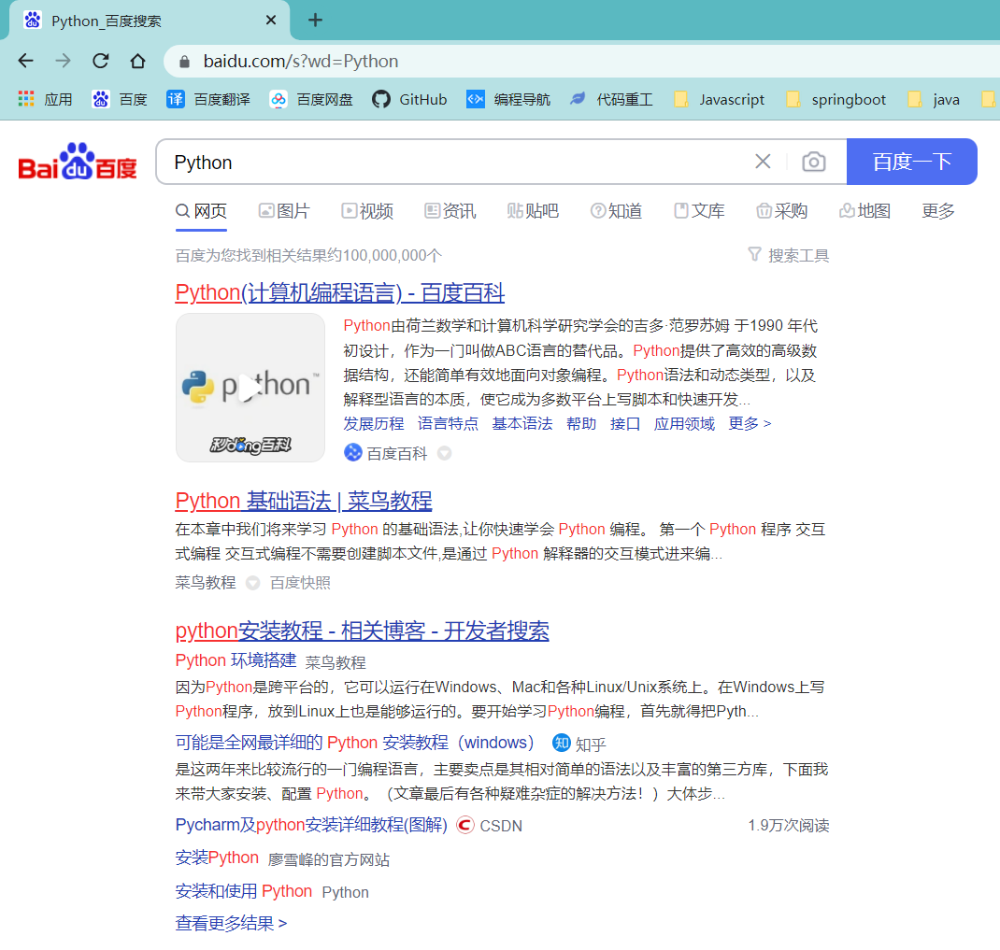
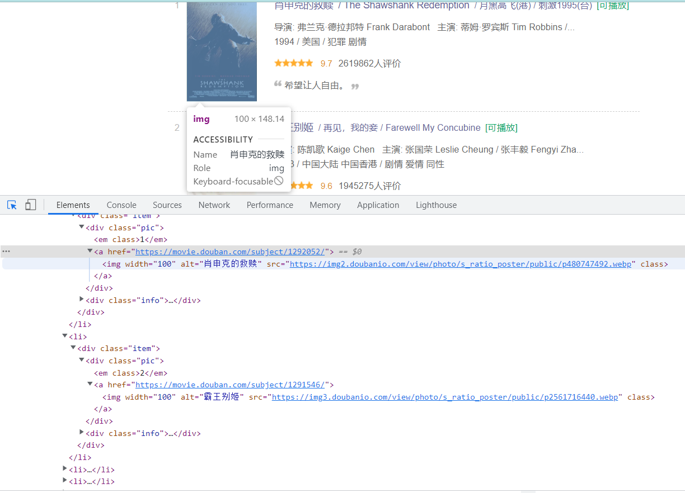
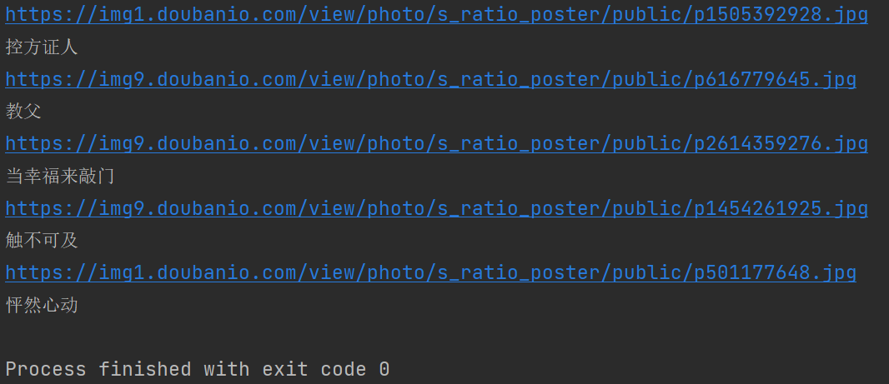

# 12. 网络爬虫

## 12.1. 概述

网络爬虫（Web Spider）又称网络蜘蛛或网络机器人，是一段用来实现自动采集网站数据的程序。如果我们把互联网比作一个大的蜘蛛网，数据便是存放于蜘蛛网的各个节点，而爬虫就是一只蜘蛛，沿着网络抓取自己的猎物（数据）。

网络爬虫不仅能够为搜索引擎采集网络信息，而且还可以作为定向信息采集器，定向采集某些网站中的特定信息，如汽车票价、招聘信息、租房信息、微博评论等。

对于定向信息的爬取，网络爬虫主要采取数据抓取、数据解析、数据入库的操作流程，如图所示。

1. 数据抓取：发送构造的 HTTP 请求，获得包含所需数据的 HTTP 响应；
2. 数据解析：对 HTTP 响应的原始数据进行分析、清洗，以提取出所需要的数据；
3. 数据入库：将数据进一步保存到数据库（或文本文件）中，用于构建知识库。


Python 提供了许多与网络爬虫相关的库。其中，在数据抓取方面包括 urllib2 (urllib3)，requests，mechanize，selenium，splinter 等；在数据解析方面包括 re（正则表达式），Beautifulsoup4， pyquery 等。本章将详细介绍其中最重要且最主流的 3个函数库：requests，re（正则表达式）和 beautifulsoup4。

> Robots 协议（也称为爬虫协议）的全程是“网络爬虫爬除标准”（Robots Exclusion Protocol），它是网站管理者表达是否希望爬虫自动获取网络信息意愿的方法。管理者可以在网站根目录中放置一个 `robots.txt` 文件，并在文件中列出哪些链接不允许爬虫获取，一般搜索引擎的爬虫会首先捕获这个文件，并根据文件要求爬取网站内容。


## 12.2. 数据抓取

### 12.2.1. requests 库概述

Python 的标准库 urllib 提供了大部分 HTTP 功能，但使用起来较繁琐。通常，我们会使用另外一个优秀的第三方库 requests。requests 库的最大优点是，程序编写过程更接近正常 URL 访问过程。

requests 库提供了很多功能特性，几乎涵盖了所有 Web 服务的需求，包括 URL 获取、HTTP 长连接和连接缓、HTTP 会话、浏览器式的 SSL 验证、身份认证、Cookie 会话、文件分块上传、流下载、HTTP(S)代理功能、连接超时处理等。有关 requests 库的更多介绍可访问 http://docs.python-requests.org/。

由于 requests 库是第三方库，因此，需要通过 pip3 指令进行安装，pip3 安装命令如下：

```bash
pip3 install requests
```

安装完 requests 库后，在 Python 交互模式下输入导入 requests 库的语句：

```python
import requests
```

如果没有提示错误，则说明安装成功。


### 12.2.2. 使用 requests 库

网络爬虫工作流程的第一步是数据的抓取，也就是使用 requests 库实现发送 HTTP 请求和获取 HTTP 响应的内容。


1. ==发送 HTTP 请求==

   requests 库提供了几乎所有的 HTTP 请求方法，如表所示。

   | 函数                                | 描述                                                         |
   | :---------------------------------- | ------------------------------------------------------------ |
   | `get(url[,timcout,=n))`             | 对于 HTTP 的 GET 方法，请求指定的页面信息，并返回实体主体；是获取网页最常用的方法，可通过 timeout = n 设置每次请求超时时间为 n 秒 |
   | `head(url)`                         | 对应用于 HTTP 的 HEAD 方法，类似于 get 请求，只不过返回的响应中没有具体的内容，用于获取报头 |
   | `post(url,data = {'key': 'value'})` | 对应用于 HTTP 的 POST 方法，向指定资源提交数据，并处理请求（如提交表单或者上传文件）；其中字典用于传递客户数据 |
   | `delete(url)`                       | 对应用于 HTTP 的 DELETE 方法，请求服务器删除指定的页面       |
   | `options(url)`                      | 对应用于 HTTP 的 OPTIONS 方法，允许客户端查看服务器性能      |
   | `put(url,data = {'key': 'value'})`  | 对应用于 HTTP 的 PUT 方法，从客户端向服务器传送的数据取代指定的文档内容。其中字典用于传递客户数据 |

   调用`get()`函数是获取网页最常用的方式，在调用`requests.get()`函数后，返回的网页内容会保存为一个 Response 对象。

   ```python
   import requests
   r = requests.get('http://www.baidu.com')
   print(type(r))  # <class 'requests.moduls.Response'>
   ```

   > 在深入了解 HTTP 协议后，会对上述函数的用法和意义有更深刻的理解，本书不进行过多介绍，从爬虫应用角度来看，只需要掌握`get()`函数即可获取网页信息。

   有时我们需要在 URL 中传递参数。例如，在采集百度搜索结果时，需要传递 wd 参数(搜索词)。requests 允许使用 params 关键字参数，以一个字符串字典来提供这些参数。

   例如：

   ```python
   import requests
   payload={'wd':'Python'}
   r= requests.get("http://www.baidu.com/s", params=payload)
   print(r.url)
   ```

   

   通过打印输出该 URL，可以看到 URL 已被正确编码，用浏览器打开被编码的 URL得到百度搜索关键字“Python”的结果。


2. ==获取 HTTP 响应的内容==

   和浏览器的交互过程一样，`requests.get()`代表发送 HTTP 请求的过程，它返回的 Response 对象代表 HTTP 响应。我们可以通过 Response 对象的不同属性来获取不同内容。其语法格式如下:

   ```python
   对象名.属性名
   ```

   

   Response 对象常用的属性：

   | 属性          | 描述                                                         |
   | ------------- | ------------------------------------------------------------ |
   | `text`        | HTTP 响应内容的字符串形式，即 URL 对应的页面内容             |
   | `content`     | HTTP 响应内容的二进制形式                                    |
   | `encoding`    | HTTP 响应内容的编码方式                                      |
   | `status_code` | HTTP 请求的返回状态，为整数，如`200`表示连接成功、`404`表示连接失败 |

   > encoding 属性给出了返回页面内容的编码方式，我们可以通过对 encoding 属性赋值来更改编码方式，以便于处理中文字符。status_code 属性返回请求 HTTP后的状态，一般情况下，需要在处理数据之前先判断状态情况，如果请求未被响应，则终止内容的处理。

   示例：

   ```python
   import requests
   r = requests.get("http://www.baidu.com")
   print(r.text)
   print(r.content)
   print(r.encoding)
   print(r.status_code)
   ```

   除了属性，Response 对象还提供了两个常用方法：

   1. `json()`方法：如果 HTTP 响应内容包含 JSON 格式数据，则该方法解析 JSON 数据。

      > JSON 的全称是“JavaScript Object Notation”，即 JavaScript 对象表示法，是一种基于文本又独立于语言的轻量级数据交换格式，易于阅读和理解。

   2. `raise_for_status()`方法：该方法能在非成功响应后产生异常，即只要返回的请求状态 status_code 不是 200，该方法就会产生一个异常，可用 try-except 异常处理结果进行处理。

      > 一般情况下，需要在发送 HTTP 请求之后，调用`raise_for_status()`方法判断有无发生异常，如果没有发生异常，则进行数据的处理，否则不进行数据处理。


### 12.2.3. 简单应用

```python
import requests

try:
    url = 'https://www.jd.com/'
    headers = {
        'user-agent': 'Mozilla/5.0 (Windows NT 10.0; Win64; x64) AppleWebKit/537.36 (KHTML, like Gecko) Chrome/101.0.4951.67 Safari/537.36'
    }
    r = requests.get(url=url, headers=headers)
    r.raise_for_status()
    r.encoding = 'utf-8'
    print(r.text)
except Exception as e:
    print(e)
```


## 12.3. 数据解析

抓取到数据后，可对 HTTP 响应的原始数据进行分析、清洗，以提取所需要的数据。解析 HTML 数据可使用正则表达式（re 模块）或第三方解析库，如 beautifulsoup4，pyquery等。


### 12.3.1. 正则表达式


1. ==正则表达式基础==

   正则表达式是用于处理字符串的强大工具，它使用预定义的特定模式去匹配一类具有共同特征的字符串，主要用于快速、准确地完成复杂字符串地查找、替换等。

   

   Python 支持地常用正则表达式元字符和语法：

   1. 字符：

      | 元字符和语法 | 说明                         | 表达式实例                                      |
      | ------------ | ---------------------------- | ----------------------------------------------- |
      | `一般字符`   | 匹配自身                     | `python`匹配`python`                            |
      | `.`          | 匹配除换行符外的任意单个字符 | `a.c`匹配`abc`，`acc`等                         |
      | `\`          | 转义字符                     | `a\.c`匹配`a.c`；`a\\c`匹配`a\c`                |
      | `[]`         | 用来表示一组字符             | `a[bcd]e`（同`a[b-d]e`）匹配`abc`，`ace`和`ade` |
      | `[^]`        | 不在`[]`中的字符             | `[^abc]`匹配除`a`，`b`，`c`之外的字符           |

      

   2. 预定义字符集（可用在字符集`[]`中）

      | 元字符和语法 | 说明                                 | 表达式实例                 |
      | ------------ | ------------------------------------ | -------------------------- |
      | `\d`         | 匹配任意数字，等价于`[0-9]`          | `a\dc`匹配`a1c`，`a2c`等   |
      | `\D`         | 匹配任意非数字                       | `a\Dc`匹配`abc`，`asc`等   |
      | `\s`         | 匹配任意空白字符，等价于`[\t\n\r\f]` | `a\sc`匹配`a c`            |
      | `\S`         | 匹配任意非空字符                     | `a\Sc`匹配`abc`等          |
      | `\w`         | 匹配任意数字、字母、下划线           | `a\wc`匹配除`a1c`，`abc`等 |
      | `\W`         | 匹配任意非数字、字母、下划线         | `a\Wc`匹配除`a c`          |

      

   3. 数量词

      | 元字符和语法 | 说明                                                         | 表达式实例                  |
      | ------------ | ------------------------------------------------------------ | --------------------------- |
      | `*`          | 匹配位于`*`之前的字符 0 次或多次                             | `abc*`匹配`ab`，`abccc`等   |
      | `+`          | 匹配位于`+`之前的字符 0 次或多次                             | `abc+`匹配`ab`，`abccc`等   |
      | `?`          | 匹配位于`?`之前的字符 0 次或 1 次，当此字符紧随任何其他限定字符（*、+、?、{m}、{m,n}）之后时，匹配模式为“非贪婪” | `abc?`匹配`a b`和`abc`      |
      | `{m}`        | 匹配前一个字符 m 次                                          | `ab{2}c`匹配`abbc`          |
      | `{m,n}`      | 匹配前一个字符 m 至 n 次，省略 m 则匹配 0 至 n 次；省略 n 则匹配 m 至无限次 | `ab{1,2}c`匹配`abc`和`abbc` |

      

   4. 边界匹配

      | 元字符和语法 | 说明     | 表达式实例                |
      | ------------ | -------- | ------------------------- |
      | `^`          | 匹配行首 | `^abc`匹配以`abc`开头的行 |
      | `$`          | 匹配行尾 | `abc$`匹配以`abc`结尾的行 |

      

   5. 逻辑、分组

      | 元字符和语法 | 说明                         | 表达式实例             |
      | ------------ | ---------------------------- | ---------------------- |
      | `|`          | 匹配位于`|`之前或之后的字符  | `a|b`匹配`a`或`b`      |
      | `()`         | 匹配`()`内的内容作为一个整体 | `(abc){2}`匹配`abcabc` |

   

   > 正则表达式通常用于在文本中查找匹配的字符串。Python 中数量词默认是**贪婪**的，即总是尝试匹配尽可能多的字符；相反，非贪婪总是尝试匹配尽可能少的字符。
   >
   > 例如：正则表达式`ab*`如果用于查找字符串`abbbc`，将找到`abbb`；而如果使用表达式`ab*?`，将找到`a`。

   

   具体应用时，可以单独使用某种类型的元字符，但处理复杂字符串时，经常需要将多个正则表达式元字符进行组合。

   1. `[a-zA-Z0-9]`可以匹配一个任意大小写字母或数字。
   2. `^(\w){6,15}$`匹配长度为 6～15 的字符串，可以包含数字、字母和下划线。
   3. `^\w+@(\w+\.)+\w+$`检查给定字符审是否为合法电了邮件地址。
   4. `\d{1,3}\.\d{1,3}\.\d{1,3}\.\d{1,3}$`检查给定字符串是否为合法 IP 地址。


2. ==re 模块==

   

   在 Python 中,主要使用 re 模块来实现止则表达式的操作，该模块的常用方法如表：

   | 方法                                                         | 描述                                                         |
   | ------------------------------------------------------------ | ------------------------------------------------------------ |
   | `re.compile(pattern[,flags])`                                | 用于编译正则表达式，生成一个正则表达式（Pattern）对象        |
   | `re.search(pattern, string[,flags])`或`search(string[,pos[,endpos]])` | 扫描整个字符串并返回第一个成功的匹配                         |
   | `re.match(pattern,string[,flags])`或`match(string[,pos[,endpos]])` | 尝试从字符串的起始位置匹配一个模式，返回`match()`对象或`none` |
   | `re.findall(pattern,string[,flags])`或`findall(string[,pos[,endpos]])` | 在字符串中找到正则表达式所匹配的所有字串，并返回一个列表，如果没有匹配到的，则返回空列表 |
   | `re.sub(pattern,repl,string[,flags])`或`sub(repl,string[,count])` | 用于替换字符串中的匹配项                                     |
   | `re.split(pattern,string[,maxsplit=0])`或`split(string[,maxsplit])` | 按照能够匹配的字符串字符串分割后返回列表                     |

   

   其中，函数参数 pattern 为`正则表达式`；参数 string 为`字符串`：参数 flags 的值可以是`re.I`（忽略大小写)、`re.M`（多行匹配模式）等。

   具体使用时，既可直接使用 re 模块的方法进行字符串处理，也可将模式编译为正则表达式对象，然后使用正则表达式对象的方法操作字符串。

   1. 直接使用 re 模块方法

      可以直接使用 re 模块的方法实现正则表达式操作，例如：

      ```python
      import re
      
      text = 'Python.C,Java...PHP'
      re.split('[\.]+', text) # ['Python', 'C', 'Java', 'PHP']
      re.findall('[a-zA-Z]+', text) # ['Python', 'C', 'Java', 'PHP']
      ```

   2. 使用正则表达式对象

      编译后的正则表达式对象不仅可以提高字符串的处理速度，还提供了更加强大的字符串处理功能。

      ```python
      import re
      
      p = re.compile(r'\d+')
      print(p.findall('one1two2three3four4')) # ['1', '2', '3', '4']
      ```

      

### 12.3.2. beautifulsoup4 库

官方中文文档https://beautifulsoup.readthedocs.io/zh_CN/v4.4.0/

beautifulsoup4 库也称为 Beautiful Soup 库或 bs4 库，用于解析和处理 HTML 和 XML 文件，其最大优点是能够根据 HTML 和 XML 语法建立解析树，进而提高解析效率。例如，有以下 HTML 文件：

```html
<html>
	<head></head>
		<body>
            <a>first</a>
			<a>second</a>
		</body>
</html>
```


由于 beautifulsoup4 库是第三方库，因此，需要通过 pip3 指令进行安装，pip3 安装命令如下：

```bash
pip3 install beautifulsoup4
```

beautifulsoup4 库中最重要的类是 BeautifulSoup，它的实例化对象相当于一个页面。可采用 from-impont 语句导入库中的 BeautifulSoup类，然后使用 `BeautifulSoup()`创建一个BeautifulSoup 对象。

```python
import requests
from bs4 import BeautifulSoup

r = requests.get('https://www.baidu.com')
r.encoding = 'utf8'
soup = BeautifulSoup(r.text)
print(type(soup))
# <class 'bs4.BeautifulSoup'>
```


创建的 BeautifulSoup 对象是一个树形结构，它包含 HTML 页面中的标签元素，如`<head>`、`<body>`等。也就是说，HTML 中的主要结构都变成了 BeautifulSoup 对象的一个属性，可通过`对象名.属性名`形式获取属性值。其中，属性名采用 HTML 中标签的名字。


> BeautifulSoup 对象的属性于 HTML 的标签名称相同，结合 HTML 语法理解。


每一个标签在 beautifulsoup4 库中又是一个对象，称为 Tag 对象。Tag 对象有 4 个常用的属性。

- name：字符串，标签的名字，如 head、title 等
- attrs：字典，包含了页面标签的所有事件（尖括号内的其他项），如 href
- contents：列表，这个标签下所有子标签的内容
- strings：字符串，标签所包围的文字，网页中真实的文字（尖括号之间的内容）


> 按照 HTML 语法，可以在标签中嵌套其他标签，因此，string 属性的返回值遵循如下原则：
>
> 1. 如果标签内部没有其他标签，string 属性返回其中的内容。
> 2. 如果标签内部没有其他标签，但只有一个标签，string 属性返回最里面标签的内容。
> 3. 如果标签内部还有其他标签，且不止一个标签，string 属性返回 None。


#### 12.3.2.1. 结合案例

豆瓣top250的电影海报下载到本地，并以电影名称命名

目标地址：https://movie.douban.com/top250

首先导入所需要的库

```python
import requests
from bs4 import BeautifulSoup
```

抓取目标网址HTML文本

```python
url = 'https://movie.douban.com/top250'
headers = {
    'User-Agent': 'Mozilla/5.0 (Windows NT 10.0; Win64; x64) AppleWebKit/537.36 (KHTML, like Gecko) Chrome/101.0.4951.64 Safari/537.36 Edg/101.0.1210.47'}
r = requests.get(url=url, headers=headers)
r.encoding = 'utf8'
text = r.text
```

保存到本地

```python
with open('douban.html','w',encoding='utf8') as f:
    f.write(text)
    f.close
```

创建`Beautifulsoup`对象

```python
soup = BeautifulSoup(text, 'lxml')
```

网页分析



获取<div class="item"> 下的 <div class="pic"> 下的 <a>之下所有的

使用过滤器`find_all()`，遍历获取所有网址和电影名称

```python
pics = soup.find_all('div', attrs={'class': 'pic'})
for tag in pics:
    print(tag.find('img').attrs['src'])
    print(tag.find('img').attrs['alt'])
```



将文件保存到本地，通过`os.path`模块下的分割扩展名方法获取资源的后缀名

```python
pics = soup.find_all('div', attrs={'class': 'pic'})
for tag in pics:
    print(tag.find('img').attrs['src'])
    print(tag.find('img').attrs['alt'])
    src = tag.find('img').attrs['src']
    name = tag.find('img').attrs['alt']
    name = name + os.path.splitext(src)[1]
    image_reps = requests.get(src, headers=headers)
    with open(name, 'wb') as img:
        img.write(image_reps.content)
        print(name + '下载完成...')
        img.close()
```

完整代码

```python
import requests
from bs4 import BeautifulSoup
import os

url = 'https://movie.douban.com/top250?start=0&filter='
headers = {
    "user-agent": "Mozilla/5.0 (Windows NT 10.0; Win64; x64) AppleWebKit/537.36 (KHTML, like Gecko) Chrome/96.0.4664.45 Safari/537.36"}
r = requests.get(url=url, headers=headers)
r.encoding = 'utf8'
text = r.text

with open('douban.html', 'r', encoding='utf8') as f:
    f.write(text)
    f.close()

soup = BeautifulSoup(text, 'lxml')

pics = soup.find_all('div', attrs={'class': 'pic'})
for tag in pics:
    print(tag.find('img').attrs['src'])
    print(tag.find('img').attrs['alt'])
    src = tag.find('img').attrs['src']
    name = tag.find('img').attrs['alt']
    name = name + os.path.splitext(src)[1]
    image_reps = requests.get(src, headers=headers)
    with open(name, 'wb') as img:
        img.write(image_reps.content)
        print(name + '下载完成...')
        img.close()
```

