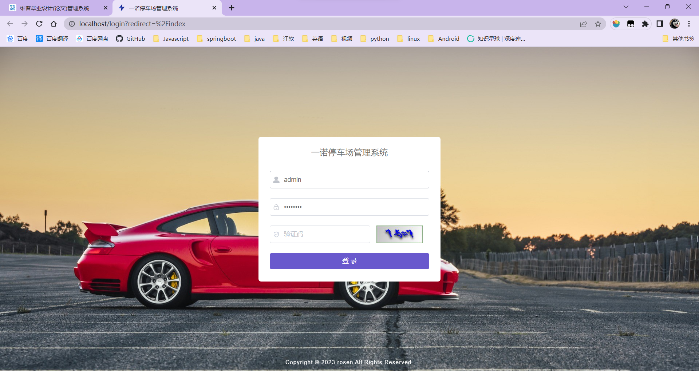
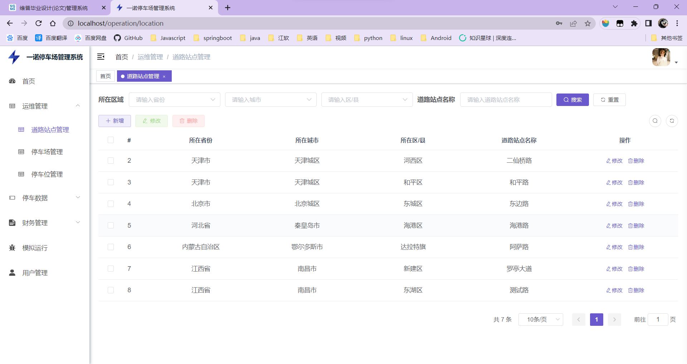
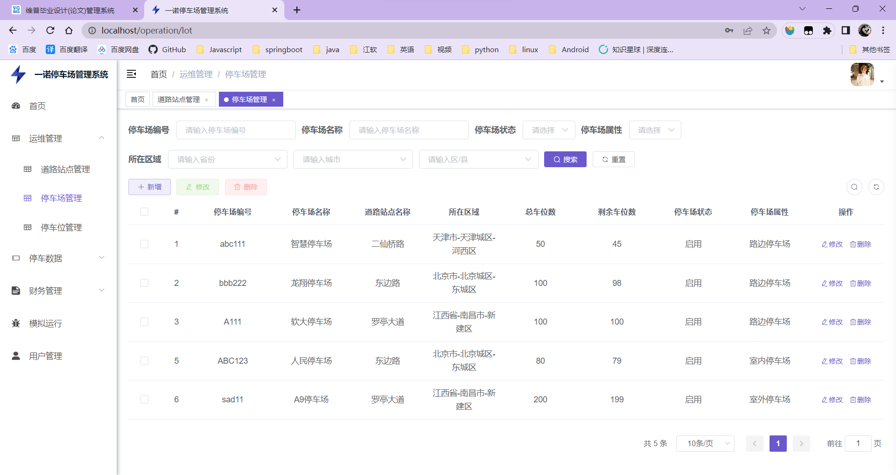
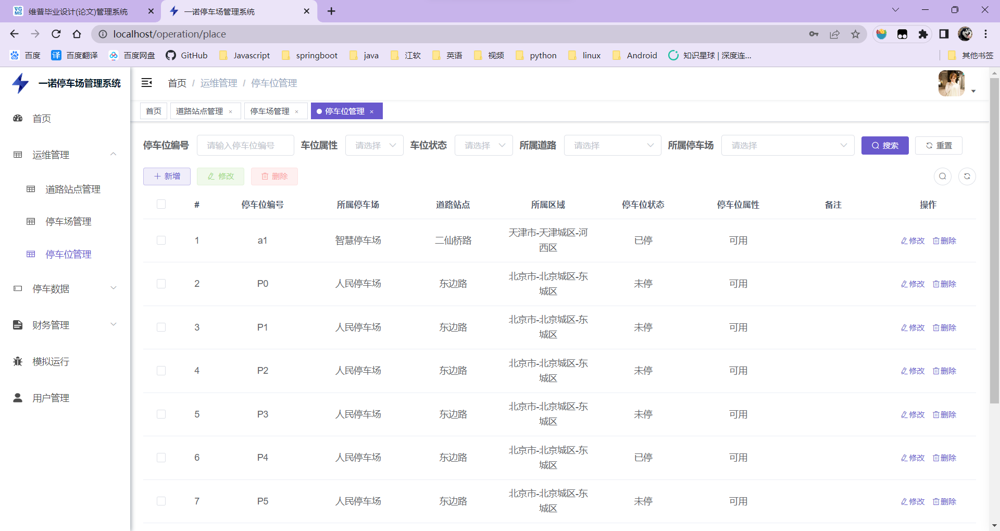
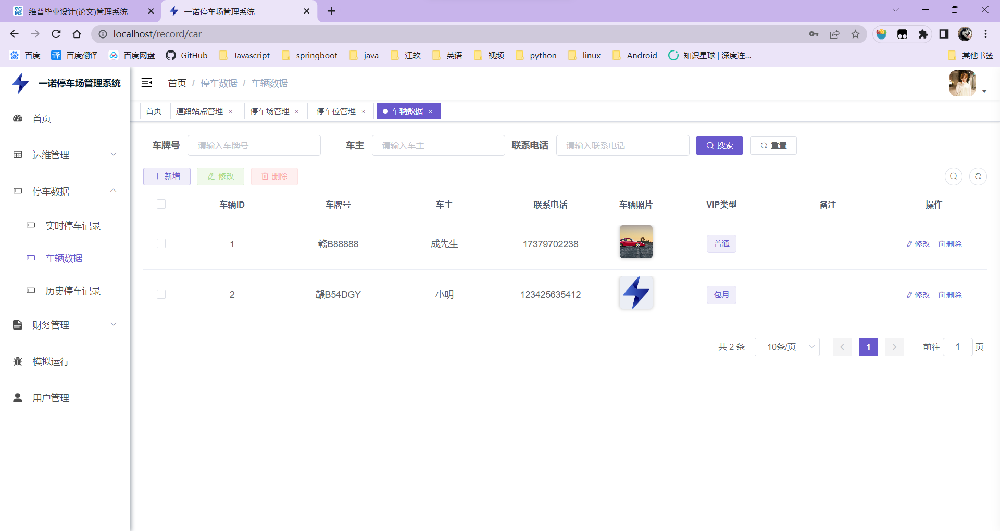
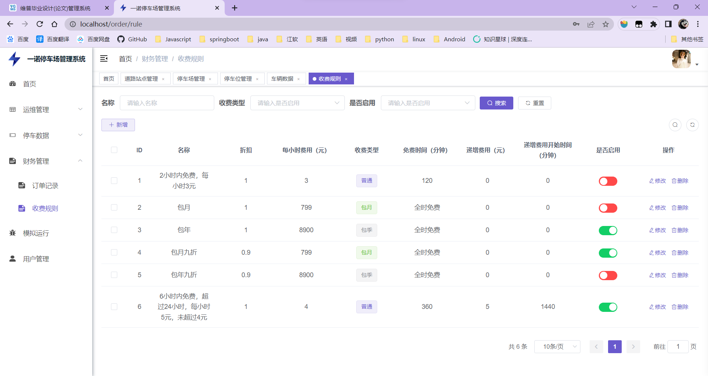
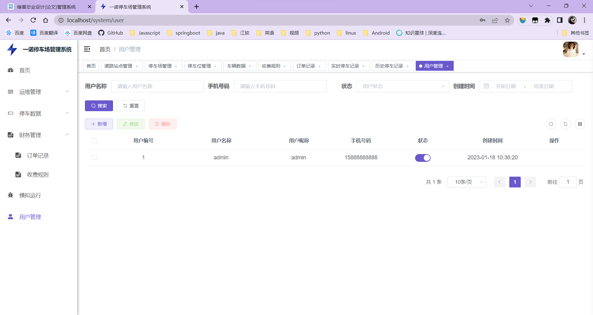
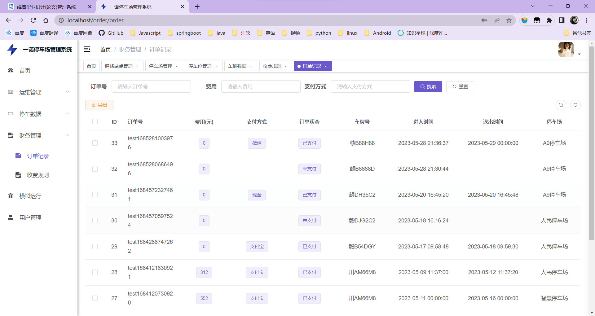
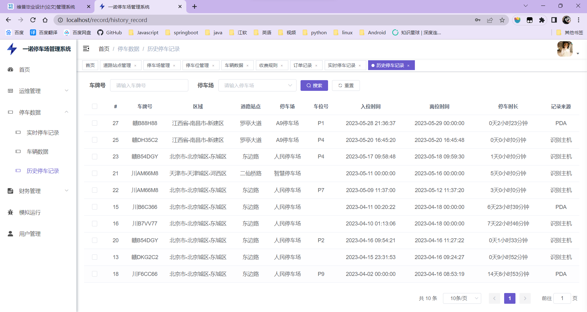
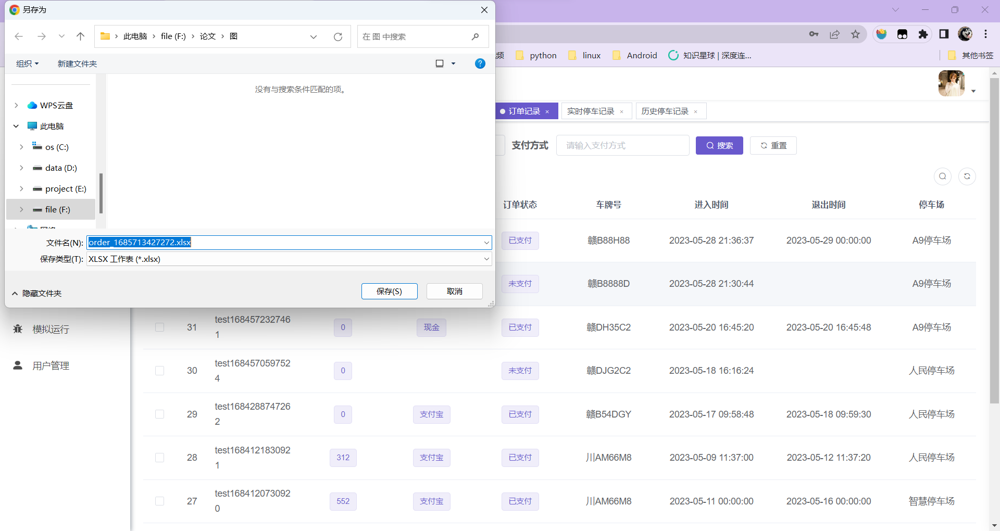

# 环境

jdk>=1.8

maven>=3.0

redis>=3.0

node>=12

# 操作

1. 创建数据库`pms`，导入sql文件，修改用户名和密码
2. 修改redis的host以及密码
3. 运行后端项目
4. 前端项目解压bin.zip，在解压目录下执行`npm install`下载依赖，执行`npm run dev`运行

# 系统功能

（1）管理员登录

（2）道路站点管理

（3）停车场管理

（4）停车位管理

（5）车辆数据管理

（6）收费规则管理

（7）用户数据管理

（8）查看订单记录

（9）查看停车记录

（10）导出订单记录

